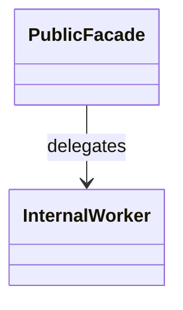
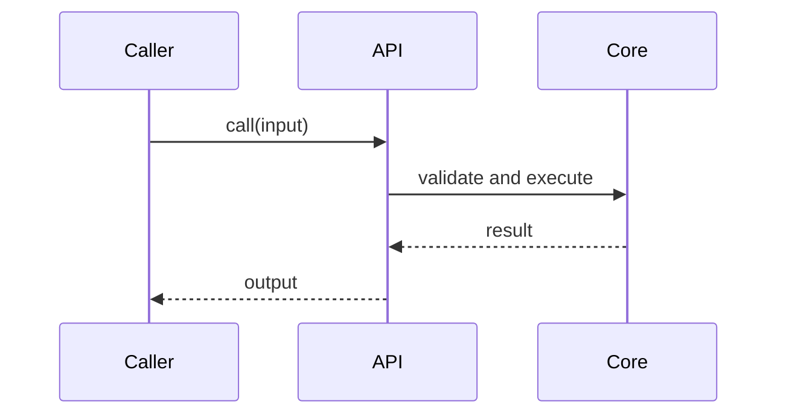
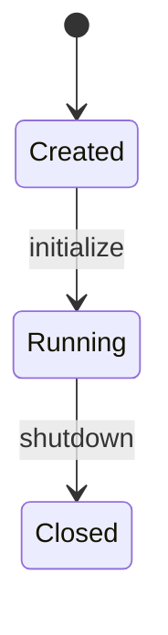

# Architecture Analysis Guide

Use this reference when a user asks for a complete module architecture analysis or when the module is complex enough that a checklist prevents missing important surfaces.

## 1. 模块定位

Answer:

- 模块职责: What problem does the module solve? What user-facing or system-facing capability does it provide?
- 边界范围: What does it own? What is explicitly delegated to other modules? What should not be changed from inside this module?
- 主要使用方: Which modules, services, pages, tasks, tests, examples, CLIs, jobs, or FFI callers invoke it?
- 关键概念: Which terms, domain objects, types, states, resources, or protocols are central to understanding the module?

Evidence to seek:

- Module README or architecture docs.
- Export files, mod declarations, route tables, dependency injection registration, command registration, service wiring.
- Tests and examples showing expected use.
- Call sites found by searching public symbols.

## 2. 对外接口

Inventory the externally visible surface:

- APIs, functions, classes, traits/interfaces, events, commands, routes, messages, configuration keys, file formats, shader/FFI boundaries, or build targets.
- Inputs, outputs, return values, errors, exceptions, result types, side effects, ownership/lifetime requirements, and threading/async constraints.
- Minimal call examples from tests/examples or a concise reconstructed example labeled as inference.
- Interface stability: public, semi-public, internal, deprecated, experimental, or test-only.

For each interface, record:

- Name and location.
- Caller expectation.
- Failure mode.
- Whether changing it would affect other modules.

## 3. 内部结构

Map the implementation:

- Component split: entry points, orchestration layer, domain objects, adapters, storage, worker/background components, helpers.
- Key classes/types/objects and their responsibilities.
- Relationship between components: owns, calls, observes, implements, adapts, schedules, caches, serializes, validates.
- Core abstractions or design patterns: facade, adapter, builder, registry, state machine, command, visitor, ECS/system, render graph pass, pipeline builder, etc.

Use a class diagram when static type relationships matter. Use a component diagram when module composition matters more than types.

## 4. 运行流程

Trace concrete flows instead of describing files:

- Initialization: configuration, registration, resource creation, dependency injection, warmup, validation.
- Typical request/call path: caller, entry point, validation, orchestration, dependency calls, return path.
- Async/background work: queues, tasks, workers, callbacks, futures/promises, channels, polling, scheduling.
- Error handling: where errors are detected, converted, logged, retried, ignored, or propagated.
- Key branches: feature flags, capability checks, platform paths, cache hit/miss, retry/fallback, validation failure.

Use a sequence diagram for one complete representative flow. If there are multiple important flows, choose the most architecture-revealing one and summarize the rest.

## 5. 数据视角

Describe data as it moves:

- Data models and schemas: structs/classes, DTOs, database rows, messages, serialized files, GPU buffers, resources, configs.
- Sources and sinks: user input, API requests, files, databases, queues, caches, external services, render resources, logs/telemetry.
- Read/write locations and mutation points.
- Transformation steps and validation points.
- Cache, persistence, message queue, external storage, and invalidation behavior.
- Consistency requirements: ordering, idempotency, atomicity, eventual consistency, synchronization, lifetime validity.

Use a data-flow diagram when the module transforms or moves data across boundaries.

## 6. 依赖关系

Analyze both directions:

- Internal dependencies: modules/packages/crates/libraries inside the repo.
- External dependencies: services, SDKs, third-party libraries, runtime systems, OS/GPU/API dependencies.
- Reverse dependencies: modules that call into this module or rely on its data/contracts.
- Dependency direction: whether dependencies point inward/outward consistently with architecture boundaries.
- Failure behavior: what happens when a dependency is unavailable, slow, returns invalid data, or changes behavior.

Use a dependency graph for cross-module relationships. Mark optional dependencies and test-only dependencies separately when relevant.

## 7. 生命周期与状态

Identify resource and state ownership:

- Module startup, initialization, runtime operation, shutdown, and cleanup.
- Object/resource lifecycle: allocation, ownership transfer, borrowing/reference lifetime, release/drop/dispose.
- State machine: states, transitions, guards, terminal states, retries, cancellation, reset/recreate paths.
- Runtime resources: timers, background tasks, worker pools, queues, connection pools, GPU resources, file handles, subscriptions.
- Cleanup guarantees and leak risks.

Use a state diagram for lifecycle-heavy modules, long-lived services, connection managers, render resources, or task state machines.

## 8. 并发与性能

Assess operational behavior:

- Thread safety and Send/Sync or equivalent guarantees.
- Concurrency model: threads, async runtime, event loop, fibers/coroutines, ECS schedule, GPU/CPU synchronization, channels.
- Shared state, locks, atomics, queues, backpressure, cancellation, and ordering constraints.
- Likely bottlenecks: hot loops, allocations, blocking IO, serialization, shader compilation, GPU synchronization, lock contention, N+1 calls.
- Complexity or throughput expectations where visible from code.
- Resource consumption: CPU, memory, IO, network, GPU memory, descriptor/pipeline/resource pressure.

State whether performance conclusions are measured, code-derived, or inferred.

## Diagram Templates

Class diagram:



Component/dependency/data-flow graph:


Sequence diagram:



State diagram:



## Report Template

Use this structure when the user asks for a full report:

```markdown
## 结论

一句话说明模块定位、核心边界、最重要的架构特征。

## 模块定位

- 职责:
- 不负责:
- 主要使用方:
- 关键概念:

## 对外接口

| 接口 | 位置 | 输入/输出 | 错误/副作用 | 稳定性 |
| --- | --- | --- | --- | --- |

## 内部结构

Mermaid diagram if useful.

## 运行流程

Mermaid sequence diagram if useful.

## 数据视角

Mermaid data-flow diagram if useful.

## 依赖关系

Mermaid dependency graph if useful.

## 生命周期与状态

Mermaid state diagram if useful.

## 并发与性能

- 并发模型:
- 资源使用:
- 潜在瓶颈:

## 风险、未知项与建议

- 未确认:
- 风险:
- 建议:
```
