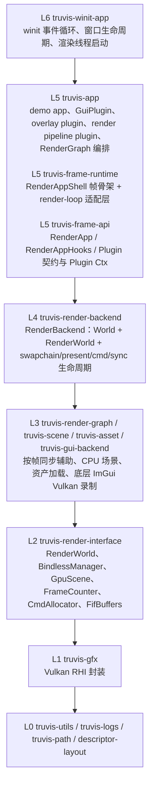
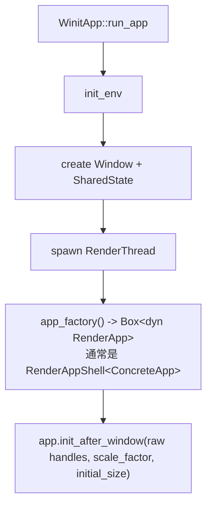
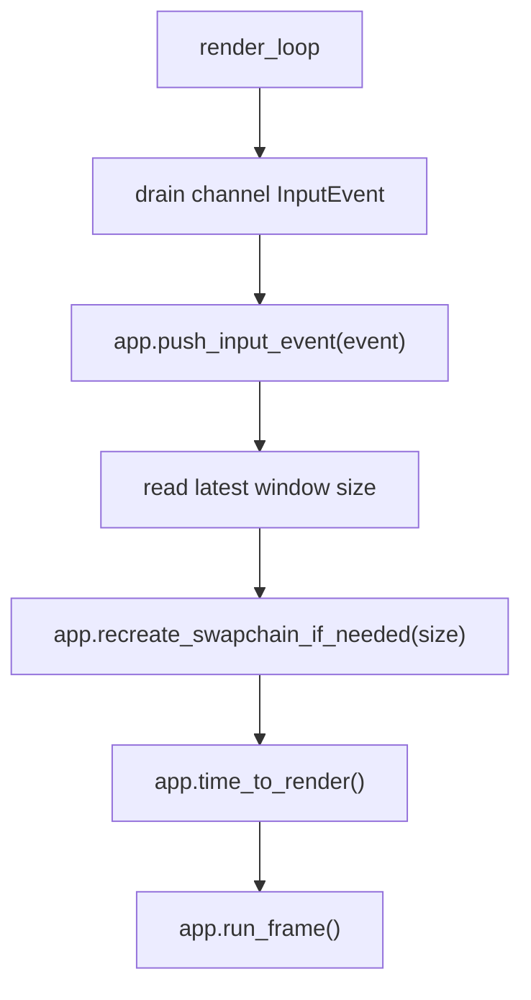
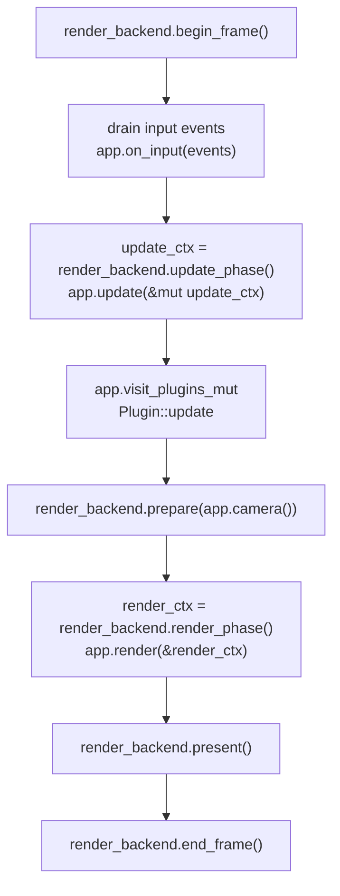
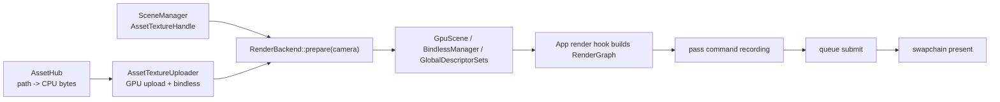
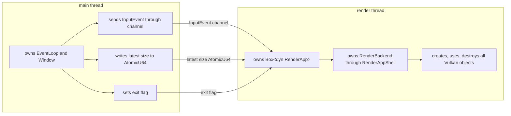

# ARCHITECTURE.md

本文档记录项目的总体架构、设计思路与模块约束。具体 crate 入口、文件职责和运行命令请查看对应模块 README。

## 1. 分层与依赖边界

项目目标是保持无环依赖：上层可以依赖下层，下层不反向依赖上层业务。



GUI 的 RenderGraph 适配位于 `truvis-app::gui_plugin`，底层 `truvis-gui-backend` 只保留 `GuiMesh` / `GuiPass` 等 Vulkan 后端能力，不依赖 render graph 或 frame runtime。

## 2. 生命周期

启动入口唯一：平台层创建窗口和渲染线程，渲染线程只通过 `Box<dyn RenderApp>` 驱动 App。

启动流程：



每帧流程：



`RenderApp` 通常由 `RenderAppShell<A>` 实现。`RenderAppShell` 持有 `RenderBackend`、待处理输入队列与具体 App hooks，因此具体 App 不需要持有 backend 或手写转发生命周期方法。

`RenderAppShell::run_frame` 的固定顺序：



关闭流程：

- 渲染线程观察到退出信号后调用 `RenderApp::shutdown(&mut self)`。
- `RenderAppShell` 先调用 App hooks 的 `shutdown()`，再通过 App 提供的 shutdown visitor 调用 Plugin shutdown，最后销毁 RenderBackend。
- `RenderBackend` 拥有 `Gfx` root owner；backend 销毁时先等待 GPU idle，释放所有子资源，最后销毁 `Gfx`。
- 主线程等待渲染线程完成后再 drop `Window`。

## 3. 状态所有权

`RenderBackend` 持有渲染后端核心状态：

```text
RenderBackend
  -> Gfx         Vulkan root owner + typed Ctx factory
  -> World       CPU scene + assets
  -> RenderWorld GPU resources + frame state
  -> RenderPresent swapchain/present resources
```

`RenderAppShell` 只持有：

- `RenderBackend`
- 待处理 `InputEvent` 队列
- 具体 App hooks

`RenderAppShell` 不持有 GUI、Camera、Overlay、InputState 或任何具体 render pipeline plugin。

具体 App state 持有：

- `GuiPlugin`
- `CameraController` / `InputManager`
- `DebugInfoOverlay` / `PipelineControlsOverlay`
- `TrianglePlugin`、`ShaderToyPlugin` 或 `RtPipeline` 等具体渲染能力

RenderBackend 通过 lifecycle Ctx 借出内部字段：

- `RenderBackendInitCtx`
- `RenderBackendUpdateCtx`
- `RenderBackendRenderCtx`
- `RenderBackendResizeCtx`
- `RenderBackendShutdownCtx`

`RenderAppShell` 从 RenderBackend Ctx 裁剪标准生命周期需要的 Plugin Ctx，App 在 render hook 中为特有 render 能力裁剪 `PluginRenderCtx`：

- `PluginInitCtx`
- `PluginUpdateCtx`
- `PluginRenderCtx`
- `PluginResizeCtx`
- `PluginShutdownCtx`

这些 Ctx 携带 phase-appropriate 的 typed `Gfx` Ctx（如 device、resource、queue、surface、immediate、device-info），调用点只获得当前阶段需要的能力，不持有完整 `&Gfx`。

GUI draw data 不进入通用 Ctx。`GuiPlugin` 自行持有 imgui context、draw data、GUI mesh buffer、font texture map，并通过 `prepare_render_data` 和 `contribute_passes` 接入 render hook。

## 4. App Hooks / RenderAppShell / Plugin 模型

`RenderApp` 是 render loop 的外部契约：

- `init_after_window`
- `run_frame`
- `push_input_event`
- `recreate_swapchain_if_needed`
- `time_to_render`
- `shutdown`

`RenderAppShell<A>` 是适配层：它实现 `RenderApp`，持有 `RenderBackend`、输入事件队列和 `A: RenderAppHooks`，把 render loop 的外部生命周期转发到 backend 与具体 App hooks。

`RenderAppHooks` 是 `RenderAppShell` 回调具体 App 的 hook 契约：

- `init`
- `visit_plugins_mut`
- `visit_plugins_mut_rev`
- `on_input`
- `update`
- `render`
- `camera`
- `on_resize`
- `shutdown`

`RenderAppShell` 使用 `visit_plugins_mut` 批量调用 `Plugin::init`、`Plugin::update` 和 `Plugin::on_resize`，使用 `visit_plugins_mut_rev` 调用 `Plugin::shutdown`。输入事件目前仍由 App hooks 显式处理，因为 GUI 事件消费和 App 自有 `InputManager` 之间存在 App 级策略。

`Plugin` 是可复用能力单元的标准生命周期：

- `init`
- `on_input`
- `update`
- `on_resize`
- `shutdown`

Plugin 的特有能力不放进统一 trait。例如：

- `GuiPlugin::begin_frame` / `ui` / `end_frame` / `prepare_render_data` / `contribute_passes`
- `TrianglePlugin::contribute_passes`
- `ShaderToyPlugin::contribute_passes`
- `RtPipeline::contribute_compute_passes` / `contribute_present_passes`

App 通过持有具体类型来组合这些能力，并通过 visitor 暴露标准生命周期 Plugin，不使用 downcast、注册表或消息总线。

## 5. RenderGraph 与数据流

CPU 语义数据从 `World` 进入 RenderBackend。资产加载先由 `AssetHub` 产出
upload-ready CPU bytes，再由 `AssetTextureUploader` 在渲染线程上传到 GPU 并注册
bindless；场景数据在 prepare 阶段通过 texture resolver 解析为 shader 可见 handle。



RenderGraph 规则：

- App 在 `RenderAppHooks::render` 中创建 RenderGraph。
- 渲染管线 Plugin 只贡献自己的 pass，不决定整个 App 的完整执行顺序。
- App 显式决定 GUI pass 与渲染管线 pass 的添加顺序，RenderGraph 按该顺序录制，不做自动重排。
- pass 必须声明 image 读写状态，让 RenderGraph 在线性序列中推导同步与 layout transition。

Triangle / ShaderToy 使用单个 present graph。RT demo 使用 compute graph 与 present graph：App 先让 `RtPipeline` 贡献 compute passes，再在 present graph 中先 resolve，最后调用 `GuiPlugin::contribute_passes` 叠加 GUI。

## 6. 线程与同步

线程模型：



约束：

- 主线程不调用 Vulkan、`ash` 或 `truvis-gfx` API。
- 所有 Vulkan 对象在渲染线程创建、使用和销毁。
- resize 通过 latest-size 模式合并连续事件。
- GPU 同步优先通过 RenderGraph、binary semaphore 和 frame timeline 表达。

## 7. 资源生命周期

生命周期契约以显式 owner 为边界：

- `Gfx` 是 Vulkan root owner，由 `RenderBackend` 持有并在所有子资源之后销毁。
- 叶子 Vulkan/VMA/WSI wrapper 通过 `destroy(self, ctx, reason)` 或 `destroy_mut(&mut self, ctx, reason)` 释放，释放所需依赖由 owner 在调用点传入 typed `Gfx` Ctx。
- `Drop` 不调用 Vulkan/VMA/WSI release API，只通过 debug assertion 暴露遗漏的显式销毁。
- `RenderWorld`、manager、plugin 字段和长期资源 wrapper 不保存 typed `Gfx` Ctx、`&Gfx`、`&GfxDevice` 或 `&VMemAllocator` 引用。
- manager 更新 descriptor 时只接收自身所需的窄 target；`GlobalDescriptorSets` 保持为全局 pipeline 绑定聚合，不作为下层 manager 的更新入口。

GPU 资源按用途分类：

- Persistent：pipeline、sampler、descriptor layout、shader binding
- Frame：command buffer、per-frame buffer、FIF resources
- Swapchain：swapchain image/view、present semaphore、window-sized targets
- Asset：`AssetHub` 持有内容资产 handle 与 CPU 加载状态；`AssetTextureUploader` 持有 texture 的 GPU image/view/bindless 绑定
- GUI：imgui font texture、per-frame GUI mesh buffer、texture map
- RenderGraph：按帧导入的 image 状态引用与同步计划；图内 transient image/buffer 是未来能力，不作为当前资源生命周期类别

创建路径：

- `RenderBackend::new` 初始化 `Gfx`，创建 `World` / `RenderWorld`。
- `RenderBackend::init_after_window` 创建 surface、swapchain 和 `RenderPresent`。
- `RenderAppShell` 创建 `RenderBackend` 并把 `RenderBackendInitCtx` 包装为 `RenderAppInitCtx` 交给 App hooks。
- App state 从 `RenderAppInitCtx` 中的 RenderBackend Ctx 构造 `PluginInitCtx`，依次初始化自己持有的 Plugin。

重建路径：

- render loop 调用 `RenderApp::recreate_swapchain_if_needed(size)`。
- `RenderAppShell` 调用 `RenderBackend::handle_resize(size)`。
- RenderBackend 只有实际重建时返回 `Some(RenderBackendResizeCtx)`。
- `RenderAppShell` 把返回值包装为 `RenderAppResizeCtx` 交给 App hooks，App state 构造 `PluginResizeCtx` 并通知需要 resize 的 Plugin。

销毁路径：

- `RenderApp::shutdown(&mut self)`：`RenderAppShell` 等待 GPU idle 后，先用 `RenderAppShutdownCtx` 调用 App hooks shutdown，再用 `PluginShutdownCtx` 反向遍历 Plugin shutdown。
- App / Plugin shutdown 必须在 `RenderBackend::destroy()` 释放 backend 子资源之前释放自己持有的 GPU 资源；需要 manager 访问时通过 shutdown context 使用 `RenderWorld`。
- manager-owned image/view 只能通过 `GfxResourceManager` 释放，manager 负责 image-view-before-image、延迟销毁队列与 `DestroyReason` 诊断。
- backend destroy：`gfx.wait_idel()` -> release present/FIF/assets/GPU scene/cmd/backend resources -> `gfx.destroy()`。
- `gfx.destroy()` 开始后，剩余 App / Plugin 字段的 `Drop` 不得再调用 Vulkan/VMA/WSI 销毁 API。
