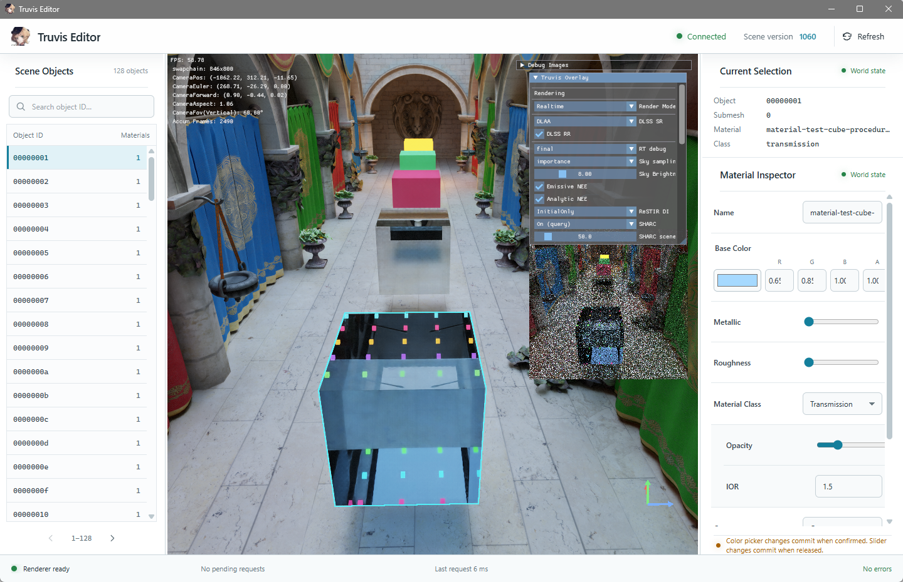
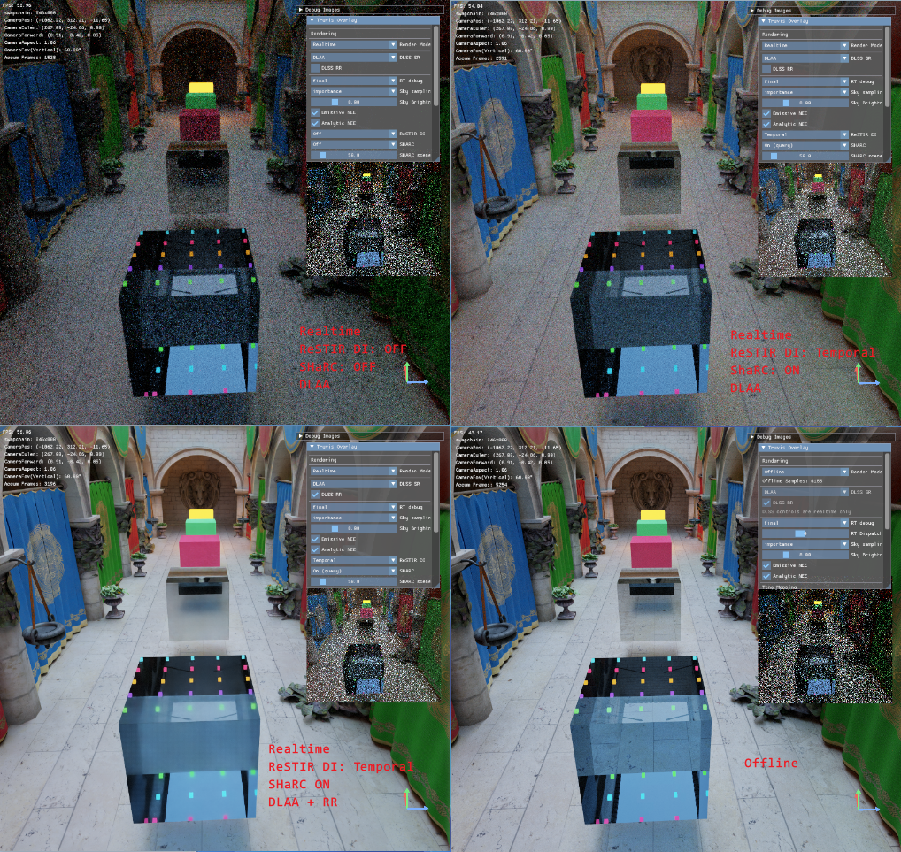
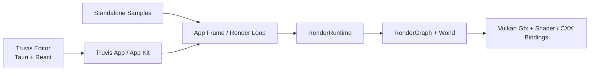

# TruvisRenderer

[](https://deepwiki.com/acccoco/TruvisRenderer)

TruvisRenderer 是一个基于 Rust、Vulkan 1.3 和 Slang 构建的实时光线追踪渲染器与桌面编辑器，当前面向 Windows x64 与 NVIDIA RTX 平台。



## 项目亮点

- **桌面编辑器**：使用 Tauri + React 构建编辑器界面，并嵌入原生 Vulkan viewport；支持场景对象浏览、点击选择、selection outline 与材质编辑。
- **Realtime / Offline Path Tracing**：提供面向交互的实时路径追踪，以及独立累计状态与采样序列的离线路径追踪。
- **统一光源采样**：对 HDRI、自发光三角形与 analytic light 执行统一 NEE，并结合 MIS 与多次反弹完成路径积分。
- **现代实时光追算法**：支持 primary ReSTIR DI 的 temporal / spatial reuse，以及 SHARC world-space radiance cache。
- **NVIDIA Streamline**：集成 DLSS Super Resolution、DLAA 与 DLSS Ray Reconstruction，并维护所需的 depth、motion vector 和材质输入。
- **渲染基础设施**：包含 Rust Vulkan RHI、RenderGraph、Bindless 资源模型，以及 Slang shader 编译与 Rust binding 生成工具链。
- **模型导入**：`.gltf` / `.glb` 由 Rust `gltf` loader 读取，其他模型格式继续通过 C++ FFI / Assimp 导入。

## 特性展示



四个视图按左上、右上、左下、右下依次展示 Realtime + DLAA 基线、ReSTIR DI + SHARC、进一步叠加 DLSS Ray Reconstruction，以及 Offline 累计结果。各视图使用相同场景与相机，便于观察不同渲染路径和功能组合的差异。

## 快速开始

### 环境要求

- Windows x64
- 支持 Vulkan Ray Tracing 与 DLSS 的 NVIDIA RTX GPU，以及匹配的显卡驱动
- Rust 1.85+（workspace 使用 Rust 2024 edition）
- Vulkan SDK 1.3+
- Node.js 20.19.x 或 22.12+，以及 npm
- CMake 3.21+；Visual Studio 2026 generator 需要 PATH 中的 CMake 4.2+
- Visual Studio 2022 或 2026，并安装 MSVC C++ workload
- LLVM LLD，并确保 `lld-link.exe` 位于 `PATH`；Cargo 的 Windows MSVC target 使用它缩短链接时间
- 已配置 `VCPKG_ROOT`
- [`just`](https://github.com/casey/just) 与 [`Nushell`](https://www.nushell.sh/)

### 获取资源并运行

```nushell
just fetch-res
just truvis
```

`just fetch-res` 下载项目运行所需的资产与外部工具。`just truvis` 会依次构建 Web editor、shader、Debug CXX 绑定和主体应用，因此首次运行耗时会更长。

构建完整 workspace 时只需执行：

```nushell
just build-all
```

`build-all` 已包含 Web editor、shader 和 Debug / Release CXX 构建，无需预先重复执行这些步骤。

### 其他运行入口

```nushell
just triangle
just cornell
just shader-toy
just truvis-direct
```

`truvis-direct` 仍会构建 Web editor，但不会重新生成 shader 或 CXX 绑定，适合确认这些产物已经是最新状态时使用。

所有渲染入口默认开启 Vulkan validation layer，可追加 `no-validation` 关闭。Truvis 入口还可追加 `imgui`，启用 Streamline ImGui 调试界面：

```nushell
just truvis imgui
just truvis no-validation
just truvis imgui no-validation
```

## 基本操作

| 操作 | 输入 |
|---|---|
| 前后、左右移动 | `W` / `S`、`A` / `D` |
| 垂直移动 | `E` / `Q` |
| 自由观察 | 按住鼠标右键拖动 |
| 围绕鼠标命中位置观察 | 按住鼠标中键拖动 |
| 沿命中表面平移 | `Shift` + 鼠标中键拖动 |
| 朝鼠标位置缩放 | 滚动鼠标滚轮 |
| 选择场景对象 | 鼠标左键点击 viewport |

## 架构速览



主体编辑器由 Tauri / React 页面与嵌入式原生 Vulkan viewport 组成；App 层决定具体渲染管线和 RenderGraph pass 顺序，`RenderRuntime` 负责 GPU 资源、场景同步、帧生命周期与 present。详细的依赖方向、线程边界和资源契约请阅读 [`docs/ARCHITECTURE.md`](./docs/ARCHITECTURE.md)。

## 坐标系约定

项目使用右手坐标系，Y 轴向上，默认相机朝向 `-Z`。光栅化阶段使用负 viewport height，保持 Vulkan clip space 到左上角为原点的 framebuffer 坐标映射一致。


## 当前支持范围

- 当前以 Windows x64、NVIDIA RTX 和源码构建为主要开发目标，仓库不提供预编译安装包。
- `.gltf` / `.glb` 当前支持 material、mesh 与 instance 导入；外部 image URI 可以作为纹理路径，GLB / data URI 内嵌贴图尚未接入现有纹理身份模型。
- ReSTIR DI 当前服务 primary direct lighting；secondary bounce 继续使用统一 NEE。
- Offline 路径拥有独立累计状态，不复用 DLSS、ReSTIR DI、SHARC 或 realtime temporal state。

## 文档导航

- [架构入口](./docs/ARCHITECTURE.md)
- [编辑器设计与协议](./docs/editor.md)
- [场景与资源模型](./docs/scene.md)
- [当前实现事实总结](./docs/summaries/)
- [App 模块说明](./app/README.md)
- [Shader 模块说明](./engine/shader/README.md)
