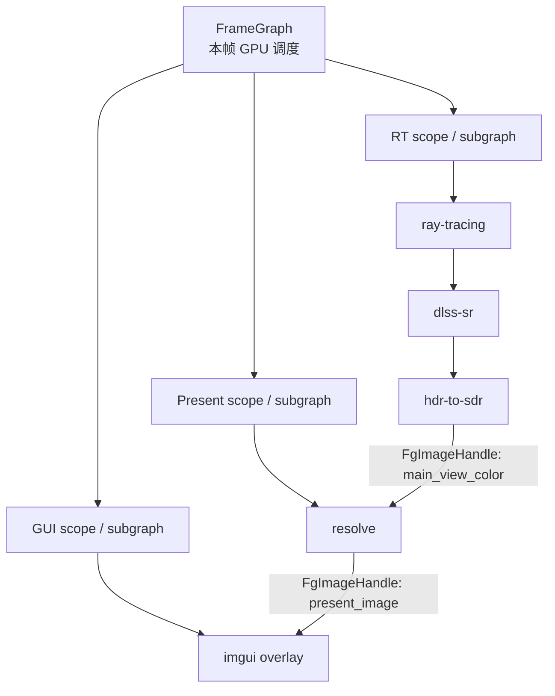

# RenderGraph 改进方向

> 状态：活跃方向，更新于 2026-06-03。当前事实以
> [`ARCHITECTURE.md`](../../ARCHITECTURE.md) 和代码为准。

本文记录当前 `truvis-render-graph` 的边界、问题和后续演进方向。目标不是一次性改成
重型渲染调度系统，而是在保留当前清晰分层的前提下，让 RenderGraph 逐步覆盖更多
本帧 GPU 工作的资源依赖、同步和调试信息。

## 当前边界

当前 RenderGraph 是 render 阶段内的按帧 pass 编排器：

- App 在 `RenderAppHooks::render` 中创建 `RenderGraphBuilder`。
- Pass 按添加顺序执行，不做自动重排或拓扑调度。
- 资源模型目前只开放 image；pass 通过 `RgImageHandle` 声明读写状态。
- Graph 根据 image 状态声明推导 image barrier 和 layout transition。
- 外部 image 通过 `import_image` 进入 graph，通过 `export_image` 声明最终状态。
- wait / signal semaphore 可以随 imported / exported image 或 graph signal 接入 submit。

主 RT 路径目前拆成两个 graph：

- compute graph：ray tracing、DLSS SR、HDR to SDR，输出 main-view color。
- present graph：导入 main-view color，resolve 到 swapchain，再叠加 GUI。

compute graph 到 present graph 的衔接依赖人工协议：compute graph 把 main-view color
导出为 fragment read，present graph 再以相同状态导入。这个做法局部清楚，但 graph
本身无法校验跨 graph 的状态是否一致。

同步 raycast 当前不进入 RenderGraph。它在 `after_prepare` 阶段由 runtime 私有
`RayCastService` 独立提交 command buffer，并用 fence 阻塞读回。实时 RT 渲染 pass 已经
在 RenderGraph 中；交互 raycast 是另一个低频、需要同帧 CPU 结果的同步查询路径。

## 主要问题

### 跨 graph 状态不可校验

当前多个 graph 各自维护自己的资源表和状态推导。一个 graph 导出的 `RgImageHandle`
只属于该 graph 的 `RgResourceManager`，不能直接被另一个 graph 识别。跨 graph 传递的
真实资源只能重新 import 同一个 `GfxImageHandle`，并由调用者手动保证 initial / final
state 对齐。

### 资源类型覆盖不足

当前公开资源模型只有 image。buffer、readback buffer、acceleration structure、TLAS/BLAS
读写状态仍由 pass 或 runtime 阶段边界手写 barrier 和队列顺序表达。因此把同步 raycast
直接包成 `RgPass` 意义有限：graph 仍看不见 ray buffer、raw hit buffer、readback buffer
和 TLAS 依赖。

### Adapter 层样板偏多

当前 `RgPass` adapter 通常需要在 `execute` 中把 `RgImageHandle` 转成
`GfxImageHandle` / `GfxImageViewHandle`，再组装底层 pass data，最后调用具体
`Gfx` pipeline 录制命令。这条边界是合理的，但每个 pass 手写转换会显得繁琐。

更值得收敛的是部分 `RgPass` adapter 直接捕获完整 `GpuStore`。长期应把它裁剪成更窄的
record context，让 pass 依赖更清楚。

## 目标形态：FrameGraph + Subgraph / Scope

长期方向不是写一个巨大硬编码 graph，而是引入顶层 `FrameGraph`：

- 一个顶层 graph 覆盖本帧 render phase 的主要 GPU 工作。
- 每个 pipeline / plugin 仍然贡献自己的 subgraph。
- subgraph 通过 typed output struct 导出少量逻辑资源。
- scope 用于命名、可见性、生命周期、调试和未来 queue / command buffer 边界。
- 顶层 FrameGraph 统一编译资源状态、barrier、submit plan 和调试信息。

示意：



### Subgraph

Subgraph 是模块贡献的一组局部 pass。它不应该独立拥有一个无法互通的资源表，而是向同一个
顶层 `FrameGraphBuilder` 注册资源和 pass。

推荐接口形态：

```rust
pub struct RtGraphOutputs {
    pub main_view_color: FgImageHandle,
    pub debug_images: Vec<DebugImageGraphEntry>,
}

pub struct PresentGraphOutputs {
    pub present_image: FgImageHandle,
}

let mut frame = FrameGraphBuilder::new();
let rt = rt_pipeline.contribute_rt_scope(&mut frame, &plugin_ctx);
let present = rt_pipeline.contribute_present_scope(&mut frame, &plugin_ctx, rt.main_view_color);
gui.contribute_gui_scope(&mut frame, &plugin_ctx, present.present_image, &rt.debug_images);
let compiled = frame.compile();
```

这里 `main_view_color` 和 `present_image` 是 typed graph handle，不是 string。

### Scope

Scope 是同一个顶层 graph 中的边界标签，不是独立 graph：

- 命名空间：例如 `rt/main-view-color`、`present/swapchain`、`gui/canvas`。
- 可见性：scope 内资源默认私有，显式 export 后才作为 subgraph output 传给其他模块。
- 生命周期：scope 内 transient 资源可以由 FrameGraph 管理，避免永久挂在 runtime 或 plugin。
- 调试：execution plan 和 resource graph 可以按 scope 折叠显示。
- 调度：未来可以把某些 scope 编译成独立 command buffer 或 async compute queue。

## Handle 规则

跨 subgraph 真实依赖应使用强类型 graph handle：

```rust
FgImageHandle
FgBufferHandle
FgAccelerationHandle
```

string 只用于 debug name、日志、可视化和脚本化查找，不作为 Rust API 中的真实依赖。

原因：

- 避免拼写错误和重名冲突。
- 保留类型信息，防止把 buffer 当 image 用。
- 便于 compiler 追踪完整访问历史。
- 支持后续 resource aliasing、transient 生命周期和 validation。

如果未来需要脚本化 graph，可以允许 string name 解析成 typed handle，但 pass 声明仍应使用
handle。

## Adapter 层改进

保留当前分层方向：

```text
Rg/Fg adapter:
  持有 graph handle，声明资源读写状态

Gfx pass / pipeline:
  只接收 Gfx handle / Vulkan handle / pass data，录制命令
```

不要让底层 `GfxPipeline` 直接认识 `RgImageHandle` 或 `FgImageHandle`，否则 render graph
会反向污染具体 pipeline，pass 也更难脱离 graph 手动录制或复用。

可以减少样板：

```rust
pub struct RgImageRef<'a> {
    pub image: GfxImageHandle,
    pub view: GfxImageViewHandle,
    pub vk_image: vk::Image,
    pub vk_view: vk::ImageView,
    pub format: vk::Format,
    pub extent: vk::Extent2D,
}
```

让 adapter 写成：

```rust
let output = ctx.image(self.single_frame_image)?;
let gbuffer_a = ctx.image(self.gbuffer_a)?;
```

而不是每个 pass 都手写 `get_image_and_view_handle`、再查 manager、再组装 pass data。

同时，用更窄的 record context 替代 adapter 捕获完整 `GpuStore`：

```rust
pub struct RenderPassRecordCtx<'a> {
    pub frame_label: FrameLabel,
    pub frame_state: &'a FrameRenderState,
    pub render_options: &'a RenderOptions,
    pub global_descriptor_sets: &'a GlobalDescriptorSets,
    pub bindless_manager: &'a BindlessManager,
}
```

## Raycast 接入取舍

同步 raycast 当前留在 `after_prepare` 是合理的：

- 它依赖 prepare 后的 GPU scene / TLAS 快照。
- 它需要同帧 CPU 结果更新相机 pivot、拖拽或点击反馈。
- 它低频，独立提交并阻塞等待的成本可控。

如果后续要把 raycast 放入 graph，建议先满足：

- FrameGraph 支持 buffer resource 和 buffer barrier。
- 支持 acceleration structure read state。
- 支持 readback / extraction / ticket，让 CPU 下一帧或显式等待读取结果。
- 明确 sync raycast 和 async picking 的 API 区别。

更适合进入 graph 的形态是异步 picking：

```text
upload rays buffer -> trace rays -> copy hits to readback buffer -> export ReadbackTicket
```

同步交互查询仍可作为 runtime 特例保留。

## 演进步骤

1. 扩展当前 RenderGraph 的 resource model：增加 buffer handle、buffer state 和 buffer barrier。
2. 为当前 compute graph / present graph 增加 export/import 状态校验，先降低人工协议风险。
3. 增强 `RgPassContext` 的 resource resolve helper，减少 adapter 层样板代码。
4. 引入更窄的 `RenderPassRecordCtx`，逐步替代 adapter 直接捕获完整 `GpuStore`。
5. 引入 `FrameGraphBuilder` 原型，允许 `RtPipeline`、`GuiPlugin` 等贡献 scope / subgraph。
6. 初期保持线性执行，先统一资源表和跨 subgraph 状态推导。
7. 再评估 submit planner、async compute、transient resource、aliasing、readback ticket 和 graph visualization。

## 非目标

- 不让 `truvis-render-graph` 依赖 `World`、asset 或具体 App state。
- 不把所有 runtime prepare、asset upload、present 生命周期都强行塞进 graph。
- 不为了减少几行 adapter 代码，让底层 `GfxPipeline` 直接依赖 graph handle。
- 不在第一阶段做完整 RDG / FrameGraph 的 pass culling、aliasing 和 async queue scheduler。
