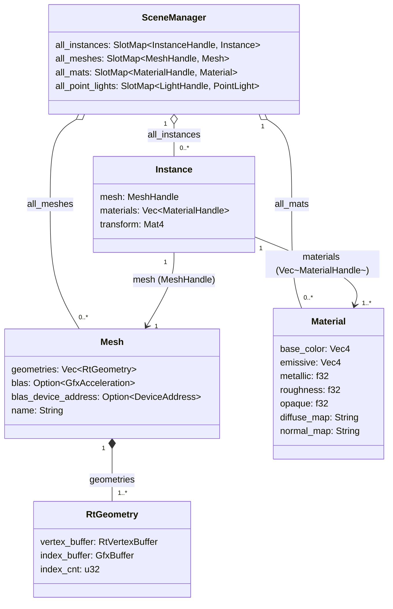

# CPU 侧场景数据模型

## 类图

## 关键约定

- `Instance.materials[i]` 与 `Mesh.geometries[i]` 一一对应，材质数量须与 submesh 数量严格对齐
- `SceneManager` 通过 `SlotMap` 管理所有资源，`Instance` 持有 `MeshHandle` / `MaterialHandle`，不直接拥有数据
- `Mesh.blas` 构建后才能用于 TLAS，`blas_device_address` 用于 `AccelerationStructureInstanceKHR`
