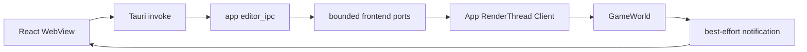

# Editor Boundary 与 Consistency

> 类型：设计文档。本文定义 WebView、Tauri、App RenderThread Client 和 GameWorld 之间的权威状态与消息边界。

## 状态权威

`GameWorld`/`SceneStore` 是 CPU scene、material、sky、light 和 instance 的唯一权威。WebView 只保存可丢弃的展示投影；Renderer selection 是 CPU handle 语义，不是 GPU slot。

Transform gizmo 的移动由 Renderer 在 update 阶段直接提交到 `GameWorld`，不新增 gizmo 专用 notification。
Renderer 的所有选择来源共用私有提交入口，集中比较、赋值、通知和旧 gizmo 展示失效；材质 handle 仅随网格通知传递。
灯光和 gizmo 统一 GPU 绘制不会改变 selection DTO 或 Editor 请求协议。普通选择不重置 InputState，拖动对象从按下到松开保持绑定。
Editor 通过既有的 `scene_version` 和 instance/light details 主动查询获得最新 transform/position；现有 selection 等业务通知仍按原有职责工作。

Editor protocol 不拥有 scene，不缓存长期 snapshot，也不把本机 `PathBuf` 或 Vulkan 类型暴露给通用 DTO。

## Instance Transform 投影

`Instance.transform` 的 world-space `Mat4` 是唯一权威表示。`truvis-world` 按查询使用 glam 分解为
TRS，并提供矩阵重组与 intrinsic XYZ Euler 角度转换；不保存 TRS 缓存，也不通过查询推进 scene version。
Quaternion 用于内部旋转表示，Euler 角仅供显示，组合为 `Rx * Ry * Rz`，不能视为原始导入角度。

World 检查有限值、仿射结构、退化输入与重组误差；shear 等无法可靠表示为 TRS 的矩阵不输出近似值。
负缩放采用等价分解，不保证恢复原始各轴符号。App RenderThread Client 只装配 DTO，Web 只格式化数值；
两者均不分解矩阵。`InstanceDetailsDto.transform` 不可用时为 `null`，其他 instance 详情仍正常返回。
协议只携带世界单位的 Location、角度制 XYZ Rotation 和 Scale，不携带旧矩阵表达或编辑命令。

## 请求与响应

Query 读取当前权威状态；Command 请求 CPU mutation；Response 只对应当前 invoke；Notification 只做 best-effort 提示。

每个 request 使用独立 oneshot reply，避免共享 response queue。`scene_version` 是 SceneStore 的单调版本，用于 WebView 丢弃过期分页或材质查询结果；它不等价于 frame id、GPU revision 或 notification 数量。

ID 是带 generation 的 opaque handle，WebView 不能解析 index，也不能混用 Instance、Mesh、Material 和 Texture identity。删除或 generation 失效后由 World 返回 stale/not-found。

## 背压

App 到 RenderThread Client 使用有界 request inbox；Client 到 App 使用有界 notification outbox。RenderThread 每帧按预算处理请求，不等待 Tauri 或 WebView。

队列满、timeout、Renderer 关闭和 notification 丢失分别是边界事件。Notification 丢失不破坏权威状态，WebView 通过查询、version 轮询或刷新恢复。

具体容量属于当前实现细节，不作为设计不变量；不能因为扩大容量而引入 RenderThread 阻塞。

## 编辑与恢复

App RenderThread Client 将 DTO handle 还原为强类型 World handle，校验成功后才提交 CPU mutation。失败不会推进 scene version。

WebView 的草稿 revision 用于区分本地未确认输入和服务器回包；过期 response 不能覆盖新草稿。查询不能自动清除仍有效的 validation error。

selection 由 Renderer 唯一持有：灯光图标在 update 通过 CPU 屏幕命中更新，网格在 after_prepare
取得 GPU raycast 结果后更新。两者共用 tagged selection DTO 与通知；灯光 ID 包含类别和 generation。
WebView 定期查询 selection，通知丢失时无需依赖 scene version 变化即可恢复。
Web 只保留一个 `inspectedObject`，可检查 Instance、Light 或 Environment；左栏检查不反向修改 Renderer selection。
只有实际 selection 变化才更新检查对象，重复轮询不抢占左栏选择。材质编辑绑定当前 instance 的 material bindings。
混合列表保持有界分页和版本校验；标签与搜索仅过滤完整 Web 投影。

灯光与环境修改使用字段 patch，由 World 合并最新状态并原子校验；Gizmo 与 Inspector 共用灯光 mutation。
Web 按检查批次、材质身份与字段 revision 丢弃旧回包，刷新仅合并未编辑字段；命令按提交顺序发送。
LightDetails 的类别专有参数使用 tagged DTO，Environment 是单例，换图不改变其检查身份。
Area 半轴是权威，朝向/尺寸只按需转换；Spot UI 使用角度，World 保持弧度。
环境加载期间继续查询 CPU texture record，即使 scene version 未变化也能收敛到 Ready/Failed；不将其视为 GPU 完成。

## 特权命令

HDRI 文件选择通过 Tauri dialog 产生本地 PathBuf，经独立有界 desktop command 进入 App RenderThread Client。通用 Editor DTO 只返回文件名和 accepted/cancelled/error。

accepted 只表示 GameWorld 接受 CPU 请求，不表示 decode、GPU upload、sky distribution 或最终画面完成。

## 生命周期

关闭时 App 先拒绝新 invoke/dialog，再让 Renderer 清空 request receiver，随后执行 Renderer/Runtime/Vulkan shutdown。未处理 oneshot 因 sender drop 结束；通知 dispatcher 最后停止。

Tauri notification task 不访问 GameWorld 或 Vulkan。WebView 退出不改变 RenderThread 的资源销毁 owner。

## 设计不变量

- WebView 是投影，不是 scene authority。
- Editor protocol 不依赖 World、Runtime 或 GPU 类型。
- request reply、notification、CPU acceptance 和 GPU completion 语义分离。
- App RenderThread Client 是 DTO 到 World API 的唯一适配点；Renderer 只负责把 Client 调用放入合法生命周期阶段。
- 任何背压策略都不能阻塞 RenderThread、Tauri main thread 或持有 desktop resource lock。

## 实现入口

- [`editor_ipc.rs`](../../app/truvis-app/src/editor_ipc.rs)
- [`client/editor_controller.rs`](../../app/truvis-app/src/client/editor_controller.rs)
- [`truvis-editor-bridge`](../../renderer/editor/truvis-editor-bridge/src/)
- [`app/editor/README.md`](../../app/editor/README.md)

## 一致性模型

WebView 不要求每个 notification 都到达，而要求下一次 query 能从 World 重建正确投影。notification 的职责是降低可见延迟，不是传输完整变更日志。

分页和详情查询携带 scene version 时，页面必须丢弃跨版本的拼接结果，并从权威第一页恢复。不同 query 不保证来自同一个原子快照，页面不能把多次 response 拼成未验证的事务。

## 错误边界

DTO 解码错误、业务校验失败、queue busy、timeout、Client shutdown 和 GPU upload 未完成是不同错误类别。
RenderThread Client 保留领域错误语义，Tauri 主线程只负责 transport 映射。

accepted 结果只能确认指定 owner 已接收请求；如果用户界面需要显示“可见”，必须等待后续 query、notification 或渲染状态，而不能复用 accepted 字段。

## 变更检查

- 新 query/command 是否有明确 owner？
- DTO 是否携带内部 GPU 或平台句柄？
- response 是否能被过期草稿覆盖？
- notification 丢失后是否可以 query 恢复？
- queue 满和 shutdown 是否可观察？
- Tauri 权限是否仍只授予需要的 WebView 能力？

## 非目标

本文不定义 Web UI 组件结构、不保存产品文案、不把 mock 页面当作真实 Renderer E2E 验收。

## 证据边界

协议编译通过只能证明 DTO 形状一致；真实请求还需要检查 RenderThread 是否运行、World 校验是否通过，以及后续 scene sync 是否完成。
