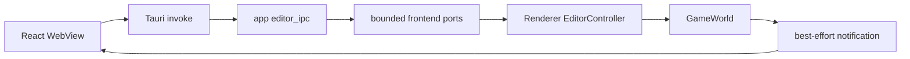

# Editor Boundary 与 Consistency

> 类型：设计文档。本文定义 WebView、Tauri、Renderer controller 和 GameWorld 之间的权威状态与消息边界。

## 状态权威

`GameWorld`/`SceneStore` 是 CPU scene、material、sky、light 和 instance 的唯一权威。WebView 只保存可丢弃的展示投影；Renderer selection 是 CPU handle 语义，不是 GPU slot。

Editor protocol 不拥有 scene，不缓存长期 snapshot，也不把本机 `PathBuf` 或 Vulkan 类型暴露给通用 DTO。

## 请求与响应

Query 读取当前权威状态；Command 请求 CPU mutation；Response 只对应当前 invoke；Notification 只做 best-effort 提示。

每个 request 使用独立 oneshot reply，避免共享 response queue。`scene_version` 是 SceneStore 的单调版本，用于 WebView 丢弃过期分页或材质查询结果；它不等价于 frame id、GPU revision 或 notification 数量。

ID 是带 generation 的 opaque handle，WebView 不能解析 index，也不能混用 Instance、Mesh、Material 和 Texture identity。删除或 generation 失效后由 World 返回 stale/not-found。

## 背压

App 到 Renderer 使用有界 request inbox；Renderer 到 App 使用有界 notification outbox。RenderThread 每帧按预算处理请求，不等待 Tauri 或 WebView。

队列满、timeout、Renderer 关闭和 notification 丢失分别是边界事件。Notification 丢失不破坏权威状态，WebView 通过查询、version 轮询或刷新恢复。

具体容量属于当前实现细节，不作为设计不变量；不能因为扩大容量而引入 RenderThread 阻塞。

## 编辑与恢复

Renderer controller 将 DTO handle 还原为强类型 World handle，校验成功后才提交 CPU mutation。失败不会推进 scene version。

WebView 的草稿 revision 用于区分本地未确认输入和服务器回包；过期 response 不能覆盖新草稿。查询不能自动清除仍有效的 validation error。

selection 由 Renderer 在 after_prepare 取得 GPU raycast 结果后更新，并发送通知；WebView 同时保留主动查询，避免通知丢失导致永久过期。

## 特权命令

HDRI 文件选择通过 Tauri dialog 产生本地 PathBuf，经独立有界 desktop command 进入 RenderThread。通用 Editor DTO 只返回文件名和 accepted/cancelled/error。

accepted 只表示 GameWorld 接受 CPU 请求，不表示 decode、GPU upload、sky distribution 或最终画面完成。

## 生命周期

关闭时 App 先拒绝新 invoke/dialog，再让 Renderer 清空 request receiver，随后执行 Renderer/Runtime/Vulkan shutdown。未处理 oneshot 因 sender drop 结束；通知 dispatcher 最后停止。

Tauri notification task 不访问 GameWorld 或 Vulkan。WebView 退出不改变 RenderThread 的资源销毁 owner。

## 设计不变量

- WebView 是投影，不是 scene authority。
- Editor protocol 不依赖 World、Runtime 或 GPU 类型。
- request reply、notification、CPU acceptance 和 GPU completion 语义分离。
- Renderer controller 是 DTO 到 World API 的唯一适配点。
- 任何背压策略都不能阻塞 RenderThread、Tauri main thread 或持有 desktop resource lock。

## 实现入口

- [`editor_ipc.rs`](../../app/truvis-app/src/editor_ipc.rs)
- [`editor_controller.rs`](../../renderer/truvis-renderer/src/editor_controller.rs)
- [`truvis-editor-bridge`](../../renderer/editor/truvis-editor-bridge/src/)
- [`app/editor/README.md`](../../app/editor/README.md)

## 一致性模型

WebView 不要求每个 notification 都到达，而要求下一次 query 能从 World 重建正确投影。notification 的职责是降低可见延迟，不是传输完整变更日志。

分页和详情查询携带 scene version 时，页面必须丢弃跨版本的拼接结果，并从权威第一页恢复。不同 query 不保证来自同一个原子快照，页面不能把多次 response 拼成未验证的事务。

## 错误边界

DTO 解码错误、业务校验失败、queue busy、timeout、Renderer shutdown 和 GPU upload 未完成是不同错误类别。controller 应保留领域错误语义，App 只负责 transport 映射。

accepted 结果只能确认指定 owner 已接收请求；如果用户界面需要显示“可见”，必须等待后续 query、notification 或渲染状态，而不能复用 accepted 字段。

## 变更检查

- 新 query/command 是否有明确 owner？
- DTO 是否携带内部 GPU 或平台句柄？
- response 是否能被过期草稿覆盖？
- notification 丢失后是否可以 query 恢复？
- queue 满和 shutdown 是否可观察？
- Tauri 权限是否仍只授予需要的 WebView 能力？

## 非目标

本文不定义 Web UI 组件结构、不保存产品文案、不把 mock 页面当作真实 Renderer E2E 验收。

## 证据边界

协议编译通过只能证明 DTO 形状一致；真实请求还需要检查 RenderThread 是否运行、World 校验是否通过，以及后续 scene sync 是否完成。
