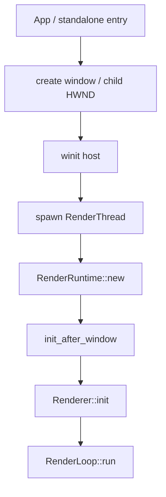
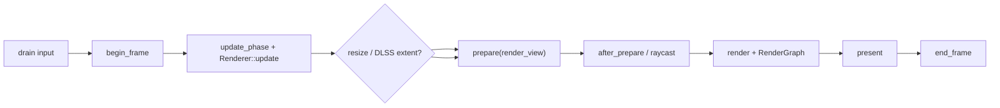

# 帧执行与窗口生命周期

> 类型：设计文档。本文描述 RenderLoop 如何把窗口、Runtime 和 Renderer 组织成完整运行周期。

## 启动路径



窗口宿主负责创建和保持窗口 owner；RenderThread 在目标线程重建 raw handle 并创建 Vulkan 对象。embedded viewport 等待第一个非零物理尺寸后才启动 Runtime，避免首帧用占位 extent。

Runtime 无窗口地创建 root state；`init_after_window` 才创建 surface、swapchain 和 present 相关对象。Renderer 子系统在拿到真实 frame state 后创建自己的窗口尺寸 target。

## 单帧顺序



`RenderLoop` 在每帧开始先合并输入和最新窗口尺寸，再进入 Runtime 阶段。输入和 resize 的安全点位于限帧等待之前，确保窗口关闭或尺寸变化不会被 spin/park 阻塞。

### 无 present target

窗口最小化、swapchain 暂不可用或尺寸为零时，Runtime 可能没有可提交的 present target。此时仍执行必要的控制状态检查和资源安全处理，但跳过 `prepare`、raycast、render 和 present，使用 timeline 补齐当前帧后进入 `end_frame`。

无 present target 不代表 Runtime 已关闭，也不等价于 GPU 工作完成；它只表示本帧没有可显示的 swapchain image。

## 软件限帧

默认 FrameTiming 以最小帧间隔限制 CPU 帧开始频率。剩余时间大于 1 ms 时使用短暂 park，最后 1 ms 使用有界 spin。spin 完成后返回外层循环，重新检查输入、resize 和退出状态。

软件限帧与 Vulkan present mode 分离。MAILBOX 或 fallback 只影响 present queue 行为，不改变 Runtime 的 phase 顺序和 CPU 帧节奏。

## Resize

resize 只在 RenderLoop 安全点处理。Runtime 重建 swapchain/present 状态并返回 `RenderRuntimeResizeCtx`；Renderer 再依次通知 realtime、offline、GUI、selection outline 等 owner 重建窗口尺寸资源。

窗口尺寸变化不进入 CPU scene，也不通过 Editor DTO 传播。DOM rect 由 App 交给平台 host，winit 的 `WM_SIZE`/WindowEvent 路径最终进入 RenderLoop。

## 关闭顺序

```text
停止接收新请求
-> Renderer::shutdown
-> RenderRuntime::wait_idle / destroy
-> RenderThread 完成并发布状态
-> window host 销毁 child HWND
-> App 停止通知 dispatcher
-> parent/WebView 退出
```

RenderLoop 必须先让 Renderer 释放自身资源，再让 Runtime 销毁 `Gfx` root owner。窗口 owner 只有在 RenderThread 退出后才能释放 child HWND。

## 设计不变量

- 初始化、resize、render 和 shutdown 都在 RenderThread 的 Vulkan 生命周期内完成。
- 每帧 phase 顺序固定，Renderer 只能在 hook 内组织自己的行为。
- present 成功不代表后续 frame timeline 已完成；timeline 完成也不代表 WebView 已收到通知。
- 无 present target 时不执行依赖 swapchain image 的渲染阶段。
- 关闭路径先阻止新请求，再释放 GPU 和窗口资源。

## 实现入口

- [`render_loop`](../../engine/e50-render-loop/truvis-render-loop/src/render_loop.rs)
- [`truvis-render-thread`](../../engine/e60-platform/truvis-render-thread/README.md)
- [`truvis-winit-host`](../../engine/e60-platform/truvis-winit-host/README.md)

## 事件语义

以下事件必须分开理解：

- request accepted：CPU owner 接受了一个命令。
- command submitted：GPU queue 接受 command buffer。
- timeline complete：对应 GPU 工作达到可回收边界。
- present queued：present queue 收到 swapchain image。
- frame visible：窗口实际显示结果。

它们之间没有自动的一一对应关系。文档、日志和 UI 状态不得把前一个事件当成后一个事件的证明。

## 窗口与 Runtime

窗口 host 只负责几何、输入和句柄生命周期；Runtime 只负责 Vulkan surface、swapchain、帧状态和渲染阶段。DOM rect 不能直接改变 RenderGraph 或 scene data。

窗口最小化是可恢复的无 present target 状态。窗口销毁是不可恢复的 shutdown 状态；两者必须由不同控制路径处理。

## 变更检查

- 新增入口是否仍在 RenderThread 创建 Vulkan？
- 首帧 extent 是否来自真实窗口？
- resize 是否只在安全点传播？
- 无 present target 是否跳过所有 image 依赖？
- 关闭时是否先停止新请求？
- frame timing 是否仍在输入和退出检查之后生效？

修改帧顺序后应做静态调用链检查，并根据影响范围运行 workspace check；不把成功启动等同于真实窗口或 GPU 画面验收。

## 非目标

本文不规定操作系统窗口 API 的所有细节，不记录平台临时 workaround，也不描述某个 Renderer 的 pass 内容。
