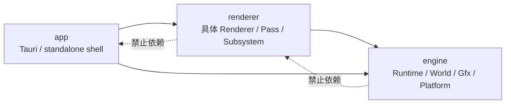

# 分层与依赖边界

> 类型：设计文档。本文记录长期分层方向、依赖不变量和跨层职责；当前实现入口以代码和模块 README 为准。

## 设计目标

Truvis 采用 `app -> renderer -> engine` 的单向依赖。上层组合产品能力，下层提供可复用的运行时能力。

分层的目的不是按目录平均分配代码，而是让所有权、生命周期和平台依赖有稳定的落点。跨层调用必须经过该层公开的窄接口，不通过反向引用内部类型建立快捷路径。

## Engine 层

Engine 提供与产品无关的能力：

- `RenderRuntime` 聚合 `Gfx`、CPU `GameWorld`、GPU `RenderWorld`、资源绑定、帧同步和 present。
- `RenderLoop` 固定帧顺序，驱动 `Renderer` hook，但不发现或管理具体 Renderer 子系统。
- `truvis-world` 保存 CPU scene 与资源身份；它不拥有 Vulkan 对象。
- `truvis-gfx`、RenderGraph 和 platform host 提供底层设备、窗口与同步能力。
- RenderThread 是 Vulkan 对象的创建、使用和销毁边界。

Engine 不知道 Tauri、Editor DTO、具体产品 overlay 或某个 Renderer 的 pass 顺序。

## Renderer 层

Renderer 负责产品或 sample 的业务组合：

- 持有 camera、input、selection、overlay 和具体 subsystem。
- 在生命周期 hook 中显式创建、resize 和销毁自己拥有的 GPU 资源。
- 在 render hook 中决定 RenderGraph 的 pass 顺序。
- 通过 Runtime 提供的 typed context 访问 CPU world 和已准备好的 GPU scene。

Renderer 可以依赖 Engine 的公开类型，但 Engine 不反向依赖 Renderer。`SubsystemLifecycle` 只描述长生命周期资源能力，不把输入、更新和 pass 顺序交给运行时注册表。

## App 层

App 是启动壳和产品接入层：

- Tauri invoke、emit、WebView、dialog、capabilities 只存在 App。
- standalone sample 负责窗口入口和命令行配置，不把窗口策略下沉到通用 Renderer。
- App 可以创建 Renderer ports，并把 Renderer 侧 ports 移交给 RenderThread。
- App 不访问 Vulkan、`ash` 或 RenderWorld 内部状态。

App 与 Engine 的直接依赖只用于启动和平台宿主，不能借此绕过 Renderer 的业务边界。

## 依赖与数据方向

CPU scene 的权威方向是 `GameWorld -> prepare -> RenderWorld -> RenderGraph`。Renderer 可以提交 CPU mutation，但不能把自己的缓存提升为第二份 scene 权威。

跨层数据应优先使用：

- Runtime 的 typed Ctx；
- transport-neutral 的 ports；
- 明确的 DTO 或只读 view；
- owner 提供的 trait 能力。

不得通过全局单例、跨层内部模块引用或长期保存完整 Runtime 借用来规避边界。

## 设计不变量

- `renderer -> app` 和 `engine -> renderer` 永久禁止。
- CPU scene 只有一个权威 owner；GPU scene 是派生状态。
- Vulkan 对象只在 RenderThread 创建、使用和销毁。
- Renderer 的 pass 顺序由 Renderer 显式决定。
- 平台消息和产品协议不能进入通用 Engine API。
- 依赖方向变化必须同时更新架构文档和对应模块 README。

## 实现入口

- [`RenderRuntime`](../../engine/e40-render/truvis-render-runtime/src/render_runtime.rs)
- [`RenderLoop`](../../engine/e50-render-loop/truvis-render-loop/src/render_loop.rs)
- [`Renderer` trait](../../engine/e50-render-loop/truvis-render-loop/src/renderer.rs)
- [`renderer/truvis-renderer`](../../renderer/truvis-renderer/README.md)
- [`app/editor`](../../app/editor/README.md)

具体模块边界变化时，先核对 Cargo 依赖和线程 owner，再修改本文；本文不承载一次性迁移步骤。

## 变化判断

新增能力先判断它属于启动壳、具体 Renderer 还是通用 Runtime。只要一个类型同时保存平台句柄、产品状态和 GPU owner，就应先拆分职责，而不是把它放入最方便调用的 crate。

跨层 API 评审至少检查调用方向、状态 owner、线程归属和销毁顺序。一个接口即使只返回只读数据，也不能因此忽略它携带的生命周期和线程约束。

共享能力优先下沉到已有 owner；只有当多个上层确实共享同一语义时，才在 Engine 增加抽象。产品特例留在 Renderer，不为了复用少量代码扩大 Runtime API。

## 非目标

本文不规定具体模块的文件布局、不记录一次性迁移步骤，也不替代 Cargo manifest、Shader package manifest 或 CMake 配置。

当目录名称与依赖事实不一致时，以代码和构建配置为准，并在对应模块 README 记录差异。架构图只能说明允许的方向，不能证明某个调用已经在运行时验证。

## 变更检查

- 是否新增反向依赖或隐藏的全局访问？
- 新状态由哪个 owner 创建、更新和销毁？
- 是否跨越了 RenderThread 或 WebView 线程边界？
- 是否需要更新 typed Ctx、ports 或 DTO？
- 是否改变 CPU scene 与 GPU scene 的权威关系？
- 是否需要补充模块 README 和本目录导航？

架构改动完成后运行依赖检查、相关 crate 的静态构建检查和文档链接检查；不把这些检查当作 GPU 或产品窗口验收。
