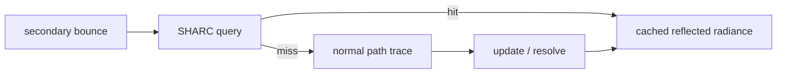

# Radiance Cache 与 Realtime Debug

> 类型：设计文档。本文只承载 SHARC world-space cache 和相关观测边界；RT 主积分契约见 [realtime-raytracing-sampling.md](realtime-raytracing-sampling.md)。

## SHARC 定位

SHARC 是 realtime Renderer-owned 的世界空间 radiance cache。它保存可供后续 bounce 查询的反射 radiance，不是 CPU scene、RenderWorld scene root 或 DLSS history 的替代品。

缓存的 world-space 粒度由 scene scale 和 level policy 决定；position bias 只用于稳定 hash cell 边界，不能作为 ray surface offset。

## 模式

- `Off`：不维护、不查询，画面不应依赖 cache。
- `Update`：执行 update/resolve 维护，但不查询；用于观察 cache 是否能稳定生成。
- `On`：维护并允许非 primary bounce 查询，命中后提前结束该 bounce 的普通追踪。

模式属于 realtime subsystem state，不进入 `DlssOptions`、`DlssSrState` 或 Runtime frame extent。

## 生命周期

SHARC targets 由 Renderer-owned subsystem 持有，属于世界空间持久资源，不按 render extent 或 FIF label 轮转。创建新 scene/runtime 时初始化历史；当前不承诺运行时单位切换或完整场景 reload 的通用失效语义。

当 cache 参数、scene identity 或资源尺寸变化时，必须由 subsystem 决定清理或拒绝旧历史。Runtime 只提供通用资源、phase 和 shutdown Ctx。

## 数据边界

cache query 前已经考虑本地 emission；cache 中只存反射 radiance，避免同一 emission 重复累加。throughput 与 AO 语义不写入 cache 作为隐式衰减。

cache 不参与 ReSTIR reservoir history，也不改变 GBuffer、DLSS motion vector、present target 或 RenderGraph 的资源 owner。

## Debug 语义

debug channel 必须说明它观测的是哪一个阶段：surface event、普通 NEE、ReSTIR reservoir、cache update、cache query 或最终输出。

旧 magic number、未声明的 shader 输出和“看起来像 accum”的值不能作为长期 UI 契约。新增 debug 通道时，先定义数据来源、颜色/数值范围、是否跨帧以及是否受 reset 影响。

普通 RT debug channel 由 realtime subsystem 持有；Hello Triangle、ShaderToy 不显示 path tracing 专属 controls。

## 与 Runtime 的边界

Runtime 负责 frame timing、GPU resource registry、FIF 和 RenderGraph context；Renderer subsystem 负责 SHARC buffer、算法状态、mode 和 debug selection。

Runtime shutdown 前，Renderer 必须先释放 SHARC pipeline、buffer 和 descriptor。RenderGraph 只导入当前 pass 需要的 cache view，不延长 cache owner 生命周期。

## 设计不变量

- SHARC 是优化/近似缓存，不是 scene authority。
- cache hit 不改变 primary output 和 DLSS input 语义。
- cache mode 和 cache history 不混入 Runtime 配置或 DLSS history。
- debug 输出必须有稳定观测语义，不能复用无定义的旧通道。
- cache 资源遵守 Renderer-owned 创建、resize（如有）和 shutdown 顺序。

## 实现入口

- [`renderer_rendering/realtime`](../../renderer/renderer-rendering/src/realtime/mod.rs)
- [`realtime shader`](../../renderer/shader/lib/renderer/realtime_rt/)
- [`render configuration`](render-configuration-and-temporal-state.md)
- [`resource lifecycle`](resource-lifecycle-and-destruction.md)

## Cache 失效

cache 的 scene scale、资源拓扑、单位约定和 shader ABI 必须保持一致。发生完整场景重载、单位切换或 cache layout 变化时，旧 history 只能在有明确失效证据时复用。

查询命中必须经过当前材质、法线、距离或其他 guard；cache 不能因为命中就绕过当前 frame 的必要可见性约束。

## Debug 变更

增加 debug mode 时同时定义：数据写入阶段、数值范围、颜色映射、是否受 temporal reset 影响，以及关闭该 mode 是否改变主路径。

如果 debug 资源只服务观察，不应进入长期 public ABI；如果 shader、Rust 和 UI 共享该通道，必须把 enum、binding 和 owner 一起更新。

## 变更检查

- cache 是否仍由 Renderer subsystem 拥有？
- cache buffer 是否错误地按 FIF 或 render extent 分配？
- update、resolve、query 的顺序是否清楚？
- 命中是否改变 primary、DLSS 或 ReSTIR 语义？
- debug channel 是否与普通 NEE 观测混淆？

## 非目标

本文不定义 cache 命中率、画质指标或 GPU 性能阈值；这些需要单独的运行时实验和图像验证。

## 证据边界

shader 编译和 graph 录制只能证明 cache 路径可生成命令；命中稳定性、噪声和性能仍需要实际 GPU 场景验证，不能从静态文档推断。

SHARC 的 cache query、update 和 resolve 仍属于同一个 Renderer subsystem 的状态机；它们不能被不同 subsystem 各自实现一半。

未来若需要运行时 scene reload，应把 cache invalidation 作为显式状态转换记录在 owner 中，而不是依赖资源 Drop 的偶然顺序。
该失效动作必须可被 debug 日志和 shutdown 顺序清楚区分。
