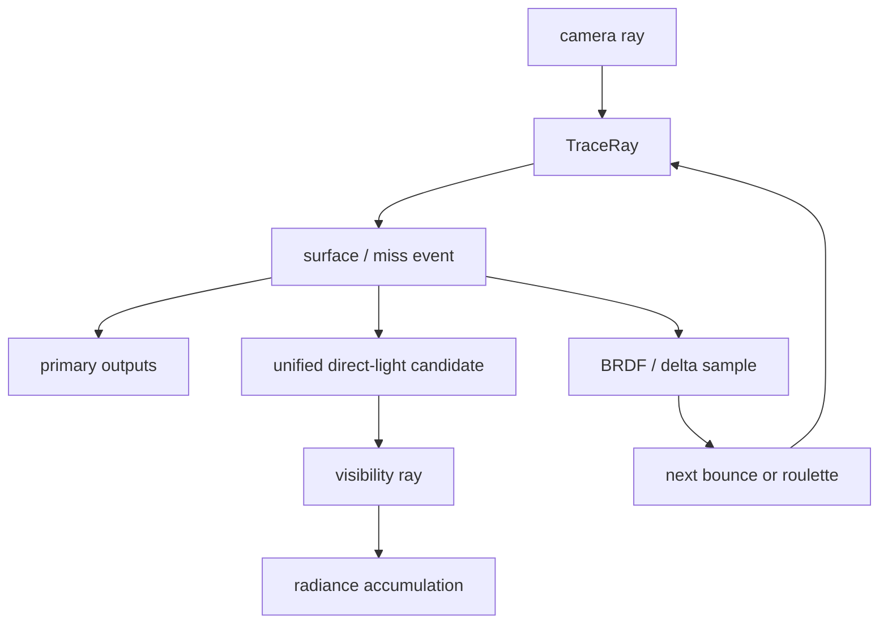

# Realtime Ray Tracing Sampling

> 类型：设计文档。本文记录 realtime RT 的积分、直接光候选和历史复用边界；具体 shader 字段以 ABI 为准。

## 责任边界

raygen 推进 path state 和 bounce 顺序；closest-hit/miss 只整理命中事件。材质求值、直接光、MIS、debug 输出和最终写入由 raygen helper 组合。



Realtime 和 Offline 共享 surface/material 语义，但各自拥有 pass-local mode 和 temporal state。

## Bounce 顺序

一次 trace 返回一个事件。raygen 的语义顺序是：

1. miss sky 时累加环境 radiance 并结束路径；
2. 第一次 hit/miss 写 GBuffer、motion vector 和 DLSS 输入；
3. 累加本地 emission；
4. 对非 delta surface 生成直接光候选；
5. 采样 BRDF 或 transmission，更新 throughput 与 PDF；
6. 在满足条件时执行 Russian roulette；
7. 继续下一 bounce 或输出累计 radiance。

primary 输出只写一次，后续 bounce 不能覆盖 camera primary 的深度、normal 或 motion vector。

## 统一 Light Candidate

HDRI、emissive triangle 和 analytic light 进入同一候选抽样入口。candidate 至少表达方向、距离、radiance、solid-angle PDF 和 shadow ray。

class 选择概率必须乘入对外 PDF，使 `P(class) * P(sample | class)` 与 BRDF PDF 处于相同 solid-angle 度量。visibility 只判断遮挡，不执行普通 closest-hit shading；alpha mask 仍使用与材质路径一致的 alpha test。

候选 shade 统一遵循：

```text
path_throughput * light_radiance * BRDF_cos / light_pdf * MIS
```

analytic light 当前使用固定 `MIS = 1`，因为它没有完整的 BRDF-hit 竞争估计器。

## 材质与坐标

MaterialAccess 统一 UV 集、纹理变换、sampler、色彩空间和 fallback。base color、metallic/roughness、normal、emissive 的 factor 与 texture 只组合一次。

surface origin offset、shadow ray TMax、RT TMin/TMax 和 SHARC position bias 是不同语义，不能用同一个 epsilon 替代。世界量纲和 PDF 度量必须保持一致。

throughput 只传播 BSDF 等实际积分权重，不把 AO 或 debug 值混入 path state。emissive hit 与 emissive NEE 使用相同 light PDF 语义，避免 MIS 概率不闭合。

## ReSTIR DI

ReSTIR DI 只服务 camera primary visible surface；secondary bounce 继续走普通统一 NEE。

```text
path phase -> initial reservoir
-> temporal reuse -> spatial reuse
-> final visibility + current target
-> primary direct contribution
```

surface key、motion、depth、normal、roughness、base color 和 metallic 用于 history rejection。最终阶段在当前 surface 上重建 candidate 并重新 trace visibility，不复用历史 visibility。

resize、mode、sky/emissive/analytic version 变化会阻止旧 reservoir 继续复用。ReSTIR debug channel 只表达 ReSTIR 结果，不反向污染普通 NEE debug channel。

## Debug 边界

surface-only debug 可以在当前事件后早退，减少不必要 path。`NeeHdri`、`NeeEmissive`、`NeeAnalytic` 描述普通 NEE 观测；ReSTIR final contribution 使用独立语义。

debug mode、sky brightness 和 NEE 开关是 pass-local 控制，不改变 Runtime-owned target 尺寸、DLSS feature 或 RenderWorld asset sync。

## 设计不变量

- primary 输出、直接光和后续 bounce 使用明确的生命周期顺序。
- 所有直接光 PDF 对外使用 solid angle 度量。
- candidate 的 light-side radiance 不包含 BRDF、cos、MIS 或 path throughput。
- ReSTIR 只替换 primary direct lighting，不改变 secondary NEE 契约。
- 共享材质求值不能在 RT、raster、raycast 路径各自维护一份规则。

## 实现入口

- [`raygen.slang`](../../renderer/shader/entry/renderer/realtime_rt/raygen.slang)
- [`raygen_direct_lighting.slangi`](../../renderer/shader/lib/renderer/realtime_rt/raygen_direct_lighting.slangi)
- [`restir_di.slangi`](../../renderer/shader/lib/renderer/realtime_rt/restir_di.slangi)
- [`surface_hit.slangi`](../../renderer/shader/lib/renderer/realtime_rt/surface_hit.slangi)

## Sky 与 emissive

HDRI importance distribution、uniform sphere fallback 和真实 sky image readiness 属于 sky resource owner；shader 采样和 PDF 查询必须读取同一 distribution 语义。

emissive triangle table 由 RenderWorld 在 prepare 产出 active render data 后构建。alias table 只包含有效面积和正 power record；材质变化、mesh readiness、instance transform 或绑定变化必须使 table 重新准备。

emissive hit 的 light PDF 通过 instance、geometry、primitive identity 反查 table；它与 NEE candidate 使用同一 class probability，避免 BRDF-hit 竞争概率缺失。

## 结果边界

RT 输出的 HDR、GBuffer、motion vector、debug channel 和最终 SDR 是不同结果。某一 debug channel 的数值不应被当作最终 radiance 或 accumulation history。

analytic light v1 的 `MIS = 1` 是当前明确的设计限制；若以后加入 BRDF-hit 竞争，应作为 PDF/MIS 契约变化处理，而不是只增加一个 UI 开关。

## 变更检查

- 新 light class 是否能表达 solid-angle PDF？
- candidate 是否把 class probability 乘入 PDF？
- visibility 是否保持 alpha-test 语义？
- primary 与 secondary 路径是否误用同一 history？
- 新 debug 输出是否定义观测阶段？

## 非目标

本文不复制每个 shader helper 的字段和常量，不描述离线 sample count UI，也不把目前的有限 RT 路径宣传为完整物理渲染规范。
