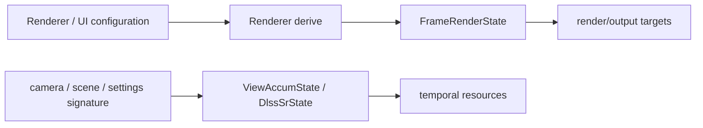

# Render Configuration 与 Temporal State

> 类型：设计文档。本文区分用户配置、Runtime 派生帧状态和渲染历史，避免把三者合并为一个 settings 对象。

## 三类状态



- 配置表达用户或启动参数，希望采用什么模式。
- `FrameRenderState` 根据窗口、设备和配置推导当前尺寸与格式。
- temporal state 保存历史匹配、jitter、reset 和跨帧资源，不是配置本身。

## Runtime 配置

`DlssOptions`、effective DLSS mode、能力查询和 optimal extent 由 `TruvisRenderer` 持有。`DlssSrMode` 决定 native、DLAA 或 SR render extent；RR 是否启用由独立选项决定。Streamline 仍由 Engine/Gfx 默认初始化。

DLSS 的 Streamline options 由 `TruvisDlssState` 统一提交：SR options 在 mode/resize 生效边界设置，
RR options 还包含逐帧相机矩阵，因此在 `frame_input` 确定当前 view 后每帧更新。更新矩阵不释放 feature，
也不重置 temporal history。

requested 配置保留用户选择，effective 配置统一决定实际模式和内部尺寸；Offline 强制 native，
返回 Realtime 后恢复受设备能力约束的用户选择，不在 Renderer 各生命周期入口重复覆盖尺寸。
update 派生目标尺寸：尺寸变化只提交请求，由随后 Runtime 的 idle/resize 边界统一释放旧 feature、
提交 SR options 并 reset history；尺寸不变但配置改变时才在 update 的 idle 边界完成这些操作。
输出尺寸变化由现有 resize 回调处理，不另存一份已配置输出尺寸或 pending 状态。

SR/RR options 提交失败通过 `StreamlineError` 向上传播，在 Renderer hook 边界以带阶段信息的
`expect` 终止当前渲染执行路径，不继续 evaluate，也不增加自动回退或重试。optimal-settings 查询
与资源释放仍沿用已有错误策略。逐帧 snapshot 保留 prepare 使用的 jitter 和 view，避免
after_prepare 的 history reset 改写本帧已上传输入。

binding wrapper 使用同一 frame token 提交 constants、resource tags 和 `slEvaluateFeature`。
当前 Streamline 2.14.1 的 SR/RR `slAllocateResources` 内部构造 `EventData{viewport, 0}`，无法读取
当前帧 tags，因此不用于此路径；feature 由当前帧 evaluate 创建。源码依据是 SDK 的
`source/plugins/sl.dlss/dlssEntry.cpp` 与 `source/plugins/sl.dlss_d/dlss_dEntry.cpp`。
Renderer 在 update、resize 和 shutdown 的 GPU idle 边界释放旧 feature，Runtime 不理解 DLSS API，
也不为 Streamline 私有资源插入应用侧 barrier。此生命周期约束不等于验证了 NGX 内部 GPU 同步。

`DefaultRenderRuntimeSettings` 只描述 Runtime 初始化策略，例如默认 FPS 上限、surface/present mode 和 depth format 候选。Renderer 不应依赖设备必然选择某个格式。

## FrameRenderState

`FrameRenderState` 由 Runtime 保存并应用 Renderer 提交的内部尺寸请求：

- `render_extent`：RT、GBuffer、motion vector、DLSS input 的内部尺寸。
- `output_extent`：swapchain、GUI、present 和 DLSS output 的尺寸。
- HDR color 与 depth format：窗口 target 和 attachment 的格式契约。

Renderer/subsystem 只读取该 state，并在 init/resize 时提交自身 target 所需的 render extent。

## Temporal state

`DlssSrState` 保存 DLSS evaluate 所需的 jitter、previous view、common constants 和 reset 标记。`ViewAccumState` 保存 main view 的历史签名和稳定帧计数。两者都由 `TruvisRenderer` 管理。

相机 previous 对齐上一实际提交的主视图，prepare 只生成本帧 view/constants 与候选 jitter。
主视图 submit 正常返回后才推进相机和 jitter；无主视图提交释放本帧准备数据并保留历史。
普通 DLSS reset 请求不清空相机/实例运动历史或修改已上传 jitter；初始化、模式/尺寸重配置
在 prepare 前重启 jitter，但仍保留上一提交相机。

Runtime 只在尺寸和 scene/lighting 语义变化时发出通用 history invalidation；`TruvisRenderer` 再分别通知 DLSS、ViewAccum 和 ReSTIR。reset 是“下一次 evaluate 不使用旧 history”的语义，不等价于立刻清除所有图像。

Realtime ReSTIR reservoir、SHARC cache、offline accumulation 属于对应 Renderer subsystem 的 temporal resources，不进入 `DlssOptions` 或 `DlssSrState`。

## Renderer 配置

`PathTracingCommonSettings` 保存 realtime/offline 共享的 sky sampling、NEE 和 post process 参数；Realtime 和 Offline 各自保存 debug channel、ReSTIR/SHARC mode 或 ray dispatch count。

同一语义只保留一个 owner：共享参数不在 realtime/offline 两个 subsystem 内各存一份，避免 UI 切换造成状态分叉。

### SDR 显示与曝光

`TruvisRenderer` 唯一持有 `SdrPostProcess`，Realtime/Offline 提供本帧 HDR 输入和各自 SDR target。
`SdrPostProcessSettings` 保存曝光、Color Grading、AgX/ACES fitted/PBR Neutral/None 与 dithering 开关；固定 update 路径归一化参数。
默认 Khronos PBR Neutral、Manual、手动增益 0 stops、中性调色、dithering 开启；切换 Auto 后默认中心加权测光，自动补偿为 0 stops。
增益 stops 为正时提亮，不是物理相机 EV100。

测光使用曝光与 Color Grading 前的原始 linear sRGB/Rec.709 HDR，不包含 GUI/gizmo。256-bin log2 直方图覆盖
[-12,20]，跳过非有限 RGB 和非正亮度，范围外正亮度计入两端 bin。中心权重为
`clamp(round(16 * exp2(-2 * dot(p,p))), 1, 16)`，其中 `p=2*(pixel+0.5)/extent-1`；全屏权重为 1。
默认在加权 CDF 的 10%～90% 区间内按 bin 中心求平均 log 亮度，边界 bin 只贡献实际保留的权重。
该统计近似只影响显示测光，不裁剪或修改源 radiance。

目标自动增益为 `clamp(log2(0.18)-mean_log_luminance, min_ev, max_ev)`，默认范围 [-16,+16]。
Auto 显示倍率为 `exp2(current_auto_ev + auto_compensation_ev)`，Manual 为 `exp2(manual_ev)`。
Manual 不读取自动历史或补偿；切换模式保留各自参数，不折算增益。0.18 指显示变换前的中灰，不是屏幕编码值。
Realtime 在 stops 空间以 `1-exp(-dt/tau)` 适应，dt 限制为 [0,0.25] 秒，压暗/提亮时间常数默认为
0.25/1.0 秒。Offline 每批累积完成后直接采用该均值图的测光目标，不依赖墙钟时间。

曝光历史只存在于 Renderer-owned 1×1 RGBA32F image：x=当前自动增益，y=目标增益，z=有效标记，
w=等待下一次有效测光直接采用目标的标记。w 保证空直方图不会提前消耗 mode 切换的首次测光语义。
直方图使用单份 256×1 R32_UINT image；二者不按 FIF 独立轮转，通过同队列跨帧 image barrier 同步。

- 首次有效测光、重新进入 Auto、Realtime/Offline 切换后的首次有效测光直接采用目标。
- 锁定只冻结自动测光结果，用户补偿和显示曲线仍可调整；锁定期间不执行直方图计算。
- 相机普通移动、resize、DLSS mode/reset 不清空曝光历史；没有单独的 camera-cut 检测。
- 全黑/无有效样本保持已有值；没有历史时使用 0 stops。无 TLAS 的清屏分支不推进曝光。
- Manual 不执行测光。非 Final 通道冻结最后一次 Final 自动增益，返回 Final 后恢复所选模式。
- 曝光、Color Grading、曲线和 dithering 均不进入 Offline accumulation signature；线性 HDR 累积不受显示设置影响。

### Color Grading 与显示映射

顺序固定为曝光 → 白平衡 → Contrast → Shadows/Midtones/Highlights → Saturation → Tone Mapping。
`ColorGradingSettings` 只保存用户参数，白平衡矩阵与分区增益由关联方法在 SDR pass 录制时派生，
不保存第二份配置或派生历史。中性参数显式恒等，所有调色独立于所选 Tone Mapping。

- Temperature/Tint 默认 0、范围 [-100,100]，为相对偏移而非 Kelvin；正值分别偏暖、偏洋红。
- Contrast 默认 1、范围 [0.5,1.5]，以 linear Rec.709 亮度 0.18 为中心做 log 对比度，再等比例缩放 RGB。
- Shadows/Midtones/Highlights 默认 0、范围 [-2,2] stops；暗部在亮度 [0,0.3] 渐退、亮部在 [0.55,1] 渐入，
  中间调为剩余权重。一次计算权重后混合三个线性增益，不读取邻域、不抬升严格黑色；大幅调节不保证亮度排序。
- Saturation 默认 1、范围 [0,2]，使用当前 Rec.709 亮度与 RGB 的插值/外推；0 输出灰度。
- 白平衡后及饱和度后的负通道归零，非法值防护不代替 HDR 亮度压缩。没有广色域映射或摄影式细节恢复。
- 设置统一在 Renderer update 中归一化，非有限值恢复默认；更改调色不清空曝光历史。

白平衡与分区参考 Unity Graphics `03ca85dffdde4b7bc1d6870074e6f5ff9f0352a3`，
采用相同版本的 ColorUtils/Color.hlsl 参数与矩阵；对比度采用项目自定义亮度公式，
不复现 Unity 的 LogC/ACEScc 调色空间。来源入口见 renderer-rendering README。

Tone Mapping 提供固定的 ACES fitted、AgX、Khronos PBR Neutral 与 None，不开放通用强度或曲线形状。
None 仍执行曝光、调色和 SDR 范围输出。数据可视化通道整体绕过该显示流程；radiance 通道共享调色，
但只有 Final 更新原始 HDR 测光，因此调色不会被自动曝光反向抵消。

不引入 pre-exposure、Local Exposure、物理相机标定或 HDR 显示。DLSS 输入 radiance、固定 exposure tag
及 pre/exposure scale 保持原契约。实时眼适应与 DLSS 内部曝光处理是不同职责。

配置合法性由设置 owner 定义，并在 Renderer 固定 update 路径归一化，不能依赖窗口、tab 或控件是否可见。
UI 只在用户操作时修改配置；Offline debug 候选判定由 `OfflineRenderSettings` 同时提供给控件过滤和归一化。
Debug Image 选择同样由 Renderer 每帧归一化。单纯切页或折叠窗口不改变渲染配置、selection、图像输出或 temporal history。

配置变化的生效路径是：

```text
UI / startup option
-> Renderer state
-> update phase
-> Runtime derives frame state
-> optional resize / history reset
-> next prepare + render graph
```

## 非配置内容

`FrameLabel`、per-frame UBO、RenderGraph image state、resource handle 和 present image wrapper 都是运行时数据或资源视图，不表达渲染策略。

把这些对象暴露成用户配置会混淆 slot、同步和质量策略，也会使历史 reset 责任无法定位。

## 设计不变量

- 配置、派生 frame state 和 temporal history 分层保存。
- 任何尺寸变化必须经过 Runtime derive 和 resize context。
- DLSS history 不能与 Renderer 私有 accumulation history 混用。
- shared setting 只有一个语义 owner。
- mode 切换的资源释放必须满足 GPU 完成条件。
- DLSS options 只有 `TruvisDlssState` 一个 owner；pass 只提交当前帧 tags、constants 和 evaluate。
- constants、tags 和 evaluate 必须使用同一 frame token；RR 相机矩阵必须来自同帧 view。

## 实现入口

- [`dlss.rs`](../../renderer/truvis-renderer/src/dlss.rs)
- [`dlss_options.rs`](../../renderer/renderer-render-passes/src/post_process/dlss_options.rs)
- [`dlss_sr_state.rs`](../../renderer/renderer-render-passes/src/post_process/dlss_sr_state.rs)
- [`frame_state.rs`](../../engine/e40-render/truvis-render-runtime/src/state/frame_state.rs)
- [`view_accum.rs`](../../renderer/truvis-renderer/src/view_accum.rs)

## Reset 与生效边界

配置改变先进入 Renderer/Runtime state，再由固定 phase 收敛。UI 修改不会直接重建 Vulkan target；resize 和 feature resource 释放必须在 Runtime 的生效点处理。

历史 reset 只清除“不应被下一次 evaluate 使用”的资格。它不表示 CPU scene 被回滚，也不保证所有旧 image 立即物理清零。

如果一个设置同时影响 render extent 和 temporal history，先派生 frame state，再通知 Renderer resize，最后在同一生效路径请求 history reset，避免两者观察到不同配置。

## 变更检查

- 这个字段是策略、派生状态还是历史？
- owner 是否唯一？
- mode 变化是否需要 resize？
- 是否需要等待 GPU 后释放 feature resource？
- reset 是否覆盖 resize、camera、scene 和 lighting 变化？
- UI 是否只展示当前 Renderer 支持的配置？

## 非目标

本文不承诺所有 Renderer 都支持 DLSS、ReSTIR 或 SHARC，也不把启动环境变量视为稳定的公共配置 API。

## 环境倍率与光照历史

环境启用和 brightness 由 World 的 SceneSkyState 唯一持有；ImGui 与 Web 均通过 World API 编辑。
RenderSceneView 暴露当前 FIF 的有效倍率，实时/离线填写已有 sky_brightness shader 参数。
离线签名保存 Sky 语义 revision 和 distribution 发布版本；ReSTIR CPU 比较 Sky revision，shader 继续检查发布版本。
Runtime 在 prepare 发现灯光语义或环境变化后发出通用 history invalidation；Renderer 在 render 前分别
失效 DLSS、ViewAccum 和 ReSTIR，不能把每 FIF 灯光副本补传视为新的 CPU 编辑，也不能将 ViewAccum reset 等同于 DLSS reset。
