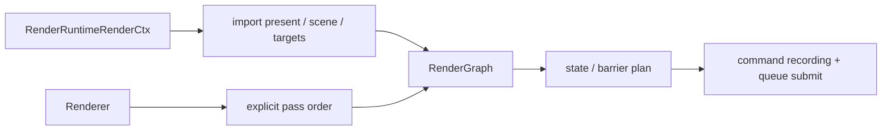

# RenderGraph 与帧内数据流

> 类型：设计文档。本文定义 RenderGraph 的资源声明、pass 顺序和提交边界，不描述具体 RT 算法。

## 机制定位

RenderGraph 是单帧内的资源访问和同步计划。它不拥有跨帧业务状态，也不替代 RenderRuntime、RenderWorld 或 Renderer 的资源 owner。



Runtime 提供当前 frame label、scene view、present image 和同步上下文；Renderer 按业务顺序把 subsystem pass 加入 graph。

## 资源职责

- swapchain image 和 present target 由 Runtime/Presenter owner 管理，graph 只借用当前帧访问。
- RenderWorld scene root、TLAS、draw cache 和 binding 由 Runtime/RenderWorld 管理，graph 只读取。
- realtime/offline target、selection mask、GUI target 由对应 Renderer subsystem 管理。
- graph 内 image state、usage、layout 和 barrier plan 属于本帧 graph，不是长期配置。

导入同一资源时必须保持唯一 owner 和明确的初始 state；graph adapter 不应复制 image/view 或延长 wrapper 生命周期。

## Pass 顺序

Renderer 负责显式决定顺序。典型路径是：

```text
scene / ray tracing or raster
-> primary outputs / resolve
-> denoise or temporal pass when enabled
-> DLSS / upscale when enabled
-> tone mapping / SDR
-> selection outline / light overlay / transform gizmo / coordinate gizmo / GUI
-> present
```

实际 pass 可能按 RenderMode 变化。顺序的设计依据是读写依赖和最终输出契约，不是 subsystem 注册顺序。

RT、raster 和 GUI 可以共享 scene view，但不能把“加入 graph”理解为资源所有权转移。每个 pass 只声明自己需要的读写范围。

灯光 overlay 在两种 RenderMode 的主图 resolve 后使用同一编排入口。图标和线框仅对
present image 声明 COLOR_ATTACHMENT_READ_WRITE，不读取深度、不写累计历史。
投影和 CPU 命中共用最终 viewport 物理像素快照，辅助线段裁剪 near plane 后才展开。
GPU vertex buffer 按 FIF 分开管理，只在当前 label 已等待完成后上传，pass 不自行提交。

## 状态推导

Graph compile 根据资源访问声明推导 image layout、access mask、stage 和 barrier。pass 不应手写依赖上一 pass 的偶然 layout；需要跨 graph 或跨帧的同步由 Runtime timeline、present semaphore 或资源 registry 负责。

present image 在 graph 中完成最终写入后交给 present queue。present queue 的等待关系由 Runtime/Presenter 设置，不能由 GUI pass 私自提交。

## 数据流边界

```text
GameWorld final state
-> RenderRuntime::prepare
-> RenderSceneView / per-frame data
-> Renderer::render
-> RenderGraph passes
-> queue submission
-> present
```

prepare 生成 GPU scene 快照；render 阶段不再修改 CPU scene。需要即时 GPU 结果的查询必须在 `after_prepare` 显式完成后再进入 render graph。

## 失败与当前边界

窗口尺寸为零或没有 acquired image 时跳过依赖 present 的 graph。资源未 ready 时由 RenderWorld 提供 fallback 或跳过对应 draw；graph 不负责 asset decode 和 readiness policy。

transient image/buffer aliasing 不是当前架构的默认资源类别。新增 transient owner 时必须补充生命周期、alias barrier 和 shutdown 契约，而不能只扩展 graph API。

## 设计不变量

- Renderer 决定 pass 顺序，RenderLoop 不动态发现 pass。
- Graph 只描述单帧访问与同步，不拥有业务状态。
- 每个 imported resource 保持唯一长期 owner。
- prepare、queue submit、timeline complete、present 是不同事件。
- pass 不能绕过 graph 直接创建跨帧共享资源。

## 实现入口

- [`truvis-render-graph`](../../engine/e40-render/truvis-render-graph/README.md)
- [`renderer-rendering`](../../renderer/renderer-rendering/README.md)
- [`render_runtime_ctx.rs`](../../engine/e40-render/truvis-render-runtime/src/render_runtime_ctx.rs)
- [`selection_outline.rs`](../../renderer/renderer-render-passes/src/effects/selection_outline.rs)

## 资源访问原则

pass adapter 应在最靠近调用点声明资源用途，避免一个“万能 target”同时代表 color、depth、storage 和 present。这样 graph 才能推导准确的状态转换，也方便审查未使用的写入。

如果两个 pass 共享资源，文档应说明共享的是访问视图还是长期 owner。共享 view 不代表共享销毁责任。

## 调试与验证

Graph debug dump 适合检查 pass 顺序、resource state 和 barrier plan；它不能证明 shader 算法或最终像素正确。RenderGraph 编译通过也不替代 GPU validation。

新增 pass 时至少检查：输入资源是否在 prepare 后可见、输出是否被后续 pass消费、layout 是否由 graph 推导、queue ownership 是否有明确提交方。

## 变更检查

- pass 是否由正确的 Renderer 决定加入？
- 是否有重复 import 或隐式 image owner？
- graph 内是否混入跨帧状态？
- present image 是否只由 Presenter 提交？
- no-present 分支是否安全跳过？
- resize 后旧 target 是否脱离 graph？

## 非目标

本文不规定 RenderGraph 的内部容器实现、transient aliasing 的未来 API，也不保存某一帧调试 dump。
