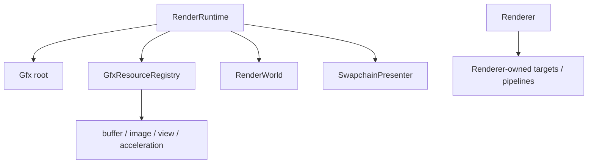

# 资源生命周期与显式销毁

> 类型：设计文档。本文定义 Vulkan、GPU scene、Renderer 子系统和 CPU asset 的 owner 与释放顺序。

## Owner 树



`Gfx` 是 Vulkan root owner；Runtime 持有资源 registry、binding system、RenderWorld、present、command allocator 和同步对象。Renderer/Subsystem 只能通过 lifecycle Ctx 创建和释放自身资源。

## 创建阶段

- `RenderRuntime::new` 创建 `Gfx`、CPU `GameWorld`、GPU binding/resource owner、FrameTiming 和私有 RenderWorld。
- `init_after_window` 创建 surface、swapchain 和 present owner。
- Renderer `init` 使用 init Ctx 创建窗口尺寸 target、pipeline、descriptor 和 subsystem state。
- prepare 阶段生成 GPU scene 和 per-frame data，不改变长期 owner 归属。

Manager 不保存 typed `Gfx` 引用，不把 device context 放进长期资源字段；需要销毁时由调用方传递窄 context。

## 资源分类

- Persistent：pipeline、sampler、descriptor layout、shader binding。
- Frame：command buffer、per-frame buffer、FIF timeline state。
- Swapchain：surface、swapchain image/view、present semaphore。
- Asset：texture image、mesh buffer、BLAS、material slot、sky distribution。
- Scene GPU：instance、geometry、light、indirect buffer、TLAS、raster draw cache。
- Renderer target：RT working target、GBuffer、selection mask、GUI buffer。

类别用于确定 owner 和回收边界，不表示所有资源都由同一个 manager 管理。

## Resize 与重建

窗口尺寸变化由 Runtime 重建 swapchain/present 状态，再通过 `ResizeCtx` 交给 Renderer。Renderer 负责重建自己的 window-sized target；CPU scene、asset identity 和 persistent shader binding 不因 resize 重建。

DLSS mode 或 render extent 变化可能同时触发 Renderer target 重建和 Streamline feature resource 释放。释放旧 feature 前必须等待仍引用它们的 GPU command buffer。

重建路径必须先让旧 target 脱离新的 graph，再按 owner 的创建顺序重新建立 view、descriptor 和 pipeline 依赖。

## 退役与 FIF

CPU 删除只撤销 CPU membership；GPU mirror 在下一次完整对账中退役。已提交但尚未完成的 upload 只销毁完成结果，不得重新 publish stale handle。

每个 FIF 副本在再次使用前必须经过 timeline 安全点。资源 registry 负责延迟释放；manager 负责撤销自己的 shader-visible slot 和局部 cache。

`Drop` 不调用 Vulkan/VMA/WSI release API。显式 `destroy` 接收 typed context，并在 debug 下暴露遗漏的释放。

## 销毁顺序

```text
Renderer/Subsystem shutdown
-> wait GPU idle
-> present / raycast / scene assets
-> per-frame data / command allocator
-> resource registry / binding system
-> timeline semaphore
-> Gfx root
```

RenderWorld 的 asset shutdown 先停止并 join CPU distribution worker，再等待 upload timeline，最后释放 active/retired/fallback GPU resources。

Renderer 资源必须早于 Runtime destroy；Runtime 资源必须早于 Gfx destroy；窗口 host 必须晚于 RenderThread 退出。

## 设计不变量

- 每个长期 GPU 资源只有一个销毁 owner。
- `Gfx` 最后销毁，不能由叶子 wrapper 自行触发 device release。
- 异步完成结果必须经过 generation/revision 或 membership 检查。
- resize、frame reuse、shutdown 都不能绕过 GPU 完成条件。
- 资源生命周期契约不通过 Drop 的偶然顺序表达。

## 实现入口

- [`gfx_resource_registry.rs`](../../engine/e40-render/truvis-render-runtime/src/resources/gfx_resource_registry.rs)
- [`render_world.rs`](../../engine/e40-render/truvis-render-runtime/src/render_world/render_world.rs)
- [`Gfx::destroy`](../../engine/e10-gfx/truvis-gfx/src/gfx.rs)
- [`selection_outline.rs`](../../renderer/truvis-renderer/src/selection_outline.rs)

## 资源变更评审

新增长期 GPU 字段前先回答：它属于 Runtime、RenderWorld、Renderer subsystem 还是 Gfx root；谁在 resize 时重建；谁在 shutdown 时释放；是否跨 FIF 使用。

新增异步完成队列时必须同时定义 generation、revision、timeline 和 stale result 处理。只保存一个 `is_ready` 布尔值通常不足以区分 CPU 完成、GPU 完成和 shader-visible publish。

资源 wrapper 不应把 `&Gfx`、`&GfxDevice` 或 allocator 引用存进跨帧字段。owner 在调用点生成 typed context，使销毁依赖保持显式。

## 失败语义

创建失败不应留下半发布的 shader-visible handle。重建失败时保留旧资源还是进入 fallback，必须由该资源 owner 定义；不能由 Drop 顺序隐式决定。

延迟释放队列的清理只说明 GPU 已越过安全 frame boundary，不说明 CPU scene 仍然引用该资源。反向索引和 generation 检查仍由 scene/resource owner 负责。

## 变更检查

- 所有叶子资源是否有唯一 destroy owner？
- 是否在正确的 queue/timeline 后回收？
- descriptor、view、image 的依赖顺序是否正确？
- resize 是否重复释放或泄漏旧 target？
- shutdown 是否先停止 CPU producer？
- Drop 是否意外调用 Vulkan release？

## 非目标

本文不维护完整资源名称列表，不记录某次设备驱动的 workaround，也不把构建成功当作 GPU lifetime 验证。

需要临时诊断时使用 `.temp/`，不要把调试文件写入 source 或 docs 目录。
