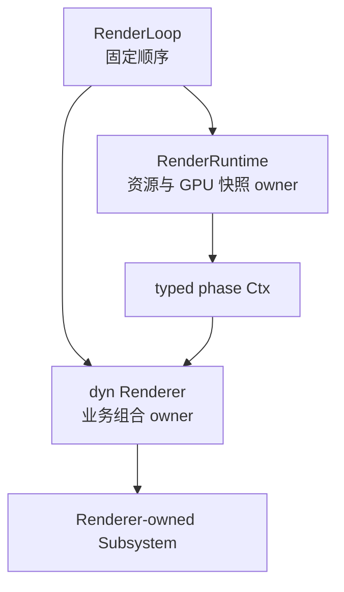
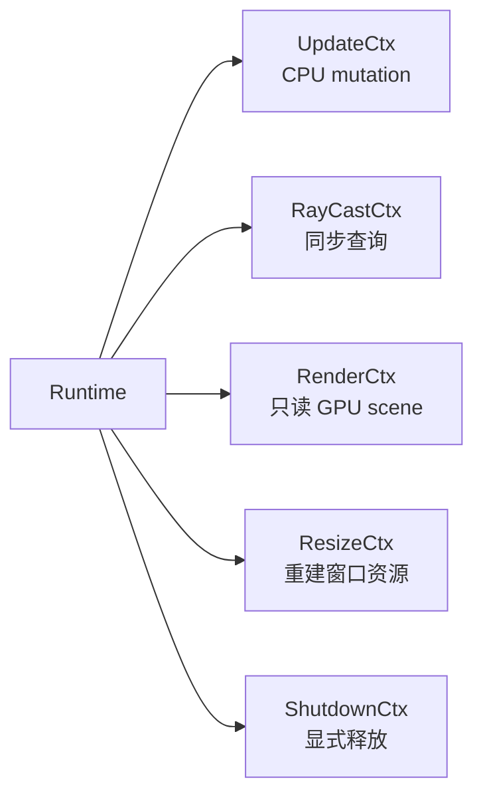

# Runtime Phase Contract

> 类型：设计文档。本文定义 Runtime、RenderLoop、Renderer 和 Subsystem 的阶段能力边界。

## 核心关系

`RenderLoop` 是唯一固定帧执行器，`RenderRuntime` 提供阶段化能力，具体 Renderer 负责业务组合。

Runtime 不感知 GUI、selection outline、具体 RT subsystem 或 Editor controller。Renderer 不长期保存完整 Runtime owner，只在当前 phase 借用窄化 context。

## Runtime 阶段

| 阶段 | 责任 | 上层能力 |
|---|---|---|
| `init_after_window` | 创建 surface、swapchain 和 present owner | `RenderRuntimeInitCtx` |
| `begin_frame` | 时间快照、FIF 等待、命令池重置、延迟释放 | 无公开 ctx |
| `update_phase` | 同步 frame state、获取 present image | CPU world 与配置可变借用 |
| `prepare` | CPU scene、asset、instance 转为 GPU 可见快照 | 不直接暴露完整 owner |
| `ray_cast_phase` | 对 prepare 后 GPU scene 做同步查询 | `RenderRuntimeRayCastCtx` |
| `render_phase` | 提供只读 scene、present 和 timing 视图 | `RenderRuntimeRenderCtx` |
| `present` | 提交 present queue | 无公开 ctx |
| `end_frame` | 推进 frame id 和 FIF label | 无公开 ctx |
| `shutdown` | Runtime destroy 前释放上层资源 | `RenderRuntimeShutdownCtx` |

`sync_dlss_options_frame_state` 是 update 后的配置收敛点；若内部尺寸变化，它返回 resize context，由 Renderer 重建窗口尺寸资源。

## Renderer 阶段

Renderer hook 与 Runtime phase 一一对应但不等价：

- `init` 创建 Renderer-owned 状态和子系统资源。
- `on_input` 消费输入并决定 camera、GUI 和业务命令的优先级。
- `update` 修改 CPU scene、camera、配置和 Editor 请求。
- `render_view` 提供纯数据快照，Runtime 在 `prepare` 中读取。
- `after_prepare` 处理需要已完成 GPU scene 的即时查询，例如 picking。
- `render` 创建 RenderGraph 并决定 pass 顺序。
- `on_resize` 传播窗口尺寸变化。
- `shutdown` 在 Runtime 销毁前释放 Renderer-owned GPU 资源。

## Ctx 裁剪

Ctx 的生命周期限制能力可见性，也限制资源借用跨阶段保存。`RenderRuntimeRenderCtx` 不提供 CPU scene 可变访问；`RenderRuntimeRayCastCtx` 不承担一般渲染工作。

## Subsystem 组合

`SubsystemLifecycle` 只约束 init、resize、shutdown。输入处理、UI frame build、prepare data 和 pass contribution 仍由具体 Renderer 显式调用。

不存在 visitor、动态注册表或由 RenderLoop 自动发现的子系统。这样做是为了让 pass 顺序、资源 owner 和释放顺序可直接阅读。

## 设计不变量

- update 可以改变 CPU 语义状态，render 只能读取 prepare 后的 GPU 状态。
- prepare 是 CPU scene 到 GPU scene 的语义翻译边界。
- after_prepare 只允许需要即时结果的同步查询。
- Renderer 决定具体 pass 顺序，Runtime 不反向编排产品能力。
- Renderer/Subsystem 资源必须在 Runtime destroy 之前显式释放。

## 实现入口

- [`render_runtime.rs`](../../engine/e40-render/truvis-render-runtime/src/render_runtime.rs)
- [`render_runtime_ctx.rs`](../../engine/e40-render/truvis-render-runtime/src/render_runtime_ctx.rs)
- [`renderer.rs`](../../engine/e50-render-loop/truvis-render-loop/src/renderer.rs)
- [`renderer-kit`](../../renderer/renderer-kit/README.md)

## 能力矩阵

| 能力 | update | prepare | after_prepare | render | shutdown |
|---|---:|---:|---:|---:|---:|
| 修改 CPU scene | 是 | 否 | 否 | 否 | 仅清理 |
| 读取 GPU scene | 间接 | 构建 | 查询 | 只读 | 释放 |
| 同步 raycast | 否 | 否 | 是 | 否 | 否 |
| 加入 RenderGraph | 否 | 否 | 否 | 是 | 否 |
| 释放 Renderer 资源 | 否 | 否 | 否 | 否 | 是 |

这张矩阵用于判断 API 应该放在哪个 Ctx，而不是用于描述具体 Renderer 的所有操作。若一个操作需要同时改变 CPU scene 和录制 GPU pass，应拆成两个明确阶段。

## 失败语义

phase 返回值表达当前阶段能否继续，而不是替上层猜测最终画面结果。resize 返回 `None` 只表示没有需要传播的 Runtime resize；它不表示 Renderer resource 一定已同步。

Runtime 错误应在 RenderLoop 的阶段边界处理。Renderer 不应在 render hook 中补做 update 或 prepare，也不应通过 catch error 隐藏 phase 顺序错误。

## 变更检查

- 新 API 属于哪个 phase？
- 它需要可变 world、GPU readback 还是只读 scene view？
- 是否可能被 Renderer 长期保存？
- 是否会改变 RenderGraph pass 顺序？
- shutdown 时是否仍需要 Runtime owner？

阶段扩展后同时更新 Ctx、RenderLoop 调用链、Renderer trait 和对应 summary；summary 只有用户主动要求时才更新。

## 非目标

本文不描述每个 pass 的 shader 算法，不定义 UI 输入消费顺序，也不规定某个 Renderer 必须使用所有 phase hook。
