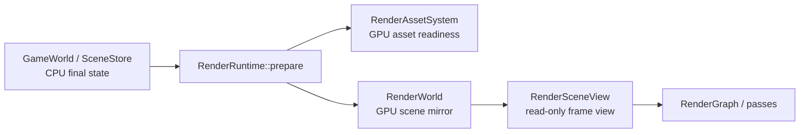

# Scene Sync 与 RenderWorld

> 类型：设计文档。本文定义 CPU scene、资源身份和 GPU scene mirror 之间的同步边界。

## 权威状态

`GameWorld`/`SceneStore` 是 CPU scene、material、light 和 asset identity 的权威 owner。Renderer 可以通过 update Ctx 发起编辑，但不保存第二份完整 scene。

Transform gizmo 属于 Renderer-owned interaction。拖拽结果在 `TruvisRenderer::update` 阶段直接写入
`GameWorld::update_instance_transform`，不经过新的 Client API 或通知通道；随后由 prepare 将 CPU transform
同步到 `RenderWorld`。

`RenderWorld` 是 RenderThread 内的 GPU-side composition owner。它保存 render-side asset stores、instance mirror、geometry/light buffers、TLAS 和 per-FIF draw cache；它不成为 Editor 或 CPU world 的业务权威。

## 身份与 slot

CPU handle 表示 world 语义身份，包含 generation，不能直接当作 GPU slot。`RenderInstanceTable` 维护 CPU instance handle 到稳定 render slot 的映射，并保存 transform/material 快照和 motion history。

material、mesh、texture manager 各自拥有 GPU slot 或 ready cache。instance 的组合关系属于 RenderWorld，不由独立 asset manager 保存。

删除或 slot reuse 必须经过 generation 检查，避免旧异步结果写入新对象。Renderer/Editor 只看到 CPU handle 和 submesh index，不依赖 GPU index。

## Final-state reconciliation

prepare 读取 CPU 的最终状态，并对照当前 render-side membership、source revision、published revision 和 per-FIF uploaded revision。

同一帧的多次编辑不需要抵消事件：移动后换材质、创建后删除或 A→B→C 都通过最终状态对账处理。异步 texture/mesh ready 通过独立 completion/revision 触发重新准备。

当前生产路径不把旧 changelog/dirty dispatch 作为跨层语义消息。局部 dirty 仍可作为 GPU buffer 尚未追平的 bookkeeping，但不能被解释成 CPU scene 的历史事件。

## prepare 顺序

1. `GameWorld::poll_asset_loads()` 消费 loader 完成事件并写回 CPU final state。
2. `RenderWorld::sync_assets()` 对账 membership、上传队列和 GPU completion。
3. `ShaderBindingSystem::prepare_render_data()` 刷新 bindless/global binding。
4. RenderWorld 扫描完整 instance membership，解析 mesh/material ready gate，生成 `RenderData`。
5. 更新 analytic/emissive/light/geometry/instance/indirect buffer、TLAS 和 scene root。
6. 写 per-frame 数据，向 RenderGraph 暴露只读 `RenderSceneView`。

完整扫描包含 hidden、pending 和 not-ready instance；只有本次扫描未出现的 handle 才能退役 render-side mirror。

## 异步与删除

loader 完成、GPU copy 入队、timeline completion、shader-visible publish 和最终 render 结果是不同阶段。任一日志成功不能替代后续阶段证据。

CPU 删除先检查反向引用，再移除 SceneStore/AssetSystem membership。RenderWorld 下一次完整扫描撤销 slot/cache；未完成上传只销毁 stale result。

GPU 资源按自己的 owner 延迟回收，不能把 CPU 删除直接等同于 Vulkan image/buffer 已安全释放。

灯光拖拽只通过 `GameWorld::update_light_position` 修改 CPU 权威位置，并同时推进
light revision 和 scene version。prepare 使用既有 AnalyticLightTable 完整对账，标记全部 FIF，
当前副本上传后才进入渲染；图标 hover/selection 不修改 World，也不影响光照累计签名。

## FIF 与 capacity

每个 material buffer、scene buffer 和 instance buffer 维护 per-FIF 副本。本帧只写当前 label；落后副本在再次使用前补写最新目标。

动态容量扩展必须同时更新 CPU mirror、GPU buffer、descriptor count 和当前 FIF 的上传路径。扩展不能改变已有 handle 语义，也不能在 GPU 仍使用旧 buffer 时直接销毁旧资源。

## 设计不变量

- CPU final state 由 World/ResourceSystem 权威持有。
- RenderWorld 只保存 GPU 派生状态与 render-side composition。
- CPU handle、source revision、published revision 和 per-FIF upload revision 不合并成一个全局 dirty 数。
- 完整 membership 对账是删除检测的依据，不能使用可见列表代替。
- Render pass 只读取 prepare 后的 scene view，不修改 CPU scene。

## 实现入口

- [`scene_store.rs`](../../engine/e30-world/truvis-world/src/scene_store.rs)
- [`asset_system.rs`](../../engine/e30-world/truvis-world/src/asset_system.rs)
- [`render_world.rs`](../../engine/e40-render/truvis-render-runtime/src/render_world/render_world.rs)
- [`render_instance_table.rs`](../../engine/e40-render/truvis-render-runtime/src/render_world/render_instance_table.rs)

## Readiness 与视图

`RenderData` 是 prepare 的只读打包视图，不是 CPU scene 的第二份权威。pending、hidden 和 not-ready instance 仍需要参与 membership 对账，不能因为本帧不可见就当成已删除。

`RenderSceneView` 只暴露当前 FIF 可安全使用的 scene root、TLAS、draw cache 和资源视图。pass 不应该通过 view 反查或修改 SceneStore。

## 版本语义

以下版本各自表达不同事件：

- handle generation：CPU slot identity 是否仍有效；
- source revision：CPU asset/material/instance 内容变化；
- published revision：GPU manager 已发布的 shader-visible 版本；
- per-FIF uploaded revision：当前 frame label 副本是否追平；
- TLAS/appearance version：局部 GPU 结构是否需要重建。

把它们压成单一 dirty counter 会丢失异步和 FIF 语义，因此同步代码应保留各自 owner。

## 变更检查

- 新资源是否先进入 CPU owner 再进入 RenderWorld？
- GPU slot 是否能从 CPU handle 安全反查？
- ready gate 是否覆盖所有依赖资源？
- 删除是否经过完整 membership 扫描？
- late completion 是否会重新 publish stale handle？
- 新 buffer capacity 是否同步 descriptor 和每个 FIF？

## 非目标

本文不定义完整 glTF/FBX importer 格式，不描述具体 RenderGraph pass，也不把当前支持范围写成未来能力承诺。

资源导入、CPU scene mutation 和 GPU upload 分属不同阶段；需要解释某个协议或 UI 恢复行为时链接 Editor design，而不在此复制。

## 灯光与环境参数编辑

`GameWorld::update_light` 按 patch 合并当前三张灯光表；位置 Gizmo 复用该入口。
所有候选值校验后一次写入，失败和 no-op 不推进 light/scene revision。
Area 以 center/half_u/half_v 为权威，旋转和尺寸不另存缓存。

`SceneSkyState` 拥有 enabled、texture、brightness 和语义 revision；有效倍率为 enabled ? brightness : 0。
prepare 将倍率和 Sky revision 写入当前 FIF 的 CPU 渲染投影，通过 RenderSceneView 只读提供给 pass，
仍使用已有 RT push constant，不增加 shader ABI。关闭环境保留纹理资源，亮度改变不重建 importance distribution。
Sky 语义 revision 与异步 distribution 发布版本独立，均参与各自消费者的历史判定。
