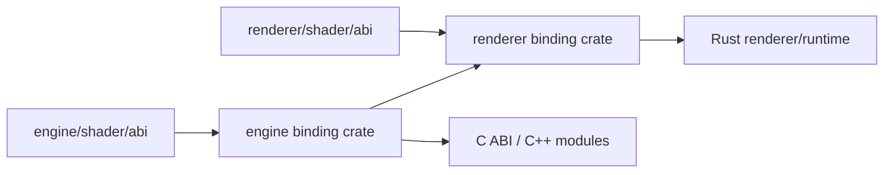

# Shader ABI 与 Native Integration 边界

> 类型：设计文档。本文只记录 owner、依赖方向和跨语言契约；字段布局细则由专项规则和 ABI 源码负责。

## 设计目标

Shader、Rust 和 C++ 必须围绕同一份 ABI 源定义协作。宿主语言投影 ABI，不能反向成为字段列表的第二个来源。



## Owner 与依赖

Engine ABI 位于 `engine/shader/abi/engine`，使用 `engine::*` 命名空间；Renderer ABI 位于 `renderer/shader/abi/renderer`，使用 `renderer::<owner>::*`。

Renderer 可以引用 Engine ABI，Engine 不得引用 Renderer ABI。Hello Triangle 只依赖 Engine；ShaderToy package 不依赖 Engine 或 Renderer。

Shader 源码层级固定为：

```text
abi/<owner> <- lib/<owner> <- entry
```

ABI 不依赖 entry；lib 不依赖 entry；entry 只组合自身可见的 ABI 和 lib。include 必须带 `abi/` 或 `lib/` 的 owner 前缀，禁止依赖 include root 顺序和 `../`。

## Binding 责任

每个 binding owner 决定：

- allowlist 中哪些 ABI 类型进入 Rust；
- 哪些类型通过 namespace re-export；
- 生成 binding 的生命周期和 crate 依赖；
- C ABI 是否需要暴露给 native module。

已有生成 binding 能表达的结构不能在 Rust 中手写镜像。C++ 只能消费 `ffi/rust_ffi.hpp` 暴露的 C ABI，不链接或回调 Rust symbol。

## 布局不变量

跨 CPU/GPU 边界的结构必须同时检查 Slang、SPIR-V/Vulkan、Rust 和 C++ 的 size、alignment、offset 与 stride。

- 明确使用的布局模型，不能把 push constant、storage record 和 uniform buffer 的规则混用。
- padding 使用显式字段并说明服务的 offset 或 stride。
- 不使用跨语言 ABI 不稳定的 `bool`、平台相关整数宽度或未固定大小枚举。
- 矩阵主序、坐标系和 CPU 写入方式属于 ABI 契约。
- 修改 ABI 字段顺序或 stride 视为跨端变化，必须检查所有写入、绑定、读取和 readback。

具体 offset 规则见 [shader-abi-layout.md](../../.agents/rules/shader-abi-layout.md)。

## Native 集成边界

workspace 根 `cxx/` 是唯一 native integration project。CMake target 直接依赖 native module，不镜像 Rust 顶层分层。

对 Rust 暴露 C ABI 的 target 必须是 DLL；内部实现可以使用 STATIC 或 OBJECT。Rust binding 只消费 public C ABI，CMake 不知道 Cargo crate。

生成 header、CXX module 和 Rust binding 的生命周期必须由各自 owner 管理。不要把 native 句柄、CPU 指针或工作线程隐藏在通用 binding 生成器中。

## 设计不变量

- ABI 只在实际 owner 目录定义一次。
- owner 方向固定为 `engine <- renderer`。
- binding 是投影，不是 ABI 源。
- shader package 的依赖闭包和 include root 必须 fail-closed。
- ABI 改动必须验证编译产物布局，而非只验证 Rust 编译通过。

## 实现入口

- [`shader-packages.toml`](../../shader-packages.toml)
- [`renderer/shader/README.md`](../../renderer/shader/README.md)
- [`cxx/README.md`](../../cxx/README.md)
- [`truvis-shader-build`](../../engine/e00-utils/README.md)

本文不重复完整字段表；字段和 binding 编号变化应直接修改 ABI owner、生成配置和相应模块文档。

## 编译与验证边界

源码预检负责发现越界 include、package 依赖和 owner 方向问题；编译器 depfile 负责发现实际使用但未声明的 shared input。两者都不能省略。

修改共享 ABI 后至少检查生成 binding、SPIR-V member offset、结构 size/align、数组 stride 或 push constant range。只通过 Rust 编译不能证明 Slang 与 Vulkan 布局一致。

CXX 目标的链接成功只能说明 native target 可链接；它不能证明 Rust caller 使用了正确的生命周期、线程或字段布局。FFI readback 还需要对照 owner 的 ABI 定义。

## 变化流程

1. 先定位 ABI owner 和使用的布局模型。
2. 检查现有 padding、生成 binding 与 C++ 投影。
3. 修改 owner ABI，并同步生成配置。
4. 运行 shader 构建和 SPIR-V 布局检查。
5. 检查 Rust/C++ 写入端、绑定端和 readback。
6. 更新模块 README 与设计边界。

## 非目标

本文不复制每个 push constant 的字段清单，不把生成 header 当作长期手写源码，也不描述某个 shader pass 的算法。

如果某个跨端结构确实不能使用生成 binding，必须在实现旁写出原因、验证方式和与 canonical ABI 的关系；不能用“当前数值相同”作为契约。

## 变更检查

- owner 是否仍然唯一？
- include 是否从固定搜索根解析？
- Renderer 是否只依赖 Engine ABI？
- 字段是否引入隐式 padding？
- C++ 是否仍只消费 public C ABI？
- 是否需要 `just shader` 和 `spirv-dis`？

专项规则比本文优先；本文只保留架构层面的 owner 和边界。
