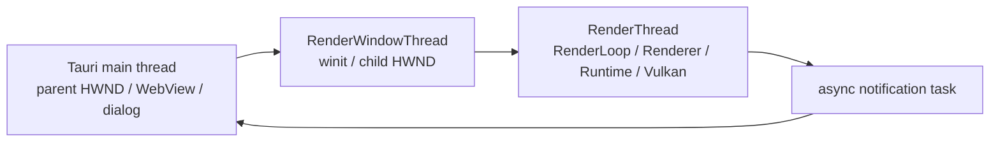

# 线程与同步边界

> 类型：设计文档。本文说明线程 owner、跨线程数据传递和 GPU 同步约束，不描述具体业务协议字段。

## 线程 owner

主体桌面运行时包含三个主要 OS 线程 owner：

- Tauri main thread 不调用 Vulkan，拥有 WebView、dialog 和 desktop state。
- RenderWindowThread 拥有 winit event loop、child HWND 和 RenderThread handle。
- RenderThread 拥有 RenderLoop、Renderer、GameWorld、RenderWorld 和全部 Vulkan 对象。
- notification dispatcher 是异步 task，不是新的 Vulkan 或 scene owner。

独立 sample 可以让 winit main thread 承担窗口角色，但 RenderThread 的 Vulkan owner 规则不变。

## 跨线程传递

跨线程边界只传递可安全发送的数据：

- 窗口使用 typed `Win32WindowHandle` / `WindowsDisplayHandle`，raw handle 在目标 RenderThread 重建。
- 输入事件进入 RenderLoop 的输入通道，由 RenderThread 消费。
- Editor request 使用有界 endpoint 和每请求 oneshot reply。
- native HDRI dialog 只传递 `PathBuf` command，不把路径放入通用 Editor DTO。
- notification 是 best-effort 展示消息，不成为 CPU scene 权威。

通道容量是当前实现参数，不构成跨版本协议承诺；重要不变量是 RenderThread 不为等待另一线程而阻塞。

## GPU 同步

FIF timeline 是每帧 command pool reset 和延迟释放的安全前提。Runtime 在 `begin_frame` 等待当前 label 上一次使用完成，再清理命令池和资源 registry。

RenderGraph 表达同一帧内 image/buffer 的读写和 barrier；timeline 表达跨帧完成；fence 用于同步 raycast 的 readback。三者不能互相替代。

asset loader 和 Alias table worker 只做 CPU 读取或构建，不创建、提交或销毁 Vulkan 资源。GPU upload 和 shader-visible publish 仍在 RenderThread 的 runtime 路径完成。

## 同步查询例外

`after_prepare` 允许 Renderer 发起同步 raycast：prepare 已经把 GPU scene/TLAS 提交到 graphics queue，raycast service 再提交 trace、copy 和 fence 等待，并把结果读回 CPU。

该等待只服务需要即时命中结果的交互路径，不能被普通更新、Editor 查询或后台任务滥用。同步 raycast 会占用 RenderThread，必须保持输入和请求处理预算可控。

## 关闭同步

关闭时先停止新请求，再等待 Renderer/runtime 的 GPU 释放完成。RenderThread 先发布完成标志，再唤醒窗口 event loop；窗口 owner 不能在 RenderThread join 前销毁 child HWND。

producer、consumer 和 owner 的销毁顺序必须覆盖：CPU worker 停止、GPU queue 完成、shader-visible 资源撤销、Vulkan wrapper 显式 destroy。

## 设计不变量

- main/window thread 不访问 Vulkan。
- RenderThread 是所有 Vulkan 对象的唯一使用线程。
- 跨线程消息不携带长期借用和不可验证的内部 owner。
- ACK、channel send 成功或 request reply 只表示对应边界事件，不自动表示 GPU 或画面完成。
- 任何会阻塞 RenderThread 的等待必须有明确的阶段语义和完成条件。

## 实现入口

- [资源生命周期文档](resource-lifecycle-and-destruction.md)
- [`truvis-render-thread`](../../engine/e60-platform/truvis-render-thread/README.md)
- [`editor_controller.rs`](../../renderer/truvis-renderer/src/editor_controller.rs)
- [`render_runtime_ctx.rs`](../../engine/e40-render/truvis-render-runtime/src/render_runtime_ctx.rs)

## 锁与等待

跨线程 channel 解决所有权交接，不自动解决业务同步。调用方必须明确消息是 fire-and-forget、oneshot reply 还是 best-effort notification。

持有 desktop resource lock、窗口锁或 CPU scene 借用时，不应等待 Tauri、RenderThread 或 GPU fence。需要等待时先释放不相关锁，并把等待放在拥有该阶段语义的 owner 中。

Raycast fence 是当前明确的同步例外；它的使用点必须限定在 `after_prepare`，因为该阶段能证明 TLAS 和 scene buffer 已按 queue 顺序可见。

## 背压与退出

队列满返回 busy、超时返回 timeout、sender drop 表示 owner 正在退出。它们不能被调用方转换成“GPU 失败”或“scene 已回滚”。

关闭时先阻断新生产者，再 drain 或 drop receiver，最后等待 worker 和 RenderThread 结束。任何后台 worker 都不能在 Gfx 已销毁后继续提交资源工作。

## 变更检查

- 消息是否包含不可 Send 的借用？
- receiver 是否有唯一 owner？
- wait 是否可能发生在 RenderThread 主循环？
- fence、timeline 和 channel 是否各自表达正确事件？
- shutdown 是否覆盖迟到消息和 worker completion？

## 非目标

本文不定义 Editor DTO 字段，不规定 channel 的永久容量，也不以日志出现顺序推断线程实际完成顺序。

## 证据边界

静态 channel 调用链只能证明可能的等待关系；线程调度、窗口消息和 GPU fence 的实时行为需要单独运行时观测，不能由文档替代。

RenderThread 的持续运行依赖窗口 owner 保持有效句柄；窗口线程退出前必须完成 RenderThread join 或得到明确的完成状态。
