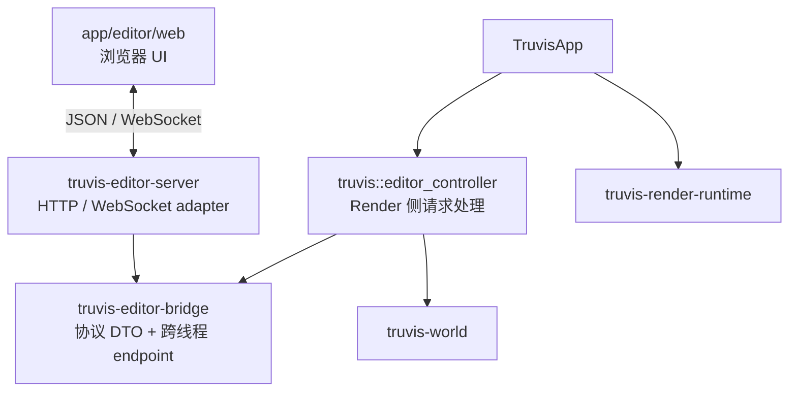
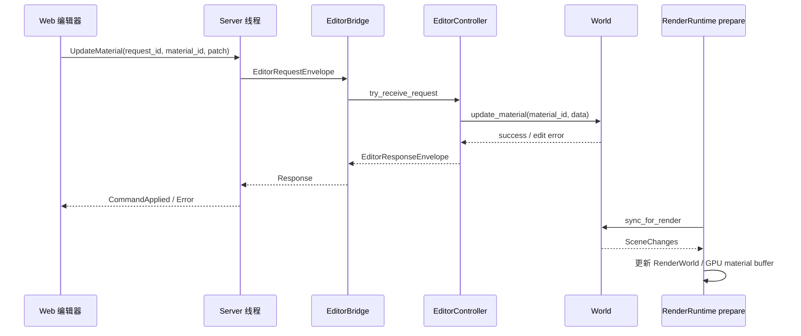

# Web 编辑器设计

> 状态：第一阶段已实现。本文同时记录稳定设计边界和当前实现参数，后续扩展场景属性编辑时沿用这些约束。
> 当前技术栈为 Axum、Tokio current-thread runtime、Tokio bounded mpsc、Vite、React、TypeScript 和 `ts-rs`。

## 1. 设计背景与目标

Truvis 后续需要提供材质编辑能力，并在此基础上扩展场景对象、灯光、环境等属性编辑。

当前不计划把完整编辑器面板集成到渲染窗口中。虽然项目已有 app 层 ImGui 集成，但大型编辑器继续使用 ImGui
会增加 GUI pass、纹理、每帧 mesh 和相关资源生命周期的组合复杂度，也会让编辑器界面与渲染窗口产生不必要的耦合。

初步方案是在 Truvis 进程中启动独立 Server 线程，通过 HTTP / WebSocket 与浏览器中的 Web 编辑器通信：

- 用户继续在渲染窗口中完成场景拾取与选择。
- Web 页面显示当前选择及其可编辑属性。
- Web 页面发送材质或场景编辑命令。
- Render 线程在合法的 update 阶段修改 CPU `World`。
- `RenderRuntime::prepare` 继续通过现有路径把 CPU scene 变化同步到 GPU。

本方案优先降低跨线程状态同步复杂度。允许通过主动查询、版本轮询、额外序列化和少量延迟，换取清晰的状态所有权。

### 1.1 非目标

第一阶段不解决：

- 把 Web UI 嵌入渲染窗口；
- Server 或 Web 直接访问 GPU scene；
- 多用户协同编辑；
- 断线重连、事件重放和离线修改合并；
- 原子化的完整场景快照；
- 通用消息总线或任意模块之间的事件订阅系统。

## 2. 核心原则

### 2.1 权威状态只有一份

- CPU 场景的唯一权威状态是 `World` / `SceneStore`。
- 当前 selection 由 Render/App 持有。
- GPU scene 是 `RenderRuntime::prepare` 根据 CPU scene 生成的派生状态。
- Server、`EditorBridge` 和 Web 页面都不能成为 CPU scene 的第二个权威 owner。

### 2.2 EditorBridge 只负责通信

`EditorBridge` 是 Server 线程与 Render 线程之间的纯通信边界。它可以短暂承载请求、响应、命令、通知和 owned DTO，
但消息被消费后即可释放，不长期保存任何场景领域状态。

`EditorBridge` 不维护：

- latest selection；
- scene / material snapshot cache；
- CPU `World` 的镜像；
- 事件重放记录；
- Web 页面使用的对象树或属性面板状态。

### 2.3 Web view 是可丢弃投影

Web 页面可以维护适合界面展示的 `EditorWorldView`，但该 view：

- 不要求与 Rust 内部 `World` 使用相同结构；
- 可以是不完整、延迟或按需加载的；
- 不具有场景权威性；
- 页面刷新后可以通过主动查询重新构建。

Web view 的组织和更新策略属于 Web 内部实现，不作为 Render、Server 或 `EditorBridge` 的外部契约。

### 2.4 Editor 属于 app 层

Editor 是主体应用能力，不进入 `engine/`。`truvis-editor-server`、`truvis-editor-bridge` 和 Web 项目放在
`app/editor/`；对 `World` 和 selection 的具体适配留在主应用 crate。

## 3. 项目与 crate 布局

第一阶段新增两个 Rust crate、一个 Web 项目，并在主体 App 内增加一个 controller 模块：

```text
app/
├── editor/
│   ├── bridge/                       # crate: truvis-editor-bridge
│   │   ├── Cargo.toml
│   │   └── src/
│   ├── server/                       # crate: truvis-editor-server
│   │   ├── Cargo.toml
│   │   └── src/
│   └── web/                          # Web 项目，不是 Cargo workspace member
│       ├── package.json
│       └── src/
│
└── truvis/
    └── src/
        └── editor_controller.rs      # 主体 App 内部模块
```

第一阶段不单独建立 `truvis-editor-protocol` 或 `truvis-editor-client` crate：

- 协议类型先放在 `truvis-editor-bridge::protocol` 中，Server 和主体 App 本来都会依赖 Bridge。
- Web 本身已经是 client，把 Render 侧适配模块命名为 client 容易混淆。
- Render 侧逻辑当前只服务 `TruvisApp`，先保留为 App 内部 `EditorController`，避免过早抽象公共 crate。

当协议出现第三个 Rust consumer、独立进程、独立版本发布或不依赖 channel 的复用需求时，再把
`bridge::protocol` 提取为独立 `truvis-editor-protocol` crate。

## 4. 依赖方向



允许的主要依赖为：

```text
truvis-editor-server
  -> truvis-editor-bridge

truvis
  -> truvis-editor-server
  -> truvis-editor-bridge
  -> truvis-world
  -> truvis-render-runtime
```

禁止形成以下依赖：

```text
truvis-editor-bridge -> truvis-world
truvis-editor-bridge -> truvis-render-runtime
truvis-editor-server -> truvis-world
truvis-editor-server -> truvis-render-runtime
engine/* -> editor-*
```

由主应用 crate 中的 `EditorController` 负责把 editor 协议 DTO 翻译成 `World` 查询或修改。Bridge 和 Server
都不感知 SlotMap handle、`MaterialData`、`RenderWorld` 或任何 GPU 类型。

## 5. `truvis-editor-bridge` crate

### 5.1 职责

Bridge crate 是 Server 和主体 App 共同依赖的 editor 契约层，负责：

- 定义与场景内部实现无关的 editor 协议 DTO；
- 定义 Server / Render 内部使用的 transport envelope；
- 创建有方向限制的 `ServerEndpoint` 和 `AppEndpoint`；
- 约束 request、response、notification 的 channel 方向与背压语义；
- 提供稳定的 client、request、object ID 和错误 code 类型。

Bridge crate 不负责：

- 创建或管理 Server 线程；
- HTTP route、WebSocket connection、JSON handler；
- 访问或修改 `World`；
- 保存 selection、scene version 或任何 scene cache；
- 生成 GPU 资源或参与 RenderGraph。

### 5.2 当前内部结构

```text
app/editor/bridge/src/
├── lib.rs
├── protocol/
│   ├── mod.rs
│   ├── message.rs
│   ├── material.rs
│   ├── scene.rs
│   ├── selection.rs
│   ├── ids.rs
│   └── error.rs
├── envelope.rs
├── server_endpoint.rs
├── app_endpoint.rs
└── bin/export_editor_types.rs
```

协议 DTO 必须是 editor 自己拥有的类型。即使 `truvis-world` 已经定义 `MaterialData`、`MaterialHandle` 等类型，
Bridge 也不直接复用它们，避免 Server 和 Web 协议绑定内部 scene 存储及生命周期。

### 5.3 Endpoint 模型

不建议创建一个由双方通过 `Arc<Mutex<EditorBridge>>` 共享的大对象。Bridge 创建后应拆成两个方向受限的 endpoint：

```text
create_editor_bridge()
  -> ServerEndpoint
  -> AppEndpoint
```

概念接口如下：

```text
ServerEndpoint
├── try_send_request(...)
├── receive_response(...)
└── receive_notification(...)

AppEndpoint
├── try_receive_request(...)
├── try_send_response(...)
└── try_send_notification(...)
```

内部保留三类有界通道：

```text
Server -> Render : request inbox
Render -> Server : response outbox
Render -> Server : notification outbox
```

Response 与 Notification 分开是为了表达不同的可靠性：

- Response 对应具体请求，应优先返回；发送失败后 client 最终通过 timeout 得到失败。
- Notification 是 best-effort，队列满时可以丢弃，Web 通过主动查询或版本轮询恢复。
- Render 对三个通道都只使用非阻塞操作。

三类通道统一使用 `tokio::sync::mpsc::channel` 创建有界队列：

- Render 侧只调用 `Receiver::try_recv` 和 `Sender::try_send`，不进入 Tokio runtime，也不等待队列容量；
- Server 侧可以异步等待 Response / Notification，不需要定时轮询 channel；
- request inbox 满时立即向 Web 返回 `busy`，不等待 Render；
- response outbox 满时让对应请求最终以 timeout 失败；
- notification outbox 满时允许丢弃通知。

当前默认容量为 request `256`、response `256`、notification `64`。这些容量限制的是短期通信数据，不是场景缓存。

## 6. `truvis-editor-server` crate

Server 使用 Axum，并在一个独立 OS 线程中运行 Tokio current-thread runtime。该线程只负责本地 HTTP / WebSocket、
JSON 编解码和消息路由，不执行场景查询、场景修改或 GPU 工作。

Server 是纯网络适配器，负责：

- 启动独立 Server 线程及其 Tokio current-thread runtime；
- 监听 loopback 地址；
- 提供 Web 静态文件和基础状态接口；
- 接受和关闭 WebSocket 连接；
- 分配、维护和清理 `ClientId`；
- JSON 反序列化与序列化；
- 协议版本、消息大小、Origin 和认证检查；
- 将 Web 请求包装成内部 envelope 并写入 Bridge；
- 将 Response 路由回指定 client；
- 广播或定向发送 Notification；
- 处理 connection close 和 shutdown。

Server 不负责：

- 判断 material 或 instance 是否存在；
- 访问或修改 `World`；
- 解析 SlotMap handle；
- 合并材质参数；
- 决定 scene version；
- 维护 selection 或场景查询缓存。

对外入口为：

```text
EditorServer::start(config, ServerEndpoint)
  -> EditorServerHandle
```

`EditorServerHandle` 负责查询绑定地址、请求停止、等待 Server 线程退出并报告运行失败。当前采用 fail-fast：绑定失败或
静态目录配置错误会中止 `TruvisApp` 创建，避免产生“渲染正常但编辑器不可用”的半初始化状态。

默认监听 `127.0.0.1:9473`，静态目录为 `app/editor/web/dist`；可以分别通过 `TRUVIS_EDITOR_ADDR` 和
`TRUVIS_EDITOR_WEB_ROOT` 覆盖。WebSocket 单消息上限为 `256 KiB`，每个 client 的网络发送队列容量为 `128`。

## 7. 主体 App 的 `EditorController`

`EditorController` 是 editor 协议与权威 `World` 之间的 App 侧适配器。它不是网络 client，也不是通用 MessageHub。

不使用 `EditorClient` 命名的原因是 Web 已经是 client；不使用 `MessageHub` 的原因是当前不需要订阅注册、动态 handler
或任意模块之间的路由。显式的 controller 更容易看清每类请求最终调用了哪个 `World` API。

`EditorController` 持有：

```text
EditorController
├── AppEndpoint
└── 每帧请求预算配置
```

它不持有：

- `World` 或 `SceneStore` 副本；
- selection 副本；
- material / instance cache；
- Server connection；
- GPU manager。

主要职责为：

```text
EditorController::process_requests(world, current_selection, budget)
EditorController::notify_selection_changed(selection)
EditorController::shutdown()
```

具体工作包括：

- 在 `TruvisApp::update` 中按预算读取 editor 请求；
- 将协议 ID 转换为当前 session 内的 World handle；
- 调用 `World::material_data`、`World::update_material` 等窄接口；
- 将 World 数据转换为 owned editor DTO；
- 发送 `EditorResponse`；
- 在 selection 变化后发送 `EditorNotification`。

`EditorController` 不实现标准 `Plugin`。它没有 GPU 资源或 RenderGraph pass，并且需要同时参与 App 的 update 与
after-prepare selection 流程，因此由 `TruvisApp` 显式调用更符合现有 App 编排边界。

当前所有权为：

```text
TruvisApp
├── editor_controller: EditorController
└── editor_server: EditorServerHandle
```

二者都是 App-owned CPU 能力，不进入 `RenderRuntime`。

## 8. Web 项目

Web 项目使用 Vite、React 和 TypeScript，放在 `app/editor/web/`，不是 Cargo workspace member。按 UI、transport 和
view state 分层：

```text
app/editor/web/
├── package.json
├── src/
│   ├── protocol/
│   │   └── generated/               # ts-rs 生成，禁止手改
│   ├── transport/
│   │   ├── editor_socket.ts
│   │   └── mock_editor_transport.ts # 仅 Vite dev + ?mock=1
│   ├── state/
│   │   └── use_editor_session.ts
│   └── components/
└── dist/
```

开发阶段不让 Cargo `build.rs` 自动调用 npm / pnpm，避免普通 `cargo check` 依赖 Node 环境、Web 网络安装和隐藏副作用。
当前通过根目录 `justfile` 组织构建：`just editor-web` 生成协议类型并构建生产资源，`just editor-web-dev` 生成协议类型
并启动 Vite 开发服务器。Cargo 自身不会隐式调用 Node。

开发阶段可以使用 Vite dev server；Truvis 内置 Server 通过 `tower-http::ServeDir` 提供已经构建的 `dist/`。发布时必须
把 `dist/` 放在默认相对路径，或通过 `TRUVIS_EDITOR_WEB_ROOT` 显式指向发布目录。开发环境可使用 `?mock=1` 启用纯前端
mock transport；该入口在 production build 中不会启用。

Truvis 启动后，正式页面入口由 `EditorServerHandle::bound_addr()` 决定，默认是 `http://127.0.0.1:9473/`。App 级
`Truvis Overlay` 主面板顶部显示实际地址和 `Open Web Editor` 按钮；点击后由 `TruvisApp` 使用系统默认浏览器打开正式
入口。该动作发生在 ImGui frame 结束后，不携带 selection/material 参数，不改变 Bridge、Server 或场景状态。

## 9. Web 与 Server 的通信

### 9.1 Transport 选择

第一阶段确定：

- HTTP：静态文件、health、协议和 Server 基础信息；
- 单个 WebSocket：全部 Command、Query、Response 和 Notification。

概念 route：

```text
GET /                         Web 静态文件
GET /api/editor/v1/health     Server 存活检查
GET /api/editor/v1/info       协议版本和基础能力
WS  /api/editor/v1/ws         Editor 消息通道
```

第一阶段不同时维护 REST command/query、SSE notification 和 WebSocket notification 等多套语义，避免重复的错误处理、
client 关联和 DTO。未来出现 CLI 或脚本访问需求时，再评估补充 REST API。

### 9.2 协议权威来源

Rust 协议类型定义在 `truvis-editor-bridge::protocol`。Server 只是 JSON adapter，`EditorController` 是协议 handler。

不长期手写两份 Rust / TypeScript 协议。使用 `ts-rs`，通过显式开发命令从 Rust DTO 生成 TypeScript 到：

```text
app/editor/web/src/protocol/generated/
```

生成动作不放进 Cargo `build.rs`，而是作为 `editor-web` 和 `editor-web-dev` 的内部前置步骤，不单独暴露日常命令：

```text
just editor-web
just editor-web-dev
```

`just build-all`、`just truvis` 和 `just truvis-direct` 也依赖生产前端构建。重复执行生成步骤应保持协议文件无变化；
后续可把这项检查加入 CI。

## 10. 消息协议

### 10.1 消息分类

本方案是消息驱动模型，但不把所有消息都称为事件：

| 类型 | 方向 | 示例 | 语义 |
| --- | --- | --- | --- |
| Command | Web → Render | `UpdateMaterial` | 请求修改权威状态，必须返回应用结果 |
| Query | Web → Render | `GetSelection`、`GetSceneObjects` | 读取当前权威状态，不建立订阅 |
| Response | Render → Web | `MaterialResponse`、`CommandResult` | 对指定请求的结果 |
| Notification | Render → Web | `SelectionChanged`、`SceneVersionChanged` | best-effort 状态变化提示 |

### 10.2 Web 协议 envelope

Web 发出的消息：

```text
EditorClientMessage {
    protocol_version,
    request_id,
    request: EditorRequest,
}
```

Render 返回给 Web 的消息：

```text
EditorServerMessage
├── Response {
│       request_id,
│       response,
│   }
└── Notification {
        notification,
    }
```

请求可按语义进一步拆分：

```text
EditorRequest
├── Query(EditorQuery)
└── Command(EditorCommand)

EditorQuery
├── GetCapabilities
├── GetSceneVersion
├── GetSelection
├── GetSceneObjects {
│       offset,
│       limit,
│       expected_scene_version?,
│   }
└── GetMaterial { material_id }

EditorCommand
└── UpdateMaterial {
        material_id,
        patch,
    }
```

初步响应和通知：

```text
EditorResponse
├── Capabilities
├── SceneVersion
├── Selection
├── SceneObjects {
│       scene_version,
│       objects,
│       next_offset?,
│   }
├── Material
├── CommandApplied
└── Error

EditorNotification
├── SelectionChanged
└── SceneVersionChanged
```

JSON 使用显式 tag 的 discriminated union，字段名和 enum 值保持稳定、可读，不依赖 Rust 默认 `Debug` 格式。

### 10.3 内部跨线程 envelope

Web 消息进入 Server 后，Server 只添加 transport 路由信息，不转换领域语义：

```text
EditorRequestEnvelope {
    client_id,
    request_id,
    request,
}

EditorResponseEnvelope {
    client_id,
    request_id,
    response,
}

EditorNotificationEnvelope {
    target: Broadcast | Client(client_id),
    notification,
}
```

`ClientId` 由 Server 根据连接分配，不由 Web 提交。相同的 `EditorRequest` / `EditorResponse` payload 贯穿
Web → Server → Render，Server 不维护第二套场景 DTO。

### 10.4 DTO 边界

协议 DTO 只使用：

- JSON 能安全表达的固定宽度数字；
- string enum；
- 数组或普通 record；
- opaque editor ID；
- 明确的 optional / `null` 语义。

Rust 内部的 `u64 scene_version`、`request_id` 和 SlotMap key 在线协议中使用十进制或固定宽度十六进制字符串表示，
避免 JavaScript number 的安全整数上限造成精度损失。字符串只是一种无损线格式，不引入额外身份或映射关系。

协议不直接暴露：

- `MaterialData`、`Instance` 等 World 内部类型；
- `MaterialHandle`、`InstanceHandle` 的 Rust `Debug` 格式；
- `glam::Vec*`；
- GPU slot、bindless handle 或 Vulkan 类型；
- Rust 错误堆栈和内部文件路径。

Editor ID 使用协议自有包装类型，例如 `InstanceId`、`MaterialId`、`TextureId`，但身份直接来自 `World` 内对应的
SlotMap key，不建立 App 侧 ID registry 或双向映射表。线协议采用带类型前缀的可逆字符串编码，例如：

```text
instance:000000010000002a
material:0000000300000011
```

`EditorController` 使用 SlotMap key 的 `Key::data().as_ffi()` 生成线格式数值，并通过 `KeyData::from_ffi()` 还原为
对应的强类型 World handle，再由当前 `SceneStore` 验证 handle 是否仍然有效。不同 ID 类型不能互换；已经删除或
generation 失效的 ID 返回 `stale_object` / `not_found`。ID 不提供跨进程 session 稳定性，页面刷新后必须重新查询，
Web 也不能解析其 index、generation 或推断 GPU slot。

错误使用稳定 code，例如：

```text
invalid_request
unsupported_protocol
busy
timeout
not_found
stale_object
conflict
internal
```

Server 产生协议、认证和消息大小错误；Web 对 pending request 使用 `2 s` timeout；Render/App 产生场景查询和命令应用错误。

## 11. 主要运行流程

### 11.1 Selection 通知

当前 selection 属于 Render/App。选择发生变化后，Render 主动发送：

```text
SelectionChanged {
    selection: None | {
        instance_id,
        submesh_index,
        material_id,
    }
}
```

通知应覆盖选中、切换选择、取消选择和原选择失效。Web 初次连接时主动请求 `GetSelection`；notification 丢失后，
Web 可以按需或定时重新查询，不要求 Bridge 或 Server 保存 latest selection。

编辑命令必须携带明确目标，例如 `material_id`，不能使用 `UpdateSelectedMaterial` 之类依赖处理时当前 selection
的隐式语义，避免 selection 和 command 异步交错后修改错误对象。

### 11.2 材质编辑



`EditorController` 在 `TruvisApp::update` 中处理命令。成功修改 `World` 后，同一帧后续 prepare 继续复用现有
`World::sync_for_render`、`SceneChanges` 和 render-side manager 路径更新 GPU，不引入额外 GPU semaphore、fence
或并行资源 owner。

材质 patch 使用绝对赋值，例如 `roughness = 0.5`，不使用 `roughness += 0.1` 之类不具备幂等性的相对命令。
Web 在用户拖动材质滑条期间只修改页面内的 draft，不发送 preview command；用户松开鼠标时发送一次
`UpdateMaterial` commit。原生颜色选择器在内部连续变化时同样只更新 draft，用户确认最终颜色并触发原生 `change`
时发送一次 commit；仅打开或取消颜色选择器不发送请求。Web 可以对同一对象串行发送 commit，Server 不合并参数，
也不自动重放失败的修改请求。

### 11.3 查询与 scene version

Web 初次连接后主动查询 capabilities、scene version、selection、对象列表和需要展示的属性。Render 在 update 阶段从
当前 `World` 构造 owned DTO；JSON 序列化、压缩和网络发送留在 Server 线程。

`SceneStore` 增加一个初始值为 `0` 的 `u64 scene_version`，作为 CPU scene 的单调递增全局版本。它只在实际发生
CPU scene 语义变化后推进；校验失败或新旧值相同的 no-op 修改不推进版本。需要覆盖：

- instance、material、texture、mesh 的增加、修改或删除；
- transform 或 material binding 变化；
- light、sky 变化；
- 后台 model import 完成并进入 `World`。

版本推进收敛在 `SceneStore` 的语义修改入口，而不是 `EditorController`。因此 editor command、App 内部修改和后台
asset ingest 最终进入 `SceneStore` 时遵守同一版本契约，不需要 Bridge 或 Server 补记版本。

`scene_version` 属于 `World` / `SceneStore`，不属于 Bridge 或 Server。`SceneReadView` 提供只读 accessor，
`EditorController` 只读取并复制版本。它不能用 frame number 或 GPU manager revision 替代。当前 `SceneChanges` 继续作为
`World` → `RenderWorld` 的单次 prepare 同步数据，不直接成为 Web 协议或由 Server 竞争消费。

Web 当前每秒请求一次 `GetSceneVersion`，同时接收 best-effort `SceneVersionChanged` 并读取 Response 携带的 scene version。
版本变化只是投影失效信号；当前 Web 自主重查 selection、对象第一页和所选材质，Bridge 与 Server 不保存这些投影。

对象列表查询从第一阶段开始分页。`limit` 默认为 `128`，Server / Render 强制最大值为 `256`；Response 携带用于
构造该页的 `scene_version` 和可选 `next_offset`。Web 可以把上一页版本作为 `expected_scene_version` 发送；如果查询时
版本已经变化，Render 返回 `conflict`，Web 丢弃尚未完成的分页结果并从第一页重新获取。分页过程不在 Server 或 Render 中
建立持久 snapshot session。

## 12. 一致性与恢复策略

第一阶段采用最终一致性：

- Server 不缓存场景查询结果。
- Render 不为查询建立持久 snapshot session。
- 多次查询可能观察到不同时间点的 `World`。
- Web 可在一组查询前后比较 scene version，并自行决定是否重查。
- Notification 允许丢失；主动查询和版本轮询是恢复手段。
- 页面与 Server 连接异常时不补发事件，用户刷新页面后重新查询。
- Web 页面中的 view 可以随时丢弃和重建。

这些取舍刻意减少 Render、Bridge 和 Server 需要维护的同步状态。

## 13. 并发、背压与性能

- Server 在独立线程或独立 async runtime 中运行，不在 Render 线程处理网络 IO。
- Server → Render request inbox 必须有界；队列满时 Server 返回 busy / unavailable，不能等待 Render。
- Render 每帧最多处理 `32` 个请求且最多占用 `500 us`，任一预算耗尽即停止，避免请求洪峰拉长整帧。
- Render 访问所有 endpoint 时只使用非阻塞操作。
- Notification 队列满时允许丢弃；Response 发送失败后由 Web pending request timeout 收敛为请求失败。
- Query / Command 必须有明确 timeout，不能无限等待。
- 场景对象查询按页构造必要的 owned DTO，每页最多 `256` 个对象，避免单个请求无界占用 Render 时间。
- 材质滑条拖动期间不发送请求，只在鼠标松开时提交一次最终值。
- 原生颜色选择器连续变化时只更新 Web draft，在用户确认最终颜色时提交一次。

HTTP Server 自身不是主要性能风险。需要重点避免的是 Render 线程锁等待、无界队列、每帧序列化完整场景，以及一次性处理
大量 editor 请求。

## 14. 生命周期与安全

当前生命周期为：

```text
创建 TruvisApp
  -> 创建 ServerEndpoint / AppEndpoint
  -> 启动 EditorServer
  -> 创建 EditorController
  -> App init
  -> update 处理 Query / Command
  -> after_prepare 发布 selection notification
  -> App shutdown 停止接收新请求
  -> 停止并 join EditorServer
  -> 继续销毁 App / Plugin / RenderRuntime
```

其他约束：

- Server 线程不得创建、访问或销毁 Vulkan / VMA / WSI 对象。
- Server shutdown 必须可取消并有明确等待边界，不能无限阻塞 Render/App shutdown。
- 初期默认仅监听 loopback 地址，并限制 Origin / CORS。
- 页面刷新视为新 client session；第一阶段不支持断线重连和旧页面状态恢复。
- 如果未来开放局域网访问，需要单独设计认证、授权和访问范围。

## 15. 已知限制与后续项

### 15.1 已知限制

- Notification 丢失后，Web 只能等待主动查询、版本轮询或刷新页面恢复。
- 多次查询不保证来自同一个原子 scene snapshot。
- scene version 变化只说明场景发生变化，第一阶段不保证指出具体变化对象。
- Server 不缓存场景状态，因此只有 Render 处理请求后才能返回权威结果。
- 当前窗口尺寸为零时 render loop 会跳过 App frame。第一阶段明确不处理该情况：窗口最小化期间 editor 请求可以超时或
  返回错误，Web 不保证继续编辑；暂不增加独立于渲染帧的 CPU request pump。

### 15.2 后续扩展前再评估

- 第一阶段 selection 不增加独立 version，依靠 identity、通知和主动查询；只有出现明确竞态需求时再引入。
- 当前材质编辑覆盖颜色、metallic、roughness、IOR、emissive、coverage 等 CPU `MaterialData` 字段；纹理绑定先只读展示。
- 多 client 冲突、局域网认证、断线重连、命令撤销与更细粒度 change set 均留到出现真实需求后设计。
