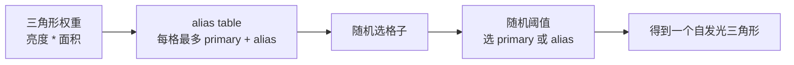

# 自发光三角形采样与 alias table

> 状态：当前实现事实总结。本文用直观方式说明 realtime RT 自发光三角形 NEE 中 light record、alias table、
> `emissive_hit_pdf` 和 MIS 的关系。

## 1. 先用一个抽奖袋理解

自发光三角形可以理解成场景里的很多小灯片。每个三角形都有自己的发光强度和面积：

- 又大又亮的三角形，对画面的直接光贡献通常更重要。
- 又小又暗的三角形，贡献通常更少。

如果完全平均抽三角形，很多样本会浪费在暗的小三角形上。更直观的做法是把每个三角形按权重放进一个抽奖袋：

```text
三角形 A：很亮，权重 5
三角形 B：中等，权重 2
三角形 C：很暗，权重 1

概念上的抽奖袋：
[A, A, A, A, A, B, B, C]
```

每次随机摸一个格子，摸到 A 的机会就比摸到 C 高。这个模型非常适合建立直觉：

```text
权重大 = 像是在抽奖袋里占了更多格子
权重小 = 像是在抽奖袋里占了更少格子
```

但真实渲染里通常不会真的重复写很多三角形 id。原因很简单：如果某个三角形权重大到几万倍，重复 id 的 buffer
会非常浪费内存，而且权重不是整数时也不好直接表达。

## 2. alias table 做的是同一件事，但更省

alias table 的目标仍然是“让权重大的三角形更容易被抽到”。它只是不用重复 id 的方式实现。

标准做法是：有多少个有效采样候选，就建多少个 alias table 格子。

```text
有效采样候选数量 = N
alias table 格子数量 = N
```

当前实现还额外保留一层直接寻址的 `emissive_triangle_lights` record array。对于 emissive submesh，record array
按 submesh 内 `primitive_id` 连续保存所有 triangle，即使 triangle 退化或预估 power 为 0 也不跳过。alias table
只指向其中有正面积、正 power 的有效 records：

```text
emissive_triangle_lights:
  [submesh primitive 0, submesh primitive 1, submesh primitive 2, ...]

alias table:
  [只抽有正 select_pdf 的 record index]
```

每个格子最多保存两个候选：

```text
primary_triangle_id
alias_triangle_id
probability
```

采样时只需要两步：

1. 随机选一个格子。
2. 再随机一个 0 到 1 的数；小于 `probability` 选 primary，否则选 alias。

例如：

| 格子 | primary | probability | alias |
|------|---------|-------------|-------|
| 0 | A | 0.25 | B |
| 1 | C | 0.60 | B |
| 2 | D | 1.00 | 无 |

如果抽到格子 0，就有 25% 选 A，75% 选 B。B 如果权重很大，会作为 alias 出现在很多格子里，而不是被塞进同一个格子很多次。

所以标准 alias table 不会出现“一个格子必须放下三个或更多三角形”的情况。每个格子最多就是 primary 加 alias 两个候选。



## 3. 格子数为什么不要随便变少

标准 alias table 的精确表达依赖一个前提：格子数等于有效采样候选数。

如果有 `N` 个有效三角形，却只给 `M` 个格子且 `M < N`，那就不再是标准 alias table 的精确模型了。此时会遇到问题：

- 有些三角形无法独立拥有自己的 primary 格子。
- 需要额外分组、层级 alias table 或近似压缩。
- PDF 查询也会更难保持精确一致。

因此当前自发光三角形 NEE 采用简单稳定的规则：

```text
过滤无效或零 power record 后，剩下多少个有效候选，就建多少个 alias table entry。
```

常见无效候选包括：

- 三角形面积为 0。
- 自发光亮度为 0。
- 材质或几何数据不可用。

这些 record 仍可保留在 `emissive_triangle_lights` 中，`select_pdf = 0`，因为 BRDF hit 的 PDF 查询需要
`base + primitive_id` 稳定寻址；它们只是不会进入 alias table，不会被 NEE 抽中。

## 4. 权重只决定抽谁，不改变灯本身

自发光三角形的权重通常可以先理解成：

```text
weight = luminance(emissive_radiance) * triangle_area
```

它表达的是“这个三角形值得被抽到的程度”。亮度越高、面积越大，权重越大。

但权重不是最终光照颜色，也不会改变三角形自己的 radiance。它只影响采样概率：

```text
亮的大灯：更常被抽到
暗的小灯：较少被抽到
```

真正算光照时，shader 仍然要读取这个三角形采样点上的材质、base color、emissive 等信息，再按 BRDF、距离、法线和可见性计算贡献。

## 5. emissive_light_pdf 回答什么问题

`emissive_light_pdf` 回答的是：

```text
如果我用自发光三角形采样器，抽到这个发光点或这个方向的概率是多少？
```

它通常由三部分组成：

```text
emissive_light_pdf =
    选中这个三角形的概率
  * 在这个三角形面积上选中这个点的概率
  * 从面积概率转换到方向概率
```

写成更接近实现的形式：

```text
triangle_select_pdf = triangle_weight / total_weight
point_area_pdf = 1 / triangle_area

area_pdf = triangle_select_pdf * point_area_pdf

solid_angle_pdf =
    area_pdf * distance^2 / abs(dot(light_normal, -light_dir))
```

这里最后一步很重要：自发光三角形采样一开始是在三角形面积上选点，但 BRDF 采样、NEE 和 MIS 比较的是方向概率。
所以对外使用的 PDF 应该转换到 solid angle 度量。

```text
面积上的概率：在灯面上选中某个点的概率
方向上的概率：从当前 shading point 朝某个方向打过去的概率
```

如果不同路径使用不同度量，MIS 权重会不匹配，能量就可能变亮、变暗或不稳定。

BRDF 路径命中 emissive surface 时不做 lookup entry，也不二分查找。closest-hit 写入 `geometry_id` 与
`primitive_id` 后，raygen 通过同一 instance-local submesh 索引直接找到 record：

```text
base = gpu_scene.instance_emissive_triangle_base_map[instance.geometry_indirect_idx + geometry_id]
light = gpu_scene.emissive_triangle_lights[base + primitive_id]
```

非 emissive submesh 的 base map 值为 `UINT_MAX`，表示没有可竞争的 emissive light PDF。

## 6. PDF lookup 的内部结构与构建

这里的 lookup 指“shader 按 instance / submesh / primitive 直接寻址 PDF 所需的数据结构”，不是额外的
lookup entry 表。它由三层 GPU 数据共同组成：

```text
GpuScene
  instance_emissive_triangle_base_map: uint[]
  emissive_triangle_lights: EmissiveTriangleLight[]
  emissive_light_alias_table: EmissiveLightAliasEntry[]
```

### 6.1 base map：instance-submesh 到 record base

`instance_emissive_triangle_base_map` 是 lookup 的第一跳，顺序与 `instance_geometry_map` /
`instance_material_map` 完全一致。对 shader 来说，`geometry_id` 就是 `GeometryIndex()` 返回的 instance-local
submesh index，因此索引公式固定为：

```text
map_index = instance.geometry_indirect_idx + geometry_id
base = instance_emissive_triangle_base_map[map_index]
```

base map 每个 entry 的含义是：

| 值 | 含义 |
|----|------|
| `UINT_MAX` | 该 instance-submesh 不是 emissive，或材质/三角形 metadata 不可用，不能参与 emissive PDF 查询。 |
| 其它 `uint` | 该 instance-submesh 在 `emissive_triangle_lights` 中的连续 record 起点。 |

base map 的长度等于当前 active instance 展开的 submesh 总数。它不是按全局 mesh submesh 建的，而是按
active instance-submesh 建的；同一个 mesh 被多个 instance 引用时，每个 instance 都有自己的 base，因为 world-space
三角形位置、面积、normal 和 instance id 都不同。

### 6.2 record array：`base + primitive_id` 直接得到 light PDF record

`emissive_triangle_lights` 保存真正用于 NEE 和 hit PDF 的三角形 record。emissive submesh 一旦写入 base，就必须为
这个 submesh 的所有 primitive 按 `PrimitiveIndex()` 顺序保留连续 record：

```text
base + 0 -> primitive 0
base + 1 -> primitive 1
base + 2 -> primitive 2
...
```

不能为了节省空间跳过退化三角形或零 power 三角形，否则 `base + primitive_id` 会错位。无效 record 仍保留在数组中，
但 `area` 或 `select_pdf` 为 0，最终 PDF 查询返回 0。

每个 `EmissiveTriangleLight` record 保存：

| 字段 | 用途 |
|------|------|
| `p0 / p1 / p2` | world-space 三角形顶点，用于 NEE 采样点、方向和距离。 |
| `area` | world-space 面积，参与 `select_pdf / area`。 |
| `select_pdf` | alias table 选中该 record 的离散概率；零 power / 退化 record 为 0。 |
| `material_slot` | shader 读取材质 `emissive`、base color / texture 的稳定 slot。 |
| `normal` | 面积 PDF 转 solid-angle PDF 时使用的几何 normal；当前双面语义使用 `abs(dot(...))`。 |
| `instance_id` | 稳定 GPU instance slot，用于 hit PDF 查询后的防错校验。 |
| `uv0 / uv1 / uv2` | 在 NEE 采样点插值 UV，读取与 closest-hit 一致的 base color。 |
| `geometry_id` | instance-local submesh index，用于防错校验。 |
| `primitive_id` | submesh-local primitive index，用于防错校验和直接寻址契约。 |

### 6.3 alias table：只服务 NEE 抽样，不服务 hit lookup

`emissive_light_alias_table` 只包含有效可采样 record。每个 `EmissiveLightAliasEntry` 保存：

| 字段 | 用途 |
|------|------|
| `alias_probability` | 当前格子选择 primary record 的概率。 |
| `light_index` | primary record 在 `emissive_triangle_lights` 中的 index。 |
| `alias_light_index` | alias record 在 `emissive_triangle_lights` 中的 index。 |

shader 采样 emissive NEE 时先随机选 alias table column，再按 `alias_probability` 得到一个 `light_index`。
BRDF hit emissive 查询 PDF 时不经过 alias table，因为 hit 已经给出了 instance、submesh 和 primitive，直接走
base map + record array 更简单，也能避免为 hit path 维护额外查找表。

### 6.4 构建流程

构建发生在 `EmissiveLightTable`，位置是 `InstanceBridge::prepare_render_data` 之后、
`GpuScene::upload_render_data` 之前。流程是：

1. `AssetMeshManager` 在 mesh 上传时从 upload-ready `MeshData.indices` 按三角形顺序生成 `RtTriangleMeta`：
   local positions、UV、`primitive_id` 和 local area。这个顺序与 BLAS / closest-hit 的 `PrimitiveIndex()` 对齐。
2. `MaterialManager` 通过 stable material slot 暴露只读 `RenderMaterialParams`，并用 `material_revision` 标记
   emissive/base color 等 CPU 参数变化。
3. `EmissiveLightTable` 的 revision 由 mesh ready revision、instance revision 和 material revision 组合得到；
   revision 变化时清空 `triangle_lights`、`alias_table`、`base_map` 并重建。
4. 重建按 `RenderData::all_instances` 遍历 active instance，再按 `instance.material_slots` 遍历 instance-local
   submesh。这个顺序必须与 `GpuScene::upload_instance_buffer` 写 `instance_geometry_map` 的顺序一致。
5. 对非 emissive material、缺失 material、缺失 triangle metadata 或空 submesh，向 `base_map` 写 `UINT_MAX`。
6. 对 emissive submesh，先把当前 `triangle_lights.len()` 写入 `base_map` 作为 base，再按 submesh primitive 顺序
   追加所有 `EmissiveTriangleLight` record。
7. 每个 record 的 world positions、world area 和 normal 由 instance transform 计算；`geometry_id` 写 submesh
   index，`primitive_id` 来自 `RtTriangleMeta`。
8. power 近似使用 `luminance(material.emissive * estimated_base_color) * world_area`。无 diffuse texture 时使用常量
   base color；有 diffuse texture 时第一版用 `1` 作为稳定近似，shader shade 阶段仍按真实 UV 读取 base color。
9. power 大于 0 的 record 进入 `weighted_records`；全部 record 追加完成后，用 `weight / total_weight` 回填
   对应 record 的 `select_pdf`，再用这些有效 record 构建 alias table。
10. 如果总 power 为 0，alias table 为空，`emissive_light_enabled = 0`；直接寻址 records 可以存在，但所有
    `select_pdf` 为 0，hit PDF 查询会返回 0。
11. 当前 FIF frame label 的三类 structured buffer 按需扩容并上传，`GpuScene` root buffer 记录 device address、
    alias entry count、enabled 标记和 version。

### 6.5 查询流程

BRDF 路径命中 emissive surface 后，closest-hit 已经把 `instance_id`、`geometry_id`、`primitive_id` 和
`hit_t` 写入 `RtSurfaceHit`。`emissive_hit_pdf` 的查询流程是：

```text
surface.instance_id -> gpu_scene.all_instances[instance_id]
geometry_id bounds check
map_index = instance.geometry_indirect_idx + geometry_id
base = instance_emissive_triangle_base_map[map_index]
base == UINT_MAX -> pdf = 0
light = emissive_triangle_lights[base + primitive_id]
校验 light.instance_id / geometry_id / primitive_id
pdf = select_pdf / area * hit_t^2 / abs(dot(light.normal, -light_dir))
```

这些校验不会替代构建期不变量；它们主要用于防止错误 table 或越界语义把能量污染到 path 中。正常情况下，
`base + primitive_id` 应该 O(1) 命中唯一的 light record。

## 7. NEE 和 MIS 怎么使用它

自发光三角形 NEE 的主流程可以理解成：

```text
当前 shading point
  -> 用 alias table 选一个自发光三角形
  -> 在三角形面积上随机选一个点
  -> 计算 light_dir、distance、radiance、solid_angle_pdf
  -> 发 shadow ray 判断是否可见
  -> 用 BRDF * cos / light_pdf 算直接光贡献
```

而 MIS 关心的是另一条路径：

```text
BRDF 随机反弹
  -> 碰巧命中自发光三角形
  -> 用 base + primitive_id 查询同一套 emissive_hit_pdf
  -> 和 BRDF PDF 做 MIS
```

这样可以避免同一个灯光贡献被两种路径重复算得过亮，也能避免直接光采样和 BRDF 命中使用两套互相矛盾的概率。

## 8. 关键不变量

- `instance_emissive_triangle_base_map` 与 `instance_geometry_map` / `instance_material_map` 使用同一 instance-local
  submesh 顺序，索引为 `instance.geometry_indirect_idx + geometry_id`。
- emissive submesh 必须为所有 primitive 保留连续 record；不能为了压缩 table 跳过中间 primitive。
- alias table 只改变“哪个三角形更常被抽到”，不改变三角形的 radiance。
- alias table 的 entry 数量等于有效采样候选数量，每个 entry 最多保存 primary 和 alias 两个 record index。
- 自发光三角形的采样 PDF 对外应使用 solid angle 度量，方便和 BRDF PDF 做 MIS。
- NEE 抽到 emissive triangle 和 BRDF 命中 emissive surface 必须查询同一套 light PDF。
- 无效三角形、零权重、零面积或几何退化都应明确返回无效候选，避免 NaN 或错误能量污染路径。

## 9. 当前数据路径

`AssetMeshManager` 在 uploaded mesh cache 中保留每个 submesh 的三角形 position、UV、primitive id 和 local
area。`MaterialManager` 提供按 material slot 读取 `RenderMaterialParams` 的窄接口，并维护 `material_revision`。

`EmissiveLightTable` 是 runtime 私有 owner，在 `InstanceBridge::prepare_render_data` 之后、
`GpuScene::upload_render_data` 之前读取当前 `RenderData` 与材质快照，重建并上传三类 buffer：

- `emissive_triangle_lights`：直接寻址 record array。
- `emissive_light_alias_table`：NEE 抽样用 alias table，只包含有效候选。
- `instance_emissive_triangle_base_map`：instance-local submesh 到 record base 的映射，非 emissive 为 `UINT_MAX`。

rebuild revision 由 mesh ready revision、instance revision 与 material revision 组合得到；mesh ready、instance
transform / active set、material emissive / base color 参数变化都会刷新 table。带 diffuse texture 的 power
分布第一版使用稳定近似，shader shade 阶段仍按真实 UV 读取 base color。

`RtPipelineSettings.emissive_nee_enabled` 默认开启；关闭、表为空或 GPU scene 标记未启用时，shader 不生成
emissive NEE candidate，退回只靠 HDRI NEE 与 hit emission 的路径。调试通道 `NeeEmissive` 只显示来自
emissive triangle NEE 的直接光贡献。
