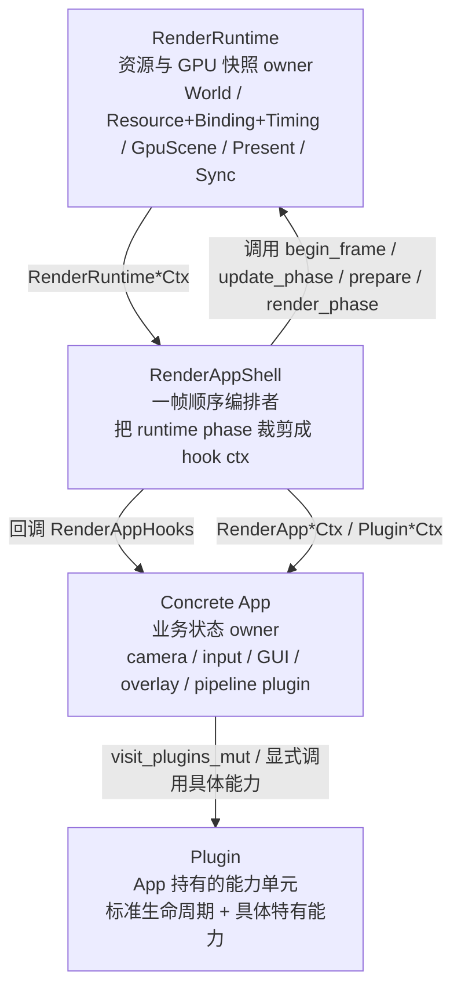
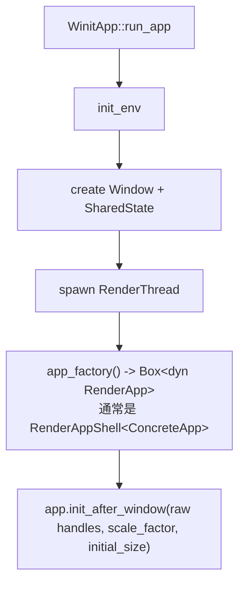
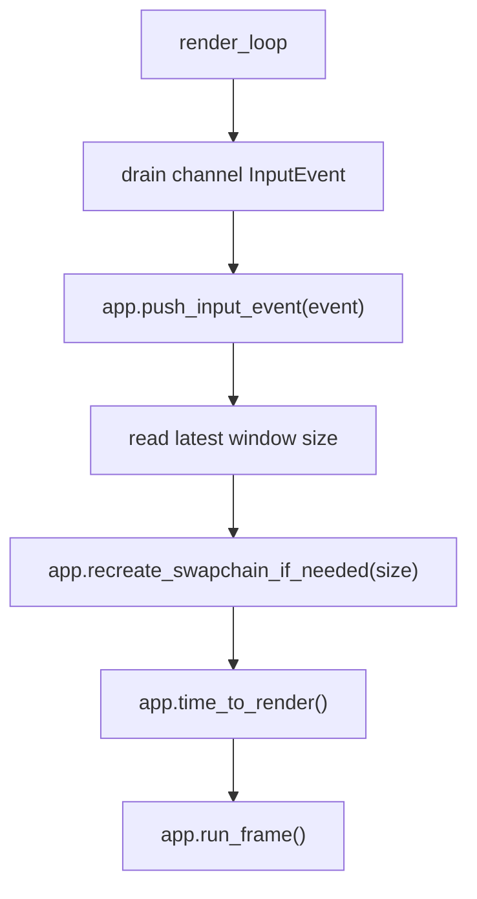
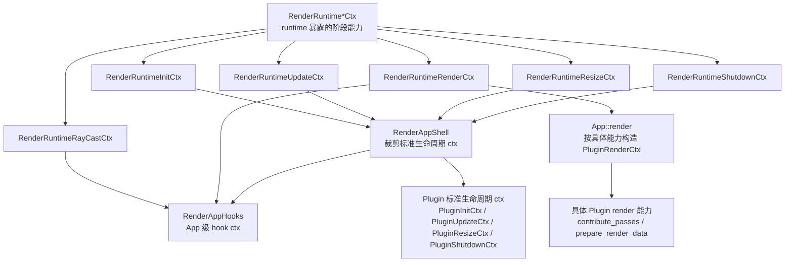

# 帧生命周期与 Phase 关系

> 状态：当前实现事实总结。本文只解释现有 `RenderRuntime`、`RenderAppShell`、
> `RenderAppHooks` 和 `Plugin` 的 phase 边界，不提出新的 API 或重命名方案。

本文把一帧理解成三层协作：

- `RenderRuntime` 提供底层阶段化能力，拥有 `World`、GPU resource/binding/timing owners、runtime-owned render state、
  `GpuScene`、present、cmd 和同步资源。
- `RenderAppShell` 固定一帧顺序，把 runtime phase 裁剪成 App / Plugin 可用的上下文。
- 具体 App 持有 camera、input、GUI、overlay 和具体渲染 Plugin，并决定这些能力如何组合。

## 整体心智模型

从阅读者角度，可以先用一个粗粒度模型理解每帧：

```text
Before Render = begin_frame + input + update + resize sync + prepare + after_prepare query
Render        = app.render + RenderGraph pass 贡献 / 录制 / 提交
After Render  = present + end_frame
```

真实代码不会把所有阶段合并成这三个函数，因为阶段化 Ctx 需要限制不同时间点能访问的资源。
例如 update 可以修改 `World`，render 只能读取 prepare 后的 GPU scene 快照。

### 三层职责图



这张图里最重要的边界是：`RenderRuntime` 不感知 Plugin、GUI 或 App 编排；App / Plugin 也不长期保存完整 runtime owner，只在当前
phase 内使用窄化后的 ctx。

## 启动、Resize 与关闭入口

启动入口唯一：平台层创建窗口和渲染线程，渲染线程只通过 `Box<dyn RenderApp>` 驱动 App。



render loop 的外层顺序先合并输入与窗口尺寸变化，再让 `RenderAppShell` 进入单帧 phase：



resize 只在 render loop 的安全点处理。`RenderRuntime::handle_resize` 只有实际重建 swapchain / present 相关状态时才返回
`Some(RenderRuntimeResizeCtx)`；随后 `RenderAppShell` 把它包装为 `RenderAppResizeCtx`，App 再通知需要重建窗口尺寸资源的
Plugin。

关闭流程：

- 渲染线程观察到退出信号后调用 `RenderApp::shutdown(&mut self)`。
- `RenderAppShell` 先调用 App hooks 的 `shutdown()`，再通过 App 提供的 shutdown visitor 调用 Plugin shutdown，最后销毁
  RenderRuntime。
- `RenderRuntime` 拥有 `Gfx` root owner；runtime 销毁时先等待 GPU idle，释放所有子资源，最后销毁 `Gfx`。
- 主线程等待渲染线程完成后再 drop `Window`。

## 一帧三泳道图

```mermaid
flowchart LR
    subgraph R["RenderRuntime"]
        R0["begin_frame<br/>FIF 等待 / 命令池重置 / 延迟释放 / asset 事件分发"]
        R1["update_phase<br/>同步 FrameRenderState<br/>acquire present target"]
        R2["sync_render_options_frame_state<br/>必要时同步 render/output extent"]
        R3{"has present target?"}
        R4["prepare(render_view)<br/>CPU scene -> GPU scene 快照<br/>descriptor / per-frame data"]
        R5["ray_cast_phase<br/>只暴露同步 raycast"]
        R6["render_phase<br/>只读 GPU render ctx"]
        R7["present"]
        R8["end_frame<br/>推进 frame counter"]
        R9["signal_current_frame_complete<br/>无 present target 时补齐 timeline"]
    end

    subgraph A["App / RenderAppHooks"]
        A0["on_input(events)<br/>输入消费策略"]
        A1["update(ctx)<br/>更新 camera / UI frame state / settings"]
        A2["on_resize(ctx)<br/>重建 App-owned targets"]
        A3["render_view()<br/>提供当前视图快照"]
        A4["after_prepare(ctx)<br/>同步查询，例如拾取"]
        A5["render(ctx)<br/>创建 RenderGraph<br/>决定 pass 顺序"]
    end

    subgraph P["Plugin"]
        P0["Plugin::update<br/>标准 CPU 更新"]
        P1["Plugin::on_resize<br/>重建 Plugin-owned targets"]
        P2["具体 plugin 能力<br/>ui / begin_frame / contribute_passes"]
    end

    R0 --> A0 --> R1 --> A1 --> P0 --> R2
    R2 -->|" Some resize ctx "| A2 --> P1 --> R3
    R2 -->|" None "| R3
    R3 -->|" no "| R9 --> R8
    R3 -->|" yes "| A3 --> R4 --> R5 --> A4 --> R6 --> A5 --> P2 --> R7 --> R8
```



泳道图对应 `RenderAppShell::run_frame` 的主路径。`RenderAppShell` 先进入 runtime 的 frame
阶段，再调用 App hook；Plugin 的标准生命周期由 App 暴露的 visitor 批量驱动，Plugin 的特有渲染能力仍由 App 在 `render`
中显式调用。

## Ctx 裁剪图



`PluginRenderCtx` 不由标准 `Plugin` trait 自动派发。原因是 render 阶段需要 App 决定完整 pass 顺序，例如先贡献 RT / raster
pass，再叠加 GUI；如果把所有 render 能力都放进统一 trait，App 反而会失去明确的管线编排权。

## RenderRuntime Phases

| Phase                          | 调用点                          | 主要职责                                                                                         | 对上层暴露                            |
|--------------------------------|------------------------------|----------------------------------------------------------------------------------------------|----------------------------------|
| `init_after_window`            | 窗口 raw handle 就绪后            | 创建 surface、swapchain、present owner                                                           | `RenderRuntimeInitCtx`           |
| `begin_frame`                  | 每帧开始                         | 等待 FIF timeline、重置 frame command pool、清理延迟释放、推进 bindless/material/instance token、分发 asset 事件 | 不直接暴露 ctx                        |
| `update_phase`                 | input 后、App update 前         | 同步 present extent 到 `FrameRenderState`，acquire 当前 present target，提供 CPU 更新能力                   | `RenderRuntimeUpdateCtx`         |
| `sync_render_options_frame_state` | App / Plugin update 后        | 当 `RenderOptions` 改变 DLSS SR mode 或 render extent 时同步 `FrameRenderState`，并触发上层 resize          | `Option<RenderRuntimeResizeCtx>` |
| `prepare(render_view)`         | update / resize 后、render 前   | 读取 App 的 `RenderView` 快照，把 `World`、asset、material、instance 同步成 GPU scene 与 descriptor 数据     | 不直接暴露 ctx                        |
| `ray_cast_phase`               | prepare 后、render graph 前     | 允许 App 对刚准备好的 GPU scene 做同步 raycast                                                          | `RenderRuntimeRayCastCtx`        |
| `render_phase`                 | App render 前                 | 提供只读 render ctx，供 RenderGraph/pass 读取 GPU scene、present view 与 timeline                      | `RenderRuntimeRenderCtx`         |
| `present`                      | render graph 提交后             | 把当前 swapchain image 交给 present queue                                                         | 不直接暴露 ctx                        |
| `end_frame`                    | 每帧最后                         | 推进 frame counter，切换下一帧 FIF label                                                             | 不直接暴露 ctx                        |
| `handle_resize`                | render loop 安全点              | 重建 swapchain / present 相关状态，并通知上层重建窗口尺寸资源                                                    | `Option<RenderRuntimeResizeCtx>` |
| `shutdown_phase`               | shutdown 中、runtime destroy 前 | 让 App / Plugin 在 `Gfx` 存活时释放自己持有的 GPU 资源                                                     | `RenderRuntimeShutdownCtx`       |

Runtime phase 的核心意图是用借用和 ctx 限制能力：update 阶段可以改 CPU 语义状态，render 阶段只能读 prepare 后的 GPU 可见状态。

## App Phases

| Phase           | 由谁调用                                | 主要职责                                                         | 与 Runtime / Plugin 的关系                                         |
|-----------------|-------------------------------------|--------------------------------------------------------------|----------------------------------------------------------------|
| `init`          | `RenderAppShell::init_after_window` | 初始化 App 自有状态和资源                                              | 发生在 runtime window 绑定后、标准 Plugin `init` 前                      |
| `on_input`      | `RenderAppShell::run_frame`         | 处理本帧累积输入，决定 GUI、camera、业务输入的消费策略                             | 标准 Plugin `on_input` 不自动批量调用，App 可显式调用具体 Plugin                |
| `update`        | `RenderAppShell::run_frame`         | 更新 camera、overlay、UI frame state、`RenderOptions` 或 app-local pipeline 配置、CPU scene | 运行在 `RenderRuntimeUpdateCtx` 内，早于 `Plugin::update` 和 `prepare` |
| `after_prepare` | `RenderAppShell::run_frame`         | 对已同步的 GPU scene 做同步查询                                        | 只拿 `RenderRuntimeRayCastCtx`，常见用途是拾取                           |
| `render`        | `RenderAppShell::run_frame`         | 创建 RenderGraph，显式决定具体 Plugin pass 与 GUI pass 的加入顺序           | 读取 `RenderRuntimeRenderCtx`，通常在这里构造 `PluginRenderCtx`          |
| `render_view`   | `RenderAppShell::run_frame`         | 提供当前 camera / view 的纯数据快照                                    | runtime 在 `prepare` 中读取，不拥有 App camera                         |
| `on_resize`     | runtime 确认 resize 后                 | 更新 App-owned target 或窗口尺寸状态                                  | 早于标准 Plugin `on_resize`                                        |
| `shutdown`      | `RenderAppShell::shutdown`          | 释放 App-owned GPU 资源                                          | 早于标准 Plugin shutdown，且早于 runtime destroy                       |

App 是业务编排层。它既不拥有 runtime，也不把具体 Plugin 交给 runtime 发现，而是通过字段显式组合能力，并通过 visitor
暴露标准生命周期。

## Plugin Phases

| Phase       | 是否由 Shell 自动批量调用 | 主要职责                                            | 备注                                |
|-------------|------------------|-------------------------------------------------|-----------------------------------|
| `init`      | 是                | 初始化 Plugin-owned 长期资源                           | 使用 `PluginInitCtx`                |
| `on_input`  | 否                | 处理单个输入事件并返回是否消费                                 | 输入消费顺序属于 App 策略                   |
| `update`    | 是                | 更新 Plugin CPU 状态，调整 `World`、`RenderOptions` 或 plugin-local 配置 | 发生在 App `update` 后                |
| `on_resize` | 是                | 重建 Plugin-owned 窗口尺寸资源                          | 发生在 App `on_resize` 后             |
| `shutdown`  | 是                | 显式释放 Plugin-owned GPU 资源                        | 通过 `visit_plugins_mut_rev` 支持反向释放 |

标准 `Plugin` trait 不包含 `ui()`、`begin_frame()`、`end_frame()`、`prepare_render_data()`、
`contribute_passes()` 或 `contribute_compute_passes()`。这些属于具体 Plugin 的特有能力，
需要 App 按业务顺序显式调用，避免通过 downcast、注册表或消息总线隐藏管线顺序。

## 关系与约束

- `RenderRuntime` 是 phase 能力来源，但不是 App / Plugin 编排者；它只暴露当前阶段需要的 typed ctx。
- `RenderAppShell` 是固定帧骨架；它把 runtime phase 和 App hook、Plugin 标准生命周期串成一帧。
- `App` 是业务组合 owner；它持有具体 Plugin，并在 render 阶段决定 RenderGraph pass 顺序。
- `Plugin` 是可复用能力单元；标准生命周期可以批量驱动，特有能力由 App 显式调用。
- `World` 只应在 init / update / resize / shutdown 等允许可变借用的阶段修改；render 阶段不再修改 CPU scene。
- `prepare` 是 update 与 render 之间的语义翻译边界；它生成本帧 GPU scene、TLAS、per-frame data 和 descriptor 状态。
- `after_prepare` 是显式例外窗口；它可以同步查询刚准备好的 GPU scene，但普通渲染工作仍应进入 `render` hook 和 RenderGraph。
- App / Plugin 持有的 GPU 资源必须在 resize 或 shutdown ctx 中显式重建 / 释放，不能依赖 runtime destroy 后的 `Drop` 再访问
  Vulkan/VMA/WSI。
