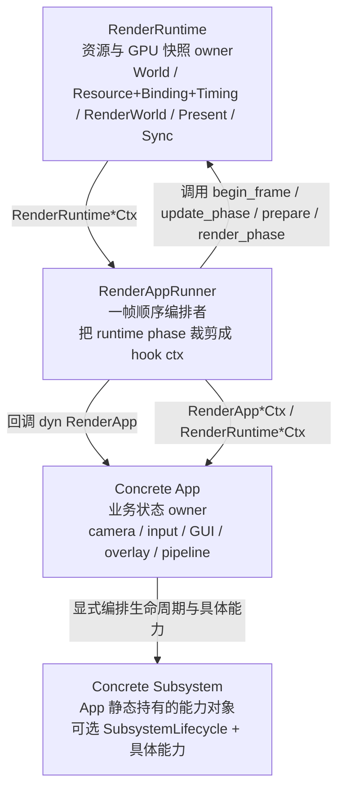
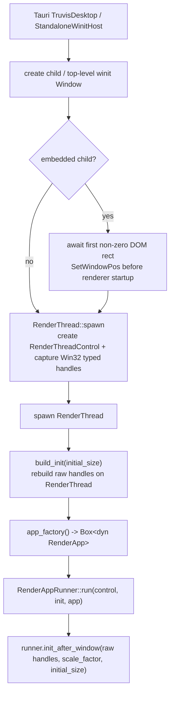
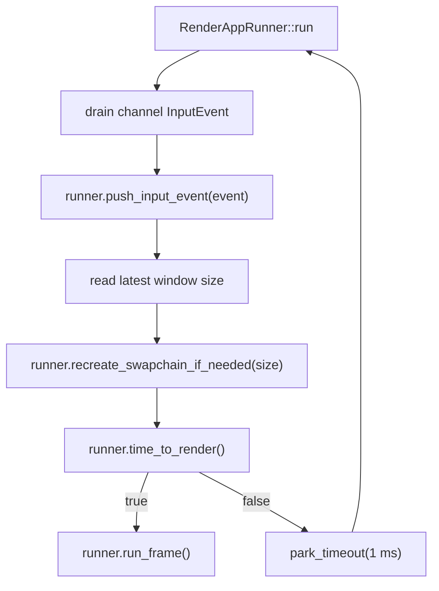
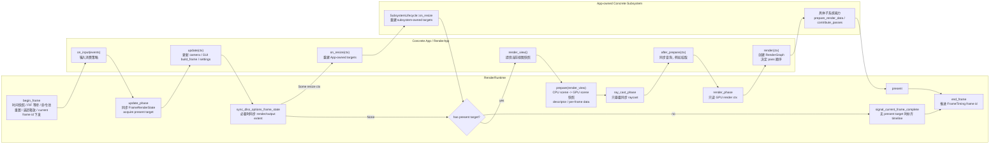
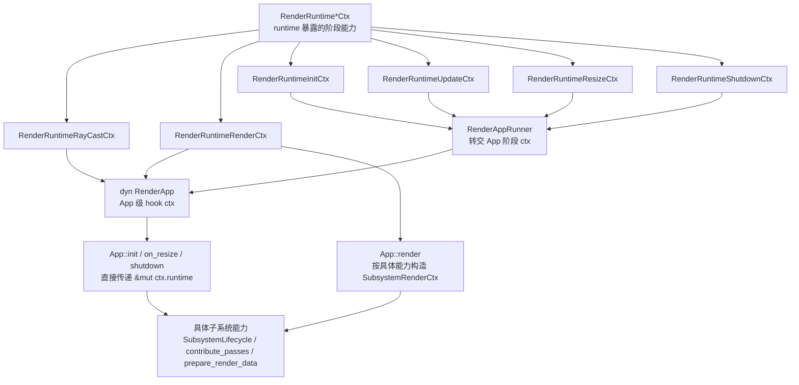

# 帧生命周期与 Phase 关系

> 状态：当前实现事实总结。本文只解释现有 `RenderRuntime`、`RenderAppRunner`、
> `RenderApp` 和 App-owned 子系统的 phase 边界。

本文把一帧理解成三层协作：

- `RenderRuntime` 提供底层阶段化能力，拥有 `World`、GPU resource/binding/timing owners、runtime-owned render state、
  `RenderWorld`、present、cmd 和同步资源。
- `RenderAppRunner` 固定一帧顺序，把 runtime phase 交给对应 App 阶段。
- 具体 App 持有 camera、input、GUI、overlay 和具体渲染子系统，并决定这些能力如何组合。

## 整体心智模型

从阅读者角度，可以先用一个粗粒度模型理解每帧：

```text
Before Render = begin_frame + input + update + resize sync + prepare + after_prepare query
Render        = app.render + RenderGraph pass 贡献 / 录制 / 提交
After Render  = present + end_frame
```

真实代码不会把所有阶段合并成这三个函数，因为阶段化 Ctx 需要限制不同时间点能访问的资源。
例如 update 可以修改 `World`，render 只能读取 prepare 后的 GPU scene 快照。

### 三层职责图


```mermaid
flowchart TB
    Runtime["RenderRuntime<br/>资源与 GPU 快照 owner<br/>World / Resource+Binding+Timing / RenderWorld / Present / Sync"]
    Runner["RenderAppRunner<br/>一帧顺序编排者<br/>把 runtime phase 裁剪成 hook ctx"]
    App["Concrete App<br/>业务状态 owner<br/>camera / input / GUI / overlay / pipeline"]
    Subsystem["Concrete Subsystem<br/>App 静态持有的能力对象<br/>可选 SubsystemLifecycle + 具体能力"]
    Runner -->|" 调用 begin_frame / update_phase / prepare / render_phase "| Runtime
    Runner -->|" 回调 dyn RenderApp "| App
    App -->|" 显式编排生命周期与具体能力 "| Subsystem
    Runtime -->|" RenderRuntime*Ctx "| Runner
    Runner -->|" RenderApp*Ctx / RenderRuntime*Ctx "| App
```

这张图里最重要的边界是：Runner 定义阶段边界，App 编排阶段内部，子系统只实现自己的具体能力。
`RenderRuntime` 与 Runner 都不感知 App 内部子系统；App / 子系统也不长期保存完整 runtime owner，只在当前 phase 内使用窄化后的 ctx。

## 启动、Resize 与关闭入口

渲染入口仍然唯一：`truvis-winit-host` 管理具体窗口并提取可 Send 的 Win32 typed handle，
`truvis-render-thread` 创建 OS RenderThread。初始化 factory 与 App factory 都只在该线程执行，随后进入
`RenderAppRunner::run(control, init, app)`，由 Runner 内部统一拥有 App、Runtime 和完整帧循环。
主体应用的 Tauri child window 与独立 sample 的顶层窗口只是在该入口之前采用不同的窗口 owner。


```mermaid
flowchart TD
    Entry["Tauri TruvisDesktop / StandaloneWinitHost"] --> CreateWindow["create child / top-level winit Window"]
    CreateWindow --> InitialSize{"embedded child?"}
    InitialSize -->|"yes"| AwaitDom["await first non-zero DOM rect<br/>SetWindowPos before renderer startup"]
    InitialSize -->|"no"| ThreadOwner["RenderThread::spawn<br/>create RenderThreadControl + capture Win32 typed handles"]
    AwaitDom --> ThreadOwner
    ThreadOwner --> SpawnThread["spawn RenderThread"]
    SpawnThread --> BuildInit["build_init(initial_size)<br/>rebuild raw handles on RenderThread"]
    BuildInit --> AppFactory["app_factory() -> Box&lt;dyn RenderApp&gt;"]
    AppFactory --> Runner["RenderAppRunner::run(control, init, app)"]
    Runner --> InitAfterWindow["runner.init_after_window(raw handles, scale_factor, initial_size)"]
```

`RenderAppRunner::run` 在内部循环中先合并输入与窗口尺寸变化，再进入单帧 phase：


```mermaid
flowchart TD
    RenderLoop["RenderAppRunner::run"] --> DrainInput["drain channel InputEvent"]
    DrainInput --> PushInput["runner.push_input_event(event)"]
    PushInput --> ReadSize["read latest window size"]
    ReadSize --> RecreateSwapchain["runner.recreate_swapchain_if_needed(size)"]
    RecreateSwapchain --> TimeToRender["runner.time_to_render()"]
    TimeToRender -->|"true"| RunFrame["runner.run_frame()"]
    TimeToRender -->|"false"| ShortPoll["park_timeout(1 ms)"]
    ShortPoll --> RenderLoop
```

`FrameTiming` 默认把相邻帧开始时间限制为至少 `1 / 120 s`（约 `8.333333 ms`）。Runner 仍按现有
`park_timeout(1 ms)` 短周期轮询：它不会忙等，也不增加主动唤醒协议。输入 drain、窗口尺寸读取和 resize 安全点位于
限帧判断之前，因此等待期间仍按该轮询周期处理控制状态。渲染本身超过最小间隔时下一轮直接开始，不补帧、不追赶，
也不再追加固定睡眠；120 FPS 只表示上限，实际轻负载帧率会受 1 ms 轮询和 OS 调度影响而略低。首帧使用
`FrameTiming` 构造时刻作为锚点，runtime/window/App 初始化通常已经覆盖一个帧间隔。

resize 只在 render loop 的安全点处理。`RenderRuntime::handle_resize` 只有实际重建 swapchain / present 相关状态时才返回
`Some(RenderRuntimeResizeCtx)`；随后 `RenderAppRunner` 把它包装为 `RenderAppResizeCtx`，App 再通知需要重建窗口尺寸资源的
具体子系统。

关闭流程：

- 渲染线程观察到退出信号后，由 `RenderAppRunner` 内部执行 shutdown，再调用具体 `RenderApp::shutdown` hook。
- `TruvisRenderApp` 在 shutdown 中关闭 RenderThread 一侧的 `EditorController` endpoint；EditorServer 由 main thread 的
  `TruvisDesktopState` 持有，不参与 GPU idle 或资源销毁。
- `RenderAppRunner` 等待 GPU idle 后只调用 App hook 的 `shutdown()`；App 在该 hook 内按自身依赖顺序释放全部子系统，
  Runner 最后销毁 RenderRuntime。
- `RenderRuntime` 拥有 `Gfx` root owner；runtime 销毁时先等待 GPU idle，释放所有子资源，最后销毁 `Gfx`。
- 窗口 owner 等待渲染线程完成后再 drop winit `Window`；Tauri 主窗口关闭时继续等待 `RenderWindowThread` 和
  EditorServer，最后才允许 parent HWND drop。

## 一帧三泳道图


```mermaid
flowchart LR
    subgraph R["RenderRuntime"]
        R0["begin_frame<br/>时间快照 / FIF 等待 / 命令池重置 / 延迟释放 / current frame id 下发"]
        R1["update_phase<br/>同步 FrameRenderState<br/>acquire present target"]
        R2["sync_dlss_options_frame_state<br/>必要时同步 render/output extent"]
        R3{"has present target?"}
        R4["prepare(render_view)<br/>CPU scene -> GPU scene 快照<br/>descriptor / per-frame data"]
        R5["ray_cast_phase<br/>只暴露同步 raycast"]
        R6["render_phase<br/>只读 GPU render ctx"]
        R7["present"]
        R8["end_frame<br/>推进 FrameTiming frame id"]
        R9["signal_current_frame_complete<br/>无 present target 时补齐 timeline"]
    end

    subgraph A["Concrete App / RenderApp"]
        A0["on_input(events)<br/>输入消费策略"]
        A1["update(ctx)<br/>更新 camera / GUI build_frame / settings"]
        A2["on_resize(ctx)<br/>重建 App-owned targets"]
        A3["render_view()<br/>提供当前视图快照"]
        A4["after_prepare(ctx)<br/>同步查询，例如拾取"]
        A5["render(ctx)<br/>创建 RenderGraph<br/>决定 pass 顺序"]
    end

    subgraph S["App-owned Concrete Subsystem"]
        S0["SubsystemLifecycle::on_resize<br/>重建 subsystem-owned targets"]
        S1["具体子系统能力<br/>prepare_render_data / contribute_passes"]
    end

    R0 --> A0 --> R1 --> A1 --> R2
    R2 -->|" Some resize ctx "| A2 --> S0 --> R3
    R2 -->|" None "| R3
    R3 -->|" no "| R9 --> R8
    R3 -->|" yes "| A3 --> R4 --> R5 --> A4 --> R6 --> A5 --> S1 --> R7 --> R8
```

泳道图对应 `RenderAppRunner::run_frame` 的主路径。`RenderAppRunner` 先进入 runtime 的 frame
阶段，再调用 App hook；具体子系统只由 App 在对应 hook 内显式调用，Runner 不直接接触它们。

## Ctx 裁剪图


```mermaid
flowchart TB
    RuntimeCtx["RenderRuntime*Ctx<br/>runtime 暴露的阶段能力"]
    InitCtx["RenderRuntimeInitCtx"]
    UpdateCtx["RenderRuntimeUpdateCtx"]
    RayCtx["RenderRuntimeRayCastCtx"]
    RenderCtx["RenderRuntimeRenderCtx"]
    ResizeCtx["RenderRuntimeResizeCtx"]
    ShutdownCtx["RenderRuntimeShutdownCtx"]
    RuntimeCtx --> InitCtx
    RuntimeCtx --> UpdateCtx
    RuntimeCtx --> RayCtx
    RuntimeCtx --> RenderCtx
    RuntimeCtx --> ResizeCtx
    RuntimeCtx --> ShutdownCtx
    Runner["RenderAppRunner<br/>转交 App 阶段 ctx"]
    AppHooks["dyn RenderApp<br/>App 级 hook ctx"]
    AppLifecycle["App::init / on_resize / shutdown<br/>直接传递 &mut ctx.runtime"]
    AppRender["App::render<br/>按具体能力构造 SubsystemRenderCtx"]
    Subsystem["具体子系统能力<br/>SubsystemLifecycle / contribute_passes / prepare_render_data"]
    InitCtx --> Runner
    UpdateCtx --> Runner
    ResizeCtx --> Runner
    ShutdownCtx --> Runner
    RayCtx --> AppHooks
    RenderCtx --> AppHooks
    Runner --> AppHooks
    AppHooks --> AppLifecycle --> Subsystem
    RenderCtx --> AppRender --> Subsystem
```

`SubsystemRenderCtx` 位于 `app-kit`，只由 App 在 render 阶段构造，不由 Runner 或
`SubsystemLifecycle` 自动派发。render 阶段需要 App 决定完整 pass 顺序，例如先贡献 RT / raster pass，再叠加 GUI；
`world_submesh_raster` 等 App 专属能力不会进入所有子系统共享的视图。

## RenderRuntime Phases

| Phase                          | 调用点                          | 主要职责                                                                                         | 对上层暴露                            |
|--------------------------------|------------------------------|----------------------------------------------------------------------------------------------|----------------------------------|
| `init_after_window`            | 窗口 raw handle 就绪后            | 创建 surface、swapchain、present owner                                                           | `RenderRuntimeInitCtx`           |
| `begin_frame`                  | 每帧开始                         | 采样 `FrameTiming`、等待 FIF timeline、重置 frame command pool、清理延迟释放并下发当前 frame id | 不直接暴露 ctx                        |
| `update_phase`                 | input 后、App update 前         | 同步 present extent 到 `FrameRenderState`，acquire 当前 present target，提供 CPU 更新能力                   | `RenderRuntimeUpdateCtx`         |
| `sync_dlss_options_frame_state` | App update 后        | 当 `DlssOptions` 改变 DLSS SR mode 或 render extent 时同步 `FrameRenderState`，并触发上层 resize          | `Option<RenderRuntimeResizeCtx>` |
| `prepare(render_view)`         | update / resize 后、render 前   | 读取 App 的 `RenderView` 快照，把 `World`、asset、material、instance 同步成 GPU scene 与 descriptor 数据     | 不直接暴露 ctx                        |
| `ray_cast_phase`               | prepare 后、render graph 前     | 允许 App 对刚准备好的 GPU scene 做同步 raycast                                                          | `RenderRuntimeRayCastCtx`        |
| `render_phase`                 | App render 前                 | 提供只读 render ctx，供 RenderGraph/pass 读取 GPU scene、present view 与 timeline                      | `RenderRuntimeRenderCtx`         |
| `present`                      | render graph 提交后             | 把当前 swapchain image 交给 present queue                                                         | 不直接暴露 ctx                        |
| `end_frame`                    | 每帧最后                         | 推进 `FrameTiming` frame id，切换下一帧 FIF label                                                    | 不直接暴露 ctx                        |
| `handle_resize`                | render loop 安全点              | 重建 swapchain / present 相关状态，并通知上层重建窗口尺寸资源                                                    | `Option<RenderRuntimeResizeCtx>` |
| `shutdown_phase`               | shutdown 中、runtime destroy 前 | 让 App 及其子系统在 `Gfx` 存活时释放自己持有的 GPU 资源                                                     | `RenderRuntimeShutdownCtx`       |

Runtime phase 的核心意图是用借用和 ctx 限制能力：update 阶段可以改 CPU 语义状态，render 阶段只能读 prepare 后的 GPU 可见状态。

## App Phases

| Phase           | 由谁调用                                | 主要职责                                                         | 与 Runtime / 子系统的关系                                         |
|-----------------|-------------------------------------|--------------------------------------------------------------|----------------------------------------------------------------|
| `init`          | `RenderAppRunner::init_after_window` | 初始化 App 自有状态和资源                                              | 发生在 runtime window 绑定后，App 显式初始化各子系统                      |
| `on_input`      | `RenderAppRunner::run_frame`         | 处理本帧累积输入，决定 GUI、camera、业务输入的消费策略                             | App 显式调用 GUI 输入处理并决定消费顺序                |
| `update`        | `RenderAppRunner::run_frame`         | 更新 camera、overlay、UI frame state、editor 请求、`DlssOptions` 或 app-local pipeline 配置、CPU scene | 运行在 `RenderRuntimeUpdateCtx` 内，早于 `prepare` |
| `after_prepare` | `RenderAppRunner::run_frame`         | 对已同步的 GPU scene 做同步查询                                        | 只拿 `RenderRuntimeRayCastCtx`，常见用途是拾取                           |
| `render`        | `RenderAppRunner::run_frame`         | 创建 RenderGraph，显式决定具体渲染器 pass 与 GUI pass 的加入顺序           | 读取 `RenderRuntimeRenderCtx`，通常在这里构造 `SubsystemRenderCtx`          |
| `render_view`   | `RenderAppRunner::run_frame`         | 提供当前 camera / view 的纯数据快照                                    | runtime 在 `prepare` 中读取，不拥有 App camera                         |
| `on_resize`     | runtime 确认 resize 后                 | 更新 App-owned target 或窗口尺寸状态                                  | App 在 hook 内调用具体子系统 `on_resize`                                        |
| `shutdown`      | `RenderAppRunner::shutdown`          | 释放 App-owned GPU 资源                                          | App 在 hook 内按依赖顺序释放子系统，且早于 runtime destroy                       |

App 是业务编排层。它既不拥有 runtime，也不把具体子系统交给 Runner 或 runtime 发现，而是通过字段静态组合能力，
在各 phase 内直接调用具体对象。

## SubsystemLifecycle

| Phase       | 调用者 | 主要职责 | 上下文 |
|-------------|--------|----------|--------|
| `init`      | 具体 App | 初始化 subsystem-owned 长期资源 | `&mut RenderRuntimeInitCtx` |
| `on_resize` | 具体 App | 按需重建窗口尺寸或 render extent 相关资源；默认空实现 | `&mut RenderRuntimeResizeCtx` |
| `shutdown`  | 具体 App | 在 runtime destroy 之前显式释放 GPU 资源 | `&mut RenderRuntimeShutdownCtx` |

`SubsystemLifecycle` 只属于 `app-kit`，不要求纯 UI overlay、camera 或 controller 实现。
`GuiSubsystem::on_input` / `build_frame` / `prepare_render_data` / `contribute_passes` 以及 pipeline
`contribute_compute_passes` 都是具体类型能力，由 App 按业务顺序显式调用；不存在 visitor、注册表或运行时动态组合。

## 关系与约束

- `RenderRuntime` 是 phase 能力来源，但不是 App / 子系统编排者；它只暴露当前阶段需要的 typed ctx。
- `RenderAppRunner` 是唯一固定帧执行器，内部同时驱动完整循环与帧生命周期，再通过 `dyn RenderApp` 调用具体业务 hook。
- `App` 是业务组合 owner；它静态持有具体子系统，并在 render 阶段决定 RenderGraph pass 顺序。
- 子系统只实现自己的具体能力；生命周期、输入消费与渲染顺序均由拥有它的 App 显式控制。
- `World` 只应在 init / update / resize / shutdown 等允许可变借用的阶段修改；render 阶段不再修改 CPU scene。
- `EditorController` 只在 App `update` 中以非阻塞、预算受限方式处理 Query / Command；selection 在 `after_prepare`
  拾取完成后通过 best-effort notification 发布，不把 Web/Server 引入 render 或 GPU 同步边界。
- `prepare` 是 update 与 render 之间的语义翻译边界；它生成本帧 GPU scene、通过 runtime 私有
  `RenderTlasManager` 更新 TLAS、刷新 per-frame data 和 descriptor 状态。
- `after_prepare` 是显式例外窗口；它可以同步查询刚准备好的 GPU scene，但普通渲染工作仍应进入 `render` hook 和 RenderGraph。
- App / 子系统持有的 GPU 资源必须在 resize 或 shutdown ctx 中显式重建 / 释放，不能依赖 runtime destroy 后的 `Drop` 再访问
  Vulkan/VMA/WSI。
