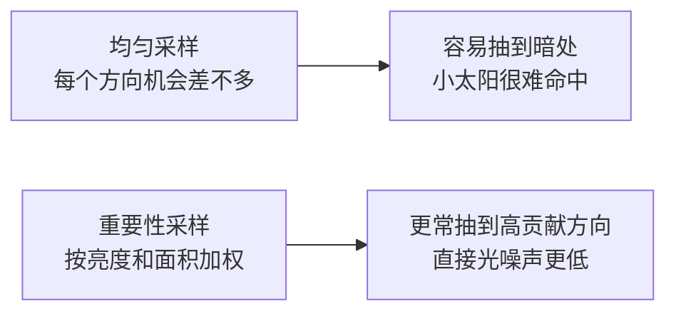
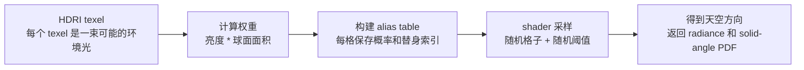
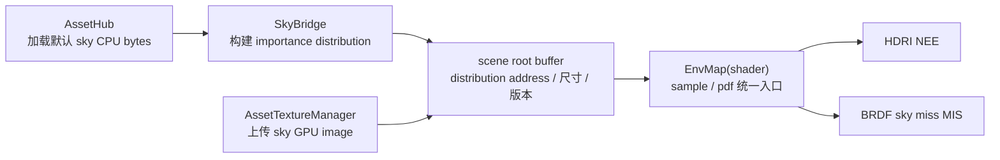

# HDRI 采样与 alias table

> 状态：当前实现事实总结。本文用直观方式说明 HDRI importance sampling、累积概率表、alias table、PDF 与现有 RT 直接光路径的关系。

## 1. 为什么要采样 HDRI

HDRI 可以理解成一张“全景灯光地图”：每个像素对应天空球上的一个方向，像素颜色表示这个方向来的环境光。
如果完全随机选天空方向，大量样本会落到暗处；如果 HDRI 里有太阳、窗户或灯带这类小而亮的区域，画面就容易出现明显噪声。

HDRI importance sampling 的目标很简单：

- 亮的方向更容易被选中。
- 暗的方向较少被选中。
- 每次 shader 采样仍然足够便宜。
- HDRI class 内部采样和 BRDF sky miss 的 MIS 使用同一套环境光 PDF；统一 NEE 对外再乘入 class 选择概率。



## 2. 从权重到概率

HDRI 采样的第一步，是给每个 texel 算一个权重。权重大，表示这个 texel 对环境光贡献更可能重要，也就应该更常被抽到。

本项目构建 HDRI 分布时使用：

```text
weight = luminance(texel) * solid_angle(texel)
```

`luminance(texel)` 表示 texel 有多亮，`solid_angle(texel)` 表示它在天空球上实际覆盖多大面积。
lat-long HDRI 的顶部和底部在贴图上有像素，但映射到球面后面积更小；如果只看亮度，不看面积，就会过度采样上下极区域。

权重会被归一化成概率：

```text
probability_i = weight_i / sum(weight)
```

采样问题就变成了一个更普通的问题：给定很多概率不同的候选项，怎样快速按概率抽中其中一个？

## 3. 累积概率表：清楚但查询是 O(log N)

最直接的做法是构建累积概率表，也就是 CDF。它把每个 texel 的概率首尾相接，排成一条从 `0` 到 `1` 的线段。

假设 4 个 texel 的权重是：

```text
A: 1
B: 3
C: 2
D: 4
```

总权重是 `10`，归一化后的概率是：

```text
A: 0.1
B: 0.3
C: 0.2
D: 0.4
```

累积概率表会把它们累加起来：

```text
CDF = [0.1, 0.4, 0.6, 1.0]
```

这张表实际表示 4 个连续区间：

| texel | 概率区间 |
|-------|----------|
| A | `[0.0, 0.1)` |
| B | `[0.1, 0.4)` |
| C | `[0.4, 0.6)` |
| D | `[0.6, 1.0)` |

采样时生成一个随机数 `u`，范围是 `[0, 1)`。如果 `u = 0.52`，它落在 `[0.4, 0.6)`，所以选中 C。

关键问题是如何快速找到 `u` 落在哪个区间。因为 CDF 一定单调递增，可以用二分查询：找第一个大于 `u` 的位置。

```cpp
int sample_cdf(const std::vector<float>& cdf, float u) {
    int lo = 0;
    int hi = static_cast<int>(cdf.size());

    while (lo < hi) {
        int mid = (lo + hi) / 2;
        if (cdf[mid] <= u) {
            lo = mid + 1;
        } else {
            hi = mid;
        }
    }

    return lo;
}
```

二分每次把搜索范围砍掉一半：

```text
N -> N / 2 -> N / 4 -> N / 8 -> ... -> 1
```

所以查询复杂度是 `O(log N)`。例如：

| texel 数量 | 大约比较次数 |
|------------|--------------|
| 1,024 | 10 |
| 1,000,000 | 20 |
| 8,000,000 | 23 |

CDF 的优点是概念简单、构建直接；缺点是 shader 每次采样都要做二分。HDRI texel 数量很大，路径追踪中采样次数也很多，`O(log N)` 的查询成本会持续出现在热路径里。

## 4. alias table：把查询变成 O(1)

alias table 本质上是一张“加权抽奖表”。它在构建阶段把概率重新整理到固定大小的格子里，让运行时 shader 只需要两次随机：

1. 随机选一个表格位置。
2. 再随机一次，判断选这个位置自己的 texel，还是选它记录的替身 texel `alias_index`。

这样可以按原始权重抽样，同时保持 `O(1)` 采样成本。



一个表格位置可以想成固定容量为 1 的小盒子。如果某个 texel 权重不足一整格，剩余空间会被另一个高权重 texel 借用；
被借来的 texel 就是 alias。

| 抽中的格子 | 本格 texel 概率 | 超过概率时改选 |
|------------|-----------------|----------------|
| 0 | 70% 选 A | 30% 选 D |
| 1 | 100% 选 B | 不需要 alias |
| 2 | 40% 选 C | 60% 选 A |

如果 shader 抽中格子 0，只要再比较一次随机数：小于 `0.7` 就选 A，否则选 D。每格只做一次简单判断，
但整张表的总体效果仍然是“亮的 texel 更常被抽到，暗的 texel 较少被抽到”。

可以把 CDF 和 alias table 的差别理解成：

| 方案 | 构建阶段 | 采样阶段 | 适合场景 |
|------|----------|----------|----------|
| CDF + 二分 | 简单累加概率 | `O(log N)`，每次二分查区间 | 概念验证、CPU 侧低频采样 |
| alias table | 预处理更复杂 | `O(1)`，一次格子选择加一次阈值判断 | shader 热路径、高频 HDRI 采样 |

alias table 没有改变“按权重抽样”这个目标，它只是把查询成本提前搬到构建阶段，用更多预处理换取运行时更便宜的采样。

## 5. PDF 为什么使用 solid angle

最终存入表里的 `solid_angle_pdf` 按球面立体角表达，而不是按贴图 UV 面积表达。

这样做的原因是渲染方程里的方向采样发生在球面上。HDRI class 采样方向、BRDF 打到天空后的 `EnvMap::pdf`
查询以及 MIS 权重都必须处在同一套概率度量下。统一 Light Candidate System 会在这层环境光 PDF 外再乘入
HDRI class 的选择概率；如果一个地方使用 UV 概率，另一个地方使用方向概率，MIS 权重会不匹配，能量也可能不稳定。

## 6. 当前项目数据路径

默认 sky 由 `SkyBridge` 请求 `AssetHub::load_texture` 异步加载。真实 sky GPU image ready 前，渲染路径使用常驻纯色 fallback
和匹配的 1x1 均匀 distribution；真实 sky 的 CPU texture bytes 到达时，`SkyBridge` 会先在 CPU 侧构建 HDRI importance
alias table，并在真实 sky image GPU ready 后切到真实贴图和真实分布。



shader 侧的 `EnvMap` 是环境光采样的统一入口：

- `RtSkySamplingMode::Importance`：默认使用 `SkyBridge` 生成的 alias table。
- `RtSkySamplingMode::Uniform`：强制回退到旧的 uniform sphere，用于 A/B 对比噪声和能量稳定性。
- fallback sky：使用 1x1 均匀 distribution，和纯色 fallback 贴图保持匹配。
- 无效分布或不可用分布：回退 uniform sphere，避免读取非法分布。

## 7. 关键不变量

- alias table 只决定“更可能抽到哪个 HDRI texel”，不改变 HDRI 本身的 radiance。
- HDRI texel 权重必须同时考虑亮度和球面面积。
- 对外 PDF 使用 solid angle 度量，不能混用贴图 UV 面积 PDF。
- HDRI class 内部采样和 BRDF sky miss 必须通过同一个 `EnvMap::pdf` 查询环境光概率；统一入口对外再乘入 class PDF。
- `Uniform` 模式只用于调试和回退，不应引入第二套长期维护的 HDRI PDF 语义。
