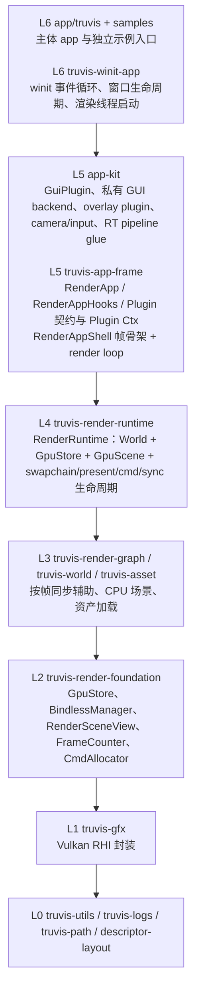
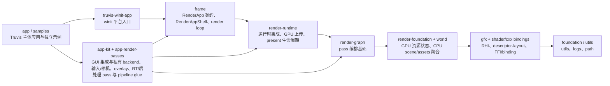

# 分层与依赖边界

> 状态：当前实现事实总结。本文记录项目总体分层、主要依赖方向和 app / engine 边界。

项目目标是保持无环依赖：上层可以依赖下层，下层不反向依赖上层业务。

## 总体分层

## 依赖方向约束

- 上层 crate 可以依赖下层 crate；下层 crate 禁止反向依赖上层业务。
- 同层 crate 默认不互相依赖；只有本文档明确记录的方向才允许。
- 物理目录用于导航，真实约束以 crate 职责与 Cargo 依赖方向为准。
- `engine/render/` 是渲染域目录，只承载通用渲染基础设施：`truvis-render-foundation` 低于 `truvis-render-graph`，
  `truvis-render-runtime` 负责集成 runtime-owned 能力。
- 具体 app 复用的 RT / 后处理 pass 位于 `app/app-render-passes`，GUI backend 位于 `app/app-kit` 私有模块。

当前允许的主依赖方向：

## GUI 与 App 层边界

GUI 属于 app 层集成能力：`app_kit::gui_plugin` 持有 imgui context、RenderGraph 适配和私有 `gui_backend`，其中 `GuiMesh` /
`GuiPass` 等底层 Vulkan 后端实现不作为 engine crate 暴露。

`app-kit` 提供 app 层公共组件，不承载具体 app state。`RtPipeline` 持有 RT working target、main view target 等 app-owned
窗口尺寸资源；主体 app 和 samples 通过具体字段组合这些能力。

`app-render-passes` 承载主体 app 与 samples 共享的具体 RT / 后处理 / shading pass，不属于 engine core。其中 `GBuffer` 定义
RT 管线的 GBuffer 通道布局和 per-FIF 纹理资源管理，由 `RtPipeline` 持有生命周期。

## 物理目录约定

- `engine/app-frame/truvis-app-frame`：平台无关的 App 契约、shell 与 render loop。
- `engine/app-frame/truvis-winit-app`：winit 平台入口，只负责窗口、事件循环和渲染线程启动。
- `app/app-kit`：app 层公共组件，包含 GUI、输入/相机、overlay 和 RT pipeline glue。
- `app/app-render-passes`：主体 app 与 samples 共享的具体 pass。
- `app/truvis`：主体 app，提供 `truvis-app`。
- `app/samples/*`：独立 sample crate，提供 triangle、shader-toy 和 Cornell 入口。
