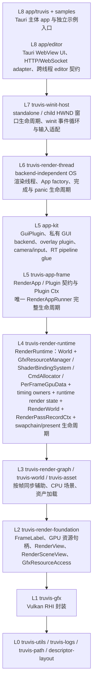
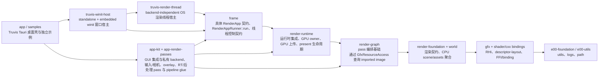
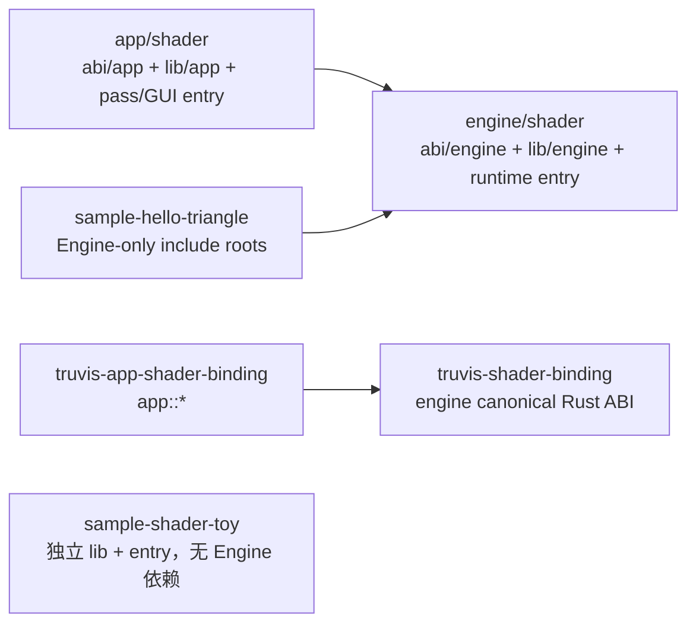

# 分层与依赖边界

> 状态：当前实现事实总结。本文记录项目总体分层、主要依赖方向和 app / engine 边界。

项目目标是保持无环依赖：上层可以依赖下层，下层不反向依赖上层业务。

## 总体分层

```mermaid
flowchart TB
    L8["L8 app/truvis + samples<br/>Tauri 主体 app 与独立示例入口<br/><br/>L8 app/editor<br/>Tauri WebView UI、HTTP/WebSocket adapter、跨线程 editor 契约"]
    L7["L7 truvis-winit-host<br/>standalone / child HWND 窗口生命周期、winit 事件循环与输入适配"]
    L6["L6 truvis-render-thread<br/>backend-independent OS 渲染线程、App factory、完成与 panic 生命周期"]
    L5["L5 app-kit<br/>GuiPlugin、私有 GUI backend、overlay plugin、camera/input、RT pipeline glue<br/><br/>L5 truvis-app-frame<br/>RenderApp / Plugin 契约与 Plugin Ctx<br/>唯一 RenderAppRunner 完整生命周期"]
    L4["L4 truvis-render-runtime<br/>RenderRuntime：World + GfxResourceManager / ShaderBindingSystem / CmdAllocator / PerFrameGpuData + timing owners + runtime render state + RenderWorld + RenderPassRecordCtx + swapchain/present 生命周期"]
    L3["L3 truvis-render-graph / truvis-world / truvis-asset<br/>按帧同步辅助、CPU 场景、资产加载"]
    L2["L2 truvis-render-foundation<br/>FrameLabel、GPU 资源句柄、RenderView、RenderSceneView、GfxResourceAccess"]
    L1["L1 truvis-gfx<br/>Vulkan RHI 封装"]
    L0["L0 truvis-utils / truvis-logs / truvis-path / descriptor-layout"]
    L8 --> L7 --> L6 --> L5 --> L4 --> L3 --> L2 --> L1 --> L0
```

## 依赖方向约束

- 上层 crate 可以依赖下层 crate；下层 crate 禁止反向依赖上层业务。
- 同层 crate 默认不互相依赖；只有本文档明确记录的方向才允许。
- 物理目录用于导航，真实约束以 crate 职责与 Cargo 依赖方向为准。
- platform 层内部保持 `truvis-winit-host -> truvis-render-thread -> truvis-app-frame`；winit host 可直接消费 frame
  契约，线程宿主不依赖 winit、Windows API、Tauri 或具体 app。
- `engine/e40-render/` 是渲染域目录，只承载通用渲染基础设施：`truvis-render-foundation` 是跨 crate 契约层，
  `truvis-render-graph` 只依赖 foundation 中的句柄和 `GfxResourceAccess`，`truvis-render-runtime` 负责集成 runtime-owned
  GPU resource/binding/cmd/per-frame 能力。
- 具体 app 复用的 RT / 后处理 pass 位于 `app/app-render-passes`，GUI backend 位于 `app/app-kit` 私有模块。
- Web editor 属于 app 域：`truvis-editor-bridge` 只包含协议 DTO 和有界 channel endpoint，
  `truvis-editor-server` 只依赖 bridge；两者都禁止依赖 `truvis-world`、render runtime 或 GPU 类型。
  `app/truvis::editor_controller` 是唯一把 editor DTO 适配到权威 `World` 的位置。

当前允许的主依赖方向：

```mermaid
flowchart LR
    Foundation["e00-foundation / e00-utils<br/>utils、logs、path"]
    Gfx["gfx + shader/cxx bindings<br/>RHI、descriptor-layout、FFI/binding"]
    Core["render-foundation + world<br/>渲染契约、CPU scene/assets 聚合"]
    RenderDomain["render-graph<br/>pass 编排基础<br/>通过 GfxResourceAccess 查询 imported image"]
    Runtime["render-runtime<br/>运行时集成、GPU owner、GPU 上传、present 生命周期"]
    Frame["frame<br/>具体 RenderApp 契约、RenderAppRunner::run、线程控制契约"]
    AppKit["app-kit + app-render-passes<br/>GUI 集成与私有 backend、输入/相机、overlay、RT/后处理 pass 与 pipeline glue"]
    App["app / samples<br/>Truvis Tauri 桌面壳与独立示例"]
    WindowHost["truvis-winit-host<br/>standalone + embedded winit 窗口宿主"]
    RenderThread["truvis-render-thread<br/>backend-independent OS 渲染线程宿主"]
    App --> WindowHost --> RenderThread --> Frame --> Runtime --> RenderDomain --> Core --> Gfx --> Foundation
    WindowHost --> Frame
    App --> AppKit --> Frame
    AppKit --> Runtime
    AppKit --> RenderDomain
```

## GUI 与 App 层边界

GUI 属于 app 层集成能力：`app_kit::gui_plugin` 持有 imgui context、RenderGraph 适配和私有 `gui_backend`，其中 `GuiMesh` /
`GuiPass` 等底层 Vulkan 后端实现不作为 engine crate 暴露。

`app-kit` 提供 app 层公共组件，不承载具体 app state。`RtPipeline` 持有 RT working target、main view target 等 app-owned
窗口尺寸资源；主体 app 和 samples 通过具体字段组合这些能力。

`app-render-passes` 承载主体 app 与 samples 共享的具体 RT / 后处理 / shading pass，不属于 engine core。其中 `GBuffer` 定义
RT 管线的 GBuffer 通道布局和 per-FIF 纹理资源管理，由 `RtPipeline` 持有生命周期。

## Shader 源码与 ABI 依赖边界

Shader package 按依赖、include roots、增量失效范围和发布边界组织；全部 App 源码集中在
`app/shader`，不再跟随 Rust crate 目录拆散：

```mermaid
flowchart LR
    EngineSource["engine/shader<br/>abi/engine + lib/engine + runtime entry"]
    EngineBinding["truvis-shader-binding<br/>engine canonical Rust ABI"]
    AppSource["app/shader<br/>abi/app + lib/app + pass/GUI entry"]
    AppBinding["truvis-app-shader-binding<br/>app::*"]
    HelloSource["sample-hello-triangle<br/>Engine-only include roots"]
    ToySource["sample-shader-toy<br/>独立 lib + entry，无 Engine 依赖"]

    AppSource --> EngineSource
    HelloSource --> EngineSource
    AppBinding --> EngineBinding
```

- `abi/<owner>/` 是 Rust/Slang 共享的内存与 binding 契约；每个 ABI 类型只有一个 Slang 定义和一个 Rust binding owner。
- `lib/<owner>/` 只承载 Slang 算法，不生成 Rust binding。依赖 App pass descriptor/resource 的算法属于 App-local `lib/app/`，
  不能以“算法通用”为由放入 Engine。
- `entry/` 只生成最终 SPIR-V，不作为其它 package 的共享接口，也不生成 Rust binding。
- Engine namespace 为 `engine::*`；App namespace 为 `app::<owner>::*`。统一 App binding
  只 allowlist `app::*`，并通过 `truvis-shader-binding` 显式复用 canonical Engine/base 类型。
  generator 固定 `allowlist_recursively(false)`，缺少映射时让构建 fail-closed，不维护定义黑名单。
- 根目录 `shader-packages.toml` 是源码 package、include root、依赖传播和输出前缀的唯一清单；运行时
  `TruvisPath` 也按 package id 解析 namespaced SPIR-V 路径。
- `.vscode/settings.json` 只声明编辑器搜索根 `engine/shader` 与 `app/shader`；构建配置显式镜像相同根或其
  严格子集，不读取编辑器配置。include 必须使用 `abi/engine`、`lib/engine`、`abi/app`、`lib/app` 或
  `lib/sample-shader-toy` 前缀并唯一解析。
- 源码方向为 `abi/<owner> <- lib/<owner> <- entry`，owner 方向为 `engine <- app`。构建器同时通过源码
  预检和 compiler depfile 强制边界，任何未声明 shared input、其它 entry 或 workspace 外依赖都 fail-closed。
- 当前 package 固定为 `engine`、`app`、`sample-hello-triangle`、`sample-shader-toy`；ShaderToy 的
  `depends_on = []` 且 include roots 不包含 Engine。
- 允许 `App shader/binding -> Engine shader/binding`；禁止 Engine 源码、binding crate 或 package 配置引用任何 App。
- 当前 Slang 源码仍以 include 为主；可选 `.slang-module` 只属于后续编译性能优化，不改变最终 SPIR-V 自包含语义。

## 物理目录约定

Engine 一级 Rust 职责目录使用 `eNN-` 前缀标识 Engine 归属和主要架构阶段；同一目录可以包含多个实际 crate 层级。
`engine/shader/` 与 `engine/cxx/` 保持稳定的横切工具链根目录。

- `engine/e50-app-frame/truvis-app-frame`：平台无关的 App 契约、统一 Runner 和最小线程控制契约。
- `engine/e60-platform/truvis-render-thread`：独立于窗口 backend 的 OS RenderThread、完成状态、panic 传播与 App factory。
- `engine/e60-platform/truvis-winit-host`：winit 窗口 backend；`StandaloneWinitHost` 服务独立顶层窗口，`EmbeddedWinitHost`
  在专用线程服务 Windows child HWND，两者复用 `truvis-render-thread` 启动和回收渲染线程。
- `app/app-kit`：app 层公共组件，包含 GUI、输入/相机、overlay 和 RT pipeline glue。
- `app/app-render-passes`：主体 app 与 samples 共享的具体 pass。
- `app/truvis`：主体 app，提供 `truvis-app`；Tauri/Tao desktop owner 在 main thread 组装 WebView、EditorServer 与
  embedded winit host，`TruvisRenderApp` 仍只承载 RenderThread 上的场景和渲染业务。
- `app/editor/bridge`：editor 协议 DTO、transport envelope 和方向受限的有界 channel endpoint。
- `app/editor/server`：独立线程上的 loopback HTTP / WebSocket adapter 和 Web 静态文件服务。
- `app/editor/web`：作为 Tauri WebView 内容运行的 React / TypeScript 编辑器；中央 DOM slot 只发布 child HWND 的物理像素矩形，
  页面状态仍只是可丢弃投影，不属于 CPU scene 权威状态。
- `app/samples/*`：独立 sample crate，提供 triangle、shader-toy 和 Cornell 入口。
