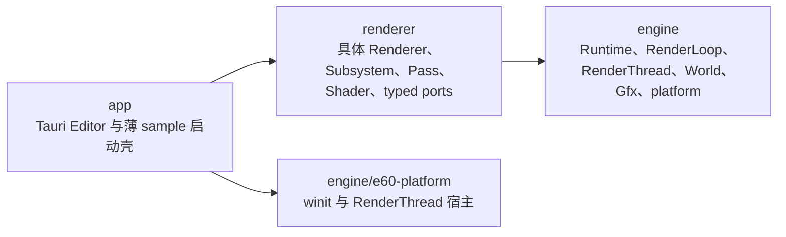
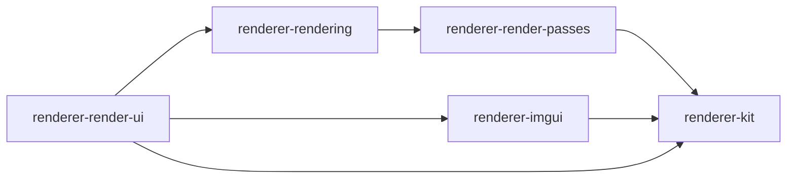

# 分层与依赖边界

> 状态：当前实现事实。本文记录 `engine / renderer / app` 三层边界。

## 顶层依赖


```mermaid
flowchart LR
    App["app<br/>Tauri Editor 与薄 sample 启动壳"]
    Renderer["renderer<br/>具体 Renderer、Subsystem、Pass、Shader、typed ports"]
    Engine["engine<br/>Runtime、RenderLoop、RenderThread、World、Gfx、platform"]
    Platform["engine/e60-platform<br/>winit 与 RenderThread 宿主"]

    App --> Renderer --> Engine
    App --> Platform
```

固定约束：

- `renderer -> app` 禁止；Renderer 不引用 Tauri、WebView、`AppHandle`、invoke/event 或 dialog。
- `engine -> renderer` 禁止；Engine 不知道 `TruvisRenderer` 或任何 sample Renderer。
- App 可直接使用 `engine/e60-platform` 启动窗口和 RenderThread，但不直接编排 Runtime、World、
  RenderGraph、pass 或 GPU resource。
- 真实依赖约束以 Cargo graph 为准；目录只是职责导航。

## Engine 层

Engine 保持通用能力，内部主要方向为：

```text
truvis-winit-host
    -> truvis-render-thread
        -> truvis-render-loop
            -> truvis-render-runtime
                -> render-graph / world / asset / render-foundation
                    -> truvis-gfx
```

- `truvis-render-loop` 定义 `Renderer` phase 契约并拥有唯一 `RenderLoop::run`。
- `truvis-render-thread` 拥有 backend-independent OS RenderThread、Renderer factory、完成状态与 panic 传播。
- `truvis-winit-host` 只处理 standalone/embedded 窗口、事件循环和输入适配。
- `truvis-render-runtime` 拥有 `World`、Gfx、GPU manager、frame data、present 和同步资源。
- Engine 运行时、线程模型和公共 API 不因顶层拆分而改变。

## Renderer 层

`renderer/` 承载一切具体渲染决策：

- `truvis-renderer`：`TruvisRenderer`、`EditorController`、`DesktopCommandController`、overlay、selection outline
  和 coordinate gizmo。
- `renderer-kit`：`SubsystemLifecycle`、`SubsystemRenderCtx`、camera/input 和纯 CPU debug image 选择状态。
- `renderer-imgui`：ImGui context、font、draw data、mesh、RenderGraph adapter 和私有 Vulkan backend。
- `renderer-render-passes`：ray tracing、post process、resolve、SDR 与产品 effects 的 GPU pass。
- `renderer-rendering`：realtime/offline subsystem、path tracing settings 与长期 GPU resource owner。
- `renderer-render-ui`：渲染设置与 ImGui 的集成层。
- `samples/{hello-triangle,shader-toy,cornell}`：分别实现 `triangle-renderer`、`shader-toy-renderer` 和
  `cornell-renderer`。

Capability 依赖保持：


```mermaid
flowchart LR
    Kit[renderer-kit]
    Passes[renderer-render-passes]
    Rendering[renderer-rendering]
    ImGui[renderer-imgui]
    UI[renderer-render-ui]

    Rendering --> Passes --> Kit
    ImGui --> Kit
    UI --> ImGui
    UI --> Rendering
    UI --> Kit
```

`renderer-rendering` 不依赖 ImGui。`renderer-kit` 不依赖具体 pass、subsystem 或 Renderer shader binding。
具体 Renderer 显式决定 update 与 RenderGraph pass 顺序；不引入运行时子系统注册表。

## App 层

`app/` 只保留应用宿主：

- `app/truvis` 的 package 名为 `truvis-app`，binary 仍为 `truvis-app`；它拥有 Tauri build、WebView、
  `TruvisDesktop`、`EditorIpc`、dialog、capabilities、icons 和关闭顺序。
- `app/editor/web` 保存 React/TypeScript UI 和 Tauri transport。
- `app/samples/*` 是薄 binary crate，只处理日志、图标、窗口参数和 `StandaloneWinitHost`。
- binary 名保持 `triangle`、`shader-toy`、`rt-cornell` 和 `truvis-app`。

App 不引用 `truvis-world`、`truvis-gfx`、`truvis-render-runtime`、`truvis-render-graph` 或具体 pass crate。

## Editor 通信边界

`renderer/editor/bridge` 中的 `truvis-editor-bridge` 仅定义 DTO、oneshot reply 和有界 channel endpoint，
不依赖 Tauri、World、Runtime 或 GPU 类型。

```text
Tauri/WebView
  -> EditorIpc + TruvisFrontendPorts
       -> FrontendEndpoint / DesktopCommandSender
            <bounded in-process channels>
       -> TruvisRendererPorts
            -> EditorController / DesktopCommandController
                 -> World
```

`create_truvis_ports` 在 App/Tauri main thread 调用。App 保留 `TruvisFrontendPorts`，将
`TruvisRendererPorts` 移入 RenderThread factory 并交给 `TruvisRenderer::new`。因此 Renderer 只理解 typed ports 和
DTO，不理解 Tauri 传输。

`EditorController` 只解释 DTO 并访问 `World`；`DesktopCommandController` 只处理本地特权命令。两者都不实现
`SubsystemLifecycle`。

## Shader 与 ABI

- Engine owner：`engine/shader/abi/engine`、`lib/engine`、`entry`，namespace 为 `engine::*`。
- Renderer owner：`renderer/shader/abi/renderer`、`lib/renderer`、`entry/renderer`，namespace 为
  `renderer::*`。
- Renderer package id 和输出前缀都为 `renderer`；Rust owner 为 `truvis-renderer-shader-binding`。
- Owner 方向为 `renderer -> engine`。Engine shader、binding 和 package 配置不得反向引用 Renderer。
- `truvis-path` 从 `paths.toml` 提供 shader、binding、temp 等可信物理目录，不依赖 shader schema；
  `truvis-shader-manifest` 依赖 `truvis-path`，管理 package、binding 与输出前缀等逻辑路径。
- `truvis-shader-manifest`、`truvis-shader-build` 与 `truvis-shader-binding-codegen` 位于 `engine/e00-utils/`；
  shader 源码和两个 Rust ABI owner 仍留在各自 shader 根。allowlist 与 Rust re-export policy 由 owner
  `build.rs` 管理。
- include 必须使用 `abi/engine`、`lib/engine`、`abi/renderer`、`lib/renderer` 或 sample-specific 前缀，
  这些前缀由当前 manifest 的 include root 与 `shared_inputs` 推导，并由源码预检与 compiler depfile 双重校验；
  e00-utils 中的通用工具不内置 owner 名称。

## 物理目录

```text
engine/                    通用运行时、渲染基础和平台宿主
renderer/
  truvis/                  TruvisRenderer 和渲染侧 controller
  renderer-*/              capability crates
  editor/bridge/           传输无关 Editor DTO 与 endpoint
  samples/                 sample Renderer libraries
  shader/                  Renderer shader、ABI 与 binding
app/
  truvis/                  Tauri Editor 应用壳
  editor/web/              React/Tauri transport
  samples/                 standalone 薄 binary
```
