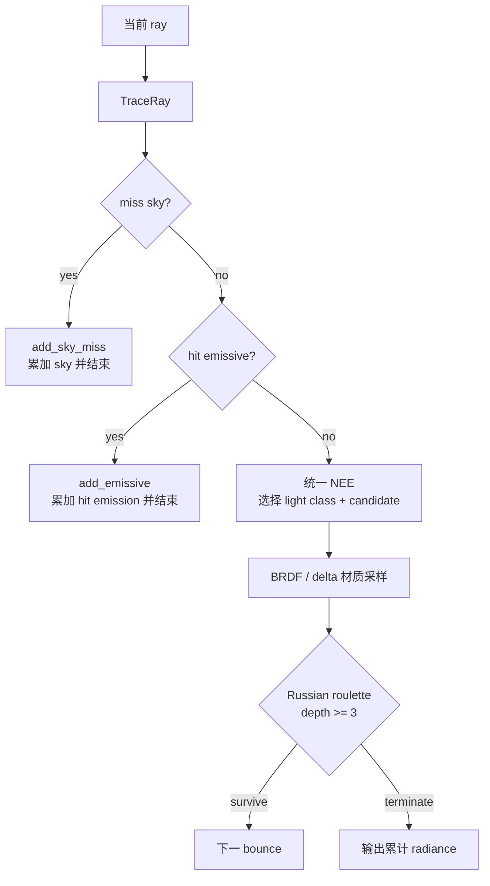

# Realtime RT Ray Tracing 采样流程

> 状态：当前实现事实总结。本文说明 realtime RT 主路径中 raygen / path tracing 的运行顺序、NEE、
> HDRI、自发光三角形、analytic light、MIS、多 bounce、primary ReSTIR DI 和当前未接入的 cache 边界。

## 职责边界

realtime RT 的 path 积分状态集中在 raygen 侧推进。closest-hit 和 miss shader 只把一次追踪事件整理成
`RtSurfaceHit`；材质采样、直接光照、MIS、debug 累积和最终写出都由 raygen 引用的 helper 处理。

主要入口：

- `engine/shader/entry/realtime_rt/raygen.slang`：每像素初始化、path loop、`TraceRay` 顺序和最终输出。
- `engine/shader/lib/realtime_rt/raygen_direct_lighting.slangi`：统一 Light Candidate System、visibility 和 shade。
- `engine/shader/lib/realtime_rt/restir_di.slangi`：primary ReSTIR DI reservoir 打包、temporal/spatial reuse 和 final shade。
- `engine/shader/lib/realtime_rt/raygen_material.slangi`：BRDF / delta 材质采样和 BRDF PDF。
- `engine/shader/lib/realtime_rt/raygen_path_state.slangi`：radiance、throughput、上一段 BRDF PDF、Russian roulette。

## Raygen 主循环

每个像素先用像素坐标、frame id 和 `spp_idx` 初始化随机种子，再生成 camera ray。路径最大深度为
`max_depth = 16`；Vulkan ray tracing pipeline recursion 只覆盖 shader 调用栈，真正的路径递归由 raygen 手动循环推进。

```text
camera ray
  -> for depth in 0..max_depth
     -> TraceRay
     -> surface/debug 早退
     -> miss sky 或 hit surface
     -> NEE / BRDF / Russian roulette
     -> 下一跳 ray
```

GBuffer、DLSS depth、motion vector 和 RR 材质输入只描述 camera primary 第一次可见事件。raygen 用
`gbuffer_written` 保证每个像素只写一次 primary hit 或 primary miss，后续 bounce 不覆盖这些输出。

surface-only debug channel 会在每次 `TraceRay` 返回后先尝试早退。normal、object normal、base color 等通道只依赖
当前 surface/miss 事件，因此不继续跑后续 path，减少 debug 模式下的噪声和成本。

## 每个 Bounce 的决策顺序

一次 `TraceRay` 只返回一个事件。raygen 按固定顺序处理：

1. **Miss sky**：miss shader 采样 sky 贴图，把 sky radiance 写入 `surface.emissive`。raygen 调用
   `add_sky_miss` 累加贡献并终止路径。
2. **Primary output**：如果这是第一次 hit/miss，写出 GBuffer / DLSS 输入。
3. **Hit emissive surface**：调用 `add_emissive` 累加 hit emission 并终止路径。
4. **普通 surface 的直接光**：Off 模式下所有非 delta surface 继续走统一 NEE；ReSTIR DI 开启时，只有 primary visible surface 生成 initial reservoir 并跳过普通 primary NEE，secondary bounce 仍走统一 NEE。
5. **BRDF / 材质采样**：采样下一跳方向和 throughput，记录本次 `brdf_pdf` 供后续 sky/emissive hit MIS 使用。
6. **Russian roulette**：depth 小于 3 时保留完整路径；depth >= 3 时按 throughput 最大通道决定是否继续。
7. **继续下一跳**：用材质采样返回的 origin / direction 更新 ray。



## NEE 通用候选契约

HDRI NEE、emissive triangle NEE 和 analytic light NEE 已收敛到统一 Light Candidate System。raygen 每个普通
surface 只请求一个直接光候选；`RtDirectLighting` 先在启用的 light class 中均匀选择来源，再调用各 class
已有 sampler 构造 `RtLightCandidate`。HDRI / emissive 通过 `shade_candidate` 评估贡献；analytic light v1
不创建 TLAS 可命中的发光几何，因此通过 `shade_analytic_candidate` 使用固定 `MIS = 1`。
candidate 必须包含：

- `direction`：从 shading point 指向 light sample 的世界空间单位方向。
- `distance`：有限光源的实际距离；HDRI 使用大 TMax 表达无限远环境。
- `radiance`：light 侧 radiance，不包含 BRDF、cos、MIS 或 path throughput。
- `solid_angle_pdf`：light sample 的 solid-angle PDF。
- `shadow_ray`：与方向和距离配套的 visibility ray。

visibility 使用 inline `RayQuery`，只判断是否有遮挡，不运行 closest-hit。shade 公式是：

```text
contribution =
    path_throughput
  * light_radiance
  * BRDF_cos
  / light_pdf
  * MIS(light_pdf, brdf_pdf)
```

所有直接光 PDF 都必须是 solid angle 度量，这样才能和 BRDF PDF 做 MIS。统一入口会把 class 选择概率乘入
candidate 的 `solid_angle_pdf`，因此对外使用的是 `P(class) * P(sample | class)`。BRDF sky miss 和 emissive
hit 的反向 MIS 查询也使用同一套统一策略 PDF，避免 NEE 侧与 BRDF 侧概率不闭合。

## Primary ReSTIR DI

Primary ReSTIR DI 只服务 camera primary 第一次可见 surface 的直接光；secondary bounce 继续走普通统一 NEE。
CPU 侧 `RtPipelineSettings.restir_di_mode` 暴露 `Off / InitialOnly / Temporal / TemporalSpatial` 四档，默认 `Off`。
shader 侧通过 `push_const.restir_di_mode` 和 `push_const.restir_di_phase` 复用同一条 RT pipeline 分阶段执行：

1. **Path phase**：raygen 写 primary GBuffer、DLSS motion vectors、ReSTIR surface key 和 initial reservoir；initial reservoir 从统一 Light Candidate System 抽取 8 个独立 proposal，以 `targetPdf / proposalPdf` streaming，再按 proposal 总数 finalize 成单个 reservoir，非 primary path 仍照常积分。surface key 只在 primary hit 是非 emissive、非 delta、且会由 ReSTIR 替换 direct NEE 的表面上有效。
2. **Temporal phase**：读取 current initial、current surface key、motion vectors、previous temporal reservoir 和 previous surface key，在回投影中心 4 像素半径内做 9 次随机 surface 搜索，做版本、depth、position、normal、roughness、base color 与 metallic rejection 后合并；current surface key 无效时直接输出 empty reservoir。history 的 `M` 按 64 上限裁剪，`weight_sum` 不缩放，因为它已经是 finalized inverse PDF。
3. **Spatial phase**：`TemporalSpatial` 模式使用 shader-local 32 个固定 neighbor offset，默认采样 8 个邻居；center reservoir 的 `M < 8` 时启用 disocclusion boost，采样 16 个邻居。每个邻居按 current surface 重新计算 target 并合并；非 spatial 模式不运行该 phase。
4. **Final phase**：读取最终 reservoir，用 ReSTIR surface key 的 RGBA32F position/normal/roughness/base color/metallic 重建 primary surface，重新 trace visibility 和当前 target，再把 primary direct contribution 合入 HDR。spatial final 只服务当前帧出图，不作为下一帧 temporal history，避免空间邻域跨帧反馈。

reservoir 使用四张 image 打包 light sample identity、样本参数、target、weight sum、M、source age、valid 和版本元数据。写入 image 的 `weight_sum` 是 RTXDI-style finalized inverse PDF，只有 phase 内部 streaming 时临时表示 raw RIS weight sum；`target` 是选中样本在当前 phase 输出 surface 上的 target PDF，`M` 是参与复用的候选/历史规模，initial 输出固定设为 1。
A/D 为 `R32G32B32A32_UINT`，保存 candidate kind、light index、class mask、valid 以及 sky/emissive/analytic version；B/C 为
`R32G32B32A32_SFLOAT`，保存 HDRI 方向、emissive barycentric、analytic light 局部样本参数和权重统计。
current/previous primary surface key 使用三张 RGBA32F image 保存 position/depth、normal/roughness 与 base color/metallic，同时作为 ReSTIR eligibility 标记；miss、emissive primary、specular/transparent delta primary 都写 invalid key。temporal/spatial/final 的 surface 重建使用该高精度 key，避免把 RR/SR 输入用的压缩 GBuffer 当作 ReSTIR visibility 起点或 target 材质签名。所有这些资源属于
RT pipeline 自有 target，按 `render_extent` 和 FIF frame label 轮转，不进入 DLSS state，也不读取 DLSS output。

initial reservoir 复用统一 Light Candidate System 的 solid-angle PDF 契约。当前 path phase 抽取 8 个 proposal；被遮挡或背面的零 target 候选通过固定 finalize denominator 计入同一次 RIS 估计。ReSTIR target 评估使用当前 surface 可见的 light radiance、BRDF*cos 和 MIS 的 RGB 最大通道，不除以 proposal PDF；final shade 直接乘 finalized inverse PDF，不再额外除以 `target * M`，因此 `InitialOnly` 的单样本估计与旧 unified NEE 的能量契约一致。
temporal/spatial 固定使用 RTXDI RayTraced bias correction 风格：combine 时把 source 的 finalized inverse PDF 还原为 `targetAtCurrent * sourceWeight * sourceM`，finalize 时使用 `rawWeightSum * numerator / (selectedTarget * denominator)`；normalization 的 numerator/denominator 会在当前、history 或邻域 source surface 上重算选中样本 target，并包含 visibility ray。final shade 仍重新 trace shadow ray，不复用历史 visibility。
temporal/spatial reuse 不再复用旧 shading point 的 direction/distance；shader 会把 reservoir key 在当前 surface 上重建为新的
`RtLightCandidate`，重新计算有限光源的方向、距离、radiance、solid-angle PDF 和 shadow ray。analytic light v1 仍使用 `MIS = 1`。

history 可用性由 CPU 侧 mode/reset/frame 与 shader 侧版本共同控制；reservoir 内保存 sky distribution、emissive table 和 analytic light
version。resize、DLSS reset、mode 变化、sky/emissive/analytic light 变化或 light class mask 变化都会让旧 reservoir 无法参与复用。

新增 ReSTIR debug channel：`RestirInitialWeight`、`RestirTemporalValid`、`RestirFinalContribution`。既有 `NeeHdri`、`NeeEmissive`、
`NeeAnalytic` 仍表示普通统一 NEE 的观测语义，不把 ReSTIR final shade 反向计入这些通道。
## HDRI / Sky 采样

HDRI 和 sky 的采样与 PDF 查询统一走 `EnvMap::sample` / `EnvMap::pdf`。

- 默认 `RtSkySamplingMode::Importance`：使用 `SkyBridge` 基于真实 sky CPU texture bytes 构建的 alias table。
- `RtSkySamplingMode::Uniform`：强制回退 uniform sphere，用于 A/B 对比。
- fallback sky：真实 sky GPU image 未 ready 前使用 1x1 均匀 distribution 和纯色 fallback 贴图。
- 无效 distribution：回退 uniform sphere，避免读取非法分布。

importance distribution 的 CPU 权重为：

```text
weight = luminance(texel) * solid_angle(texel)
```

shader 抽中 texel 后，会在该 texel 覆盖的 solid angle 内继续均匀采样方向。`EnvMap::pdf(dir)` 返回同一个
distribution 中该方向的 solid-angle PDF。`sky_brightness` 只在 shader 采样 sky 贴图后统一缩放 radiance；
它不改变 alias table 权重，也不改变 PDF。

HDRI class 内部采样与 PDF 查询必须读取同一个 `EnvMap::pdf`；统一策略对外再乘上 HDRI class 的选择概率。
更细的 HDRI alias table 和 PDF 语义见
[`hdri-sampling.md`](hdri-sampling.md)。

## 自发光三角形采样

自发光三角形由 `EmissiveLightTable` 在 prepare 阶段构建并上传：

- `emissive_triangle_lights`：world-space triangle record array。
- `emissive_light_alias_table`：只包含正面积、正 power record 的 NEE alias table。
- `instance_emissive_triangle_base_map`：instance-local submesh 到 record base 的映射，非 emissive 为 `UINT_MAX`。

emissive NEE 先在 alias table 中 O(1) 抽一个有效 record，再在三角形面积上均匀采样点。shader 插值 UV 后读取
`mat.emissive * base_color` 作为 radiance。面积 PDF 转换为方向 PDF：

```text
pdf_omega = select_pdf / area * distance^2 / abs(dot(light_normal, -light_dir))
```

shadow ray 使用 `TMax = distance - epsilon`，避免采样点所在的 light triangle 自遮挡。第一版沿用当前 hit emission
的双面语义，因此面积到方向 PDF 使用 `abs(dot(...))`。

BRDF 路径命中 emissive surface 时不走 alias table。closest-hit 已经写入 `instance_id`、`geometry_id` 和
`primitive_id`，raygen 通过直接寻址查询 emissive class 内部 light PDF；统一策略对外再乘上 emissive class
选择概率：

```text
base = instance_emissive_triangle_base_map[instance.geometry_indirect_idx + geometry_id]
light = emissive_triangle_lights[base + primitive_id]
```

更细的 record 字段、lookup 构建和 hit PDF 查询流程见 [`emissive-light-sampling.md`](emissive-light-sampling.md)。

## Analytic Light 采样

analytic light NEE 读取 GPU scene 中独立上传的 point / spot / area light buffer。Point / Spot 在 RT 中不是
delta light，而是半径固定为 `0.5` 的 analytic sphere surface emitter；Area 是 `center + half_u + half_v`
描述的矩形单面 emitter。

统一入口选中 analytic class 后，shader 先在所有 analytic light 中均匀选择一个 light。Point / Spot 从
shading point 看到的 sphere visible cap 做 solid-angle 均匀采样，PDF 为 `select_pdf / solid_angle`；Spot
额外按 radians 表达的 inner / outer cone 计算 soft falloff。Area 在矩形面积上均匀采样，并把面积 PDF
转换为 solid-angle PDF，背面无效。

analytic light v1 没有 BRDF-hit 竞争估计器，因此 NEE shade 固定 `MIS = 1`。更细的 sphere / area 采样、PDF 和
调试边界见 [`analytic-light-sampling.md`](analytic-light-sampling.md)。

## BRDF、多 Bounce 与 Throughput

当前材质分类由 closest-hit 根据常量材质参数粗分：

- `EMISSIVE`：直接累加 `mat.emissive * base_color`，路径终止。
- `TRANSPARENT`：按 opaque 概率在折射和镜面反射之间选择，属于 delta path。
- `SPECULAR`：镜面反射，属于 delta path。
- `DIFFUSE`：按 roughness 在 cosine diffuse 与 GGX glossy 之间混合采样。

普通非 delta 材质采样后，throughput 使用完整混合 BRDF PDF：

```text
throughput *= BRDF_cos / brdf_pdf
```

raygen 同时保存 `prev_brdf_pdf` 和 `prev_is_delta`。下一次如果 miss sky 或 hit emissive，就可以判断是否需要
与对应 light PDF 做 MIS。delta path 不做 NEE，也不与 sky/emissive direct sampling 竞争；camera ray 或 delta 链路
直接看到 sky/emissive 时，保持完整直视/镜面语义。

Russian roulette 从 depth 3 开始启用。存活概率使用当前 throughput 的最大 RGB 通道，并 clamp 到 `[0.05, 0.95]`；
存活路径会除以该概率补偿 throughput，保持估计无偏。

## MIS 规则

当前使用 `Mis::power_heuristic`：

```text
w = pdf_a^2 / max(pdf_a^2 + pdf_b^2, epsilon)
```

MIS 出现在三类位置：

- **NEE shade**：light sample 通过 visibility 后，用 `MIS(unified_light_pdf, brdf_pdf)` 调制直接光贡献。
- **BRDF sky miss**：非 delta BRDF 路径打到 sky 时，用 `MIS(prev_brdf_pdf, unified_hdri_pdf(sky_dir))`。
- **BRDF emissive hit**：非 delta BRDF 路径打到 emissive surface 时，用
  `MIS(prev_brdf_pdf, unified_emissive_hit_pdf(surface, light_dir))`。

如果是 camera ray 或上一段是 delta path，则不存在可竞争的 NEE 策略，sky / emissive 直接按当前 throughput 累加。
analytic light v1 不创建可命中的发光几何，因此 analytic NEE 固定 `MIS = 1`，不参与上述 BRDF-hit MIS。

## Debug 与当前边界

当前 RT debug channel 中，`NeeHdri` 只显示普通统一 NEE 中抽到 HDRI class 的直接光，`NeeEmissive` 只显示普通统一 NEE 抽到
emissive triangle class 的直接光，`NeeAnalytic` 只显示普通统一 NEE 抽到 point / spot / area analytic class 的直接光。
`Emission` 显示 hit emissive contribution，`BrdfHdri` 显示 sky miss / HDRI contribution，`NeeBounce0` 和
`NeeBounce1` 分别累加 depth 0 与 depth 1 的所有 NEE 贡献。

当前未接入 realtime RT raygen 的内容：

- 统一 Light Candidate System v1 使用启用 class 均匀选择，尚未引入 power-weighted light-class PMF。
- analytic light v1 仍没有 BRDF-hit 竞争估计器，因此 analytic NEE 使用固定 `MIS = 1`。
- ReSTIR DI v1 只覆盖 primary direct lighting；secondary ReSTIR DI、ReSTIR GI/PT 和 SHARC / world-space radiance cache 尚未接入主路径。
- DLSS SR/RR 只消费 raygen 输出的 HDR、GBuffer、depth、motion vectors 和 RR 输入，不参与 light sampling、MIS、
  ReSTIR reservoir 或 radiance cache 状态。
