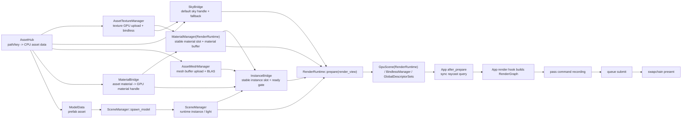

# RenderGraph 与数据流

> 状态：当前实现事实总结。本文记录 CPU 语义数据到 GPU scene 的同步路径，以及 RenderGraph 的 pass 编排规则。

## CPU 资产到 GPU Scene

CPU 语义数据从 `World` 进入 RenderRuntime。资产加载先由 `AssetHub` 产出 upload-ready CPU bytes，再由 `AssetTextureManager`
在渲染线程上传到 GPU 并注册 bindless。

material 参数由 `AssetHub` 通过 `MaterialLoaded` 事件交给 render-side `MaterialBridge`，再由 runtime 显式传入
`MaterialManager` 完成注册或更新。mesh CPU 数据由 `AssetMeshManager` 在 graphics queue 上上传 vertex/index buffer 并构建 BLAS。

Assimp model 读取由 `AssetHub::load_model` 在后台完成，只保存 `ModelData` / prefab CPU 数据；App 根据 ready 的 model data
显式调用 `SceneManager::spawn_model`。`SceneManager` 保存运行时语义，`InstanceBridge` 负责稳定 GPU instance slot、ready
gate 和 active render list。

mesh/material ready 查询通过 `truvis-render-runtime` 私有 scene bridge trait 连接到 `AssetMeshManager` 与
`MaterialBridge` / `MaterialManager` 组合 resolver，这些 resolver 不属于 `truvis-world`。

默认 sky 通过 `SkyBridge` 请求 `AssetHub::load_texture` 异步加载，并在真实贴图 GPU ready 前使用常驻纯色 fallback。
`SkyBridge` 同时在默认 sky 的 CPU texture bytes 到达时构建 HDRI importance alias table；真实 sky image 仍由
`AssetTextureManager` 上传，scene root buffer 只消费当前可用的 sky SRV、sampler 与 distribution 快照。

`GpuScene` 与 `RenderData` 是 runtime 私有 scene 翻译层；render pass 只通过 `RenderSceneView` 访问 scene buffer、TLAS
handle 和光栅化 draw。

`RenderRuntime::prepare` 负责把这些 bridge 按固定顺序串成 update 与 render 之间的 prepare 阶段。`after_prepare` 阶段只用于
App 对刚同步完成的 GPU scene 发起同步查询，例如批量 raycast；普通渲染工作仍在 `render` hook 中进入 RenderGraph。

## RenderGraph 规则

- App 在 `RenderAppHooks::render` 中创建 RenderGraph。
- 同步 raycast 不接入 RenderGraph；它在 `after_prepare` 通过独立 command pool/fence 提交，阻塞读回后把 GPU instance
  slot/submesh 转回 CPU `InstanceHandle` 与 asset handle。
- 渲染管线 Plugin 只贡献自己的 pass，不决定整个 App 的完整执行顺序。
- App 显式决定 GUI pass 与渲染管线 pass 的添加顺序，RenderGraph 按该顺序录制，不做自动重排。
- pass 必须声明 image 读写状态，让 RenderGraph 在线性序列中推导同步与 layout transition。

## 典型 Graph 组织

Triangle / ShaderToy 使用单个 present graph。

RT demo 使用 compute graph 与 present graph：App 先让 `RtPipeline` 贡献 compute passes，再在 present graph 中先
resolve，最后调用 `GuiPlugin::contribute_passes` 叠加 GUI。

## RT 直接光采样契约

当前 realtime RT 主路径的直接光只接入 HDRI NEE。raygen shader 内部把 HDRI 采样整理为 light candidate、visibility
和 shade 三段：candidate 使用 direction、radiance、distance、shadow ray 和 solid-angle PDF 描述光源侧样本；
visibility 复用现有 inline `RayQuery` shadow path；shade 继续使用 `BRDF * cos / light_pdf * MIS` 的旧公式。

环境光 sample 与 PDF 统一通过 `EnvMap` 查询。默认 sky 真实贴图 ready 后，`EnvMap` 使用
`SkyBridge` 生成的 `luminance(texel) * solid_angle(texel)` alias table 做 importance sampling，并返回
solid-angle PDF；fallback sky 使用 1x1 均匀分布，无效分布或 `RtPipelineSettings.sky_sampling_mode = Uniform`
时回退 uniform sphere。HDRI NEE 与 BRDF sky miss MIS 读取同一 `EnvMap::pdf`，不维护第二套环境光概率。
HDRI 采样的概念解释、alias table 原理和项目内数据路径见
[`docs/summaries/hdri-sampling.md`](hdri-sampling.md)。

自发光材质目前仍只在路径命中时累加 emission，尚未作为 emissive triangle light 进入 NEE/MIS；CPU/GPU scene
中的 point light 数据也尚未被 realtime RT 直接光候选系统消费。DLSS SR/RR 仍只读取 RT 输出的 HDR、GBuffer、depth
和 motion vectors，不参与 light candidate、reservoir 或 radiance cache 状态。

## 与生命周期的关系

- update 阶段可以修改 CPU 语义状态。
- prepare 是 CPU scene / asset / material / instance 到 GPU 可见状态的同步边界。
- after_prepare 只处理刚准备好的 GPU scene 的同步查询。
- render 阶段只读取 prepare 后的 GPU scene 快照，并通过 RenderGraph 录制 pass。
