# RenderGraph 与数据流

> 状态：当前实现事实总结。本文记录 CPU 语义数据到 GPU scene 的同步路径，以及 RenderGraph 的 pass 编排规则。

## CPU 资产到 GPU Scene

CPU 语义数据从 `World` 进入 RenderRuntime。`World::sync_for_render` 从内部 `AssetHub`
取出 upload-ready CPU bytes，并由 `SceneAssetIngestor` 翻译为带 `Scene*Handle` 的
`WorldRenderSync.asset_uploads` typed payload；同一次 sync 还会 drain `SceneStore` 的
`SceneChanges`。asset payload 再由 `RenderWorld` 内部的 `RenderTextureManager` 在渲染线程上传到 GPU 并注册 bindless。
`SceneChanges.removed_textures` / `removed_meshes` / `removed_materials` 会在新的 upload payload 前写入对应
render manager，确保 CPU scene 删除不会被同一帧或迟到的上传结果重新发布到 resolver。

material 添加 / 更新由 `WorldRenderSync.scene_changes.changed_materials` 表达；`RenderMaterialManager`
只以 `SceneMaterialHandle` 维护 stable slot 和 dirty upload 状态，写 GPU material buffer 时通过
`SceneReadView` 从 `SceneStore` 读取当前 CPU 权威参数。mesh CPU 数据由 `RenderWorld` 内部的
`RenderMeshManager` 在 graphics queue 上上传 vertex/index buffer 并构建 BLAS。

Assimp / glTF model 读取当前仍由 `AssetHub` 在后台完成，完成后通过 `ModelLoaded` 事件一次性交付 owned CPU scene payload；App 通过
`World::request_model_import` 发起请求，拿到的是 `SceneModelImportHandle`，再通过
`World::sync_for_render` 内部的 `SceneAssetIngestor` 把 ready prefab 自动实例化为 runtime instances。`World` facade 内部的
`SceneAssetIngestor` 负责把 scene import handle 映射到内部 loader 状态，并把 loader 结果翻译成
`SceneMeshHandle` / `SceneMaterialHandle` / `SceneTextureHandle`，App 不再直接接触 `ModelLoadHandle`
或把 `AssetHub` 与 `SceneStore` 串起来。
`SceneStore` 保存运行时语义，但 owner 不跨 crate 暴露；`RenderWorld` 通过 `World::scene_view()` 得到只读
`SceneReadView`，并通过 `WorldRenderSync.scene_changes` 得到本帧 instance / material / light 语义变化。
内部 `RenderInstanceManager` 负责稳定 GPU instance slot、ready gate 和 active render list。
`SceneStore` 内部维护 texture -> material、material -> instance、mesh -> instance 反向依赖索引；
删除 texture/material/mesh 前如果仍有依赖会由 `WorldEditError` 暴露失败，失败 edit 不写 change log。
sky enabled、intensity、texture handle 与 revision 保存在 `SceneSkyState`；`changed_sky_environment`
会随 `WorldRenderSync.scene_changes` 到达 prepare，`RenderSkyManager` 通过 `SceneReadView` 读取权威值。

mesh/material ready 查询通过 `truvis-render-runtime` 私有 render resolver trait 连接到 `RenderWorld` 内部的
`RenderMeshManager` 与 `RenderMaterialManager`，这些 resolver 不属于 `truvis-world`。

默认 sky 通过 `World` facade 注册为普通 `SceneTextureHandle` 并写入 `SceneStore::SceneSkyState`；
真实贴图仍异步加载。`RenderSkyManager` 从 `SceneReadView` 读取 CPU sky state，在真实贴图 GPU ready 前使用常驻
纯色 fallback。当前 sky 的 CPU texture bytes 到达时，`RenderSkyManager` 构建 HDRI importance alias table；
真实 sky image 仍由 `RenderTextureManager` 上传，scene root buffer 只消费当前可用的 sky SRV、sampler 与
distribution 快照。

`RenderWorld`、`RenderTlasManager`、`RenderEmissiveLightTable` 与 `RenderData` 是 runtime 私有 scene 翻译层；
render pass 只通过 `RenderSceneView` 访问 scene buffer、TLAS handle 和光栅化 draw。`RenderSceneView::accum_signature` 只暴露
TLAS / emissive light / analytic light / sky distribution 的版本号快照，供 app-owned 离线累计判断 scene 语义是否变化；
它不暴露 `RenderWorld` owner 或具体 GPU buffer 布局。

`RenderRuntime::prepare` 负责把 `RenderWorld::prepare_render_data` 与 per-frame descriptor 更新串成 update 与 render 之间的 prepare 阶段。`after_prepare` 阶段只用于
App 对刚同步完成的 GPU scene 发起同步查询，例如批量 raycast；普通渲染工作仍在 `render` hook 中进入 RenderGraph。

```mermaid
flowchart LR
    AssetHub["AssetHub<br/>loader CPU payload"] --> Ingestor["SceneAssetIngestor<br/>Asset event -> Scene handle"]
    Ingestor --> TextureManager["RenderTextureManager<br/>texture GPU upload + bindless"]
    Scene --> RenderSkyManager["RenderSkyManager<br/>SceneSkyState + fallback"]
    Ingestor --> RenderSkyManager
    Ingestor --> MeshManager["RenderMeshManager<br/>mesh buffer upload + BLAS"]
    Ingestor --> RenderMaterialManager["RenderMaterialManager(RenderWorld)<br/>scene material -> stable slot + material buffer"]
    AssetHub --> ModelCpuPayload["ModelLoaded event<br/>owned CPU scene payload"]
    ModelCpuPayload --> SceneSpawner["World::sync_for_render<br/>SceneAssetIngestor + SceneStore"]
    SceneSpawner --> SceneChanges["SceneChanges<br/>CPU semantic changes"]
    SceneSpawner --> Scene["SceneReadView<br/>runtime instance / light snapshot"]
    SceneChanges --> RenderInstanceManager["RenderInstanceManager<br/>stable instance slot + ready gate"]
    Scene --> RenderInstanceManager
    TextureManager --> RenderMaterialManager
    TextureManager --> RenderSkyManager
    MeshManager --> RenderInstanceManager
    Scene --> Prepare["RenderRuntime::prepare(render_view)"]
    RenderMaterialManager --> RenderInstanceManager
    RenderMaterialManager --> Prepare
    RenderSkyManager --> Prepare
    RenderInstanceManager --> Prepare
    Prepare --> EmissiveTable["RenderEmissiveLightTable<br/>emissive triangle records + alias"]
    RenderMaterialManager --> EmissiveTable
    EmissiveTable --> GpuResources
    Prepare --> GpuResources["RenderWorld(RenderRuntime) + internal managers / BindlessManager / GlobalDescriptorSets"]
    GpuResources --> RayCast["App after_prepare<br/>sync raycast query"]
    RayCast --> BuildGraph["App render hook builds RenderGraph"]
    BuildGraph --> RecordCommands["pass command recording"]
    RecordCommands --> Submit["queue submit"]
    Submit --> Present["swapchain present"]
```

## RenderGraph 规则

- App 在 `RenderAppHooks::render` 中创建 RenderGraph。
- 同步 raycast 不接入 RenderGraph；它在 `after_prepare` 通过独立 command pool/fence 提交，阻塞读回后把 GPU instance
  slot/submesh 转回 CPU `InstanceHandle`、`SceneMeshHandle` 与 `SceneMaterialHandle`。
- 渲染管线 Plugin 只贡献自己的 pass，不决定整个 App 的完整执行顺序。
- App 显式决定 GUI pass 与渲染管线 pass 的添加顺序，RenderGraph 按该顺序录制，不做自动重排。
- pass 必须声明 image 读写状态，让 RenderGraph 在线性序列中推导同步与 layout transition。

## 典型 Graph 组织

Triangle / ShaderToy 使用单个 present graph。

RT demo 使用 compute graph 与 present graph：App 先让 `RtPipeline` 贡献 compute passes，再在 present graph 中先
resolve，最后调用 `GuiPlugin::contribute_passes` 叠加 GUI。

Truvis 现在通过 `RenderMode { Realtime, Offline }` 在实时和离线两套 app-owned pipeline 之间选择：

- `Realtime`：沿用 `RtPipeline`，执行 realtime ray tracing、可选 DLSS SR/RR、可选 ReSTIR DI，再输出 main view color。
- `Offline`：执行 `OfflinePipeline`，数据流是 1-8 组 `offline ray tracing -> per-FIF single_frame_image -> FIF 唯一 accum_image`，
  再输出到 `per-FIF render_target -> present`。

离线 `accum_image` 是 pipeline-owned 单张 HDR image，不按 FIF 轮转；RenderGraph import 初始状态为
`STORAGE_READ_WRITE_COMPUTE`。离线 present graph 只读取 per-FIF `render_target`，不导出图片，不复用 DLSS、ReSTIR、RR、denoise 或 realtime `ViewAccumState`。
Truvis 持有一份 `PathTracingCommonSettings`，并在构建 graph 时同时传给 realtime 与 offline pipeline；这份状态保存 sky
采样、sky 亮度、NEE 开关和 tone mapping，因此 ImGui 在 `Realtime / Offline` 间切换时不会让公共参数分叉。RT debug /
ReSTIR DI 与 offline debug / dispatch count 仍分别属于各自 pipeline settings。

离线 sample count 和 primary ray jitter 都由 `OfflineAccumState` 按 sample index 维护，jitter 使用离线自有 Halton 2/3 序列，不读取
`PerFrameData::temporal_jitter_px`。`OfflinePipelineSettings.ray_dispatch_count` 只控制每帧添加多少组 RT/accum pass，
范围固定为 1-8，改变它不会 reset `accum_image`。如果当前 frame label 没有 TLAS，`OfflinePipeline` 会 reset 离线累计状态，不调度 RT / accum pass，
而是通过 `ImageClearPass` 把 `single_frame_image`、`accum_image` 和 `render_target` 写成确定黑色输出，避免累积未定义或过期图像。

## RT 直接光采样契约

当前 realtime RT 主路径的直接光通过统一 Light Candidate System 接入 HDRI、自发光三角形和 analytic light。
raygen shader 每个普通 surface 只生成一个 light candidate；candidate 使用 direction、radiance、distance、
shadow ray 和 solid-angle PDF 描述光源侧样本；visibility 复用现有 inline `RayQuery` shadow path；shade 使用
`BRDF * cos / light_pdf * MIS` 的统一公式。
完整 raygen path loop、miss / emissive hit、多 bounce、Russian roulette 和 MIS 决策顺序见
[`docs/summaries/realtime-rt-raytracing-flow.md`](realtime-rt-raytracing-flow.md)。

环境光 sample 与 PDF 统一通过 `EnvMap` 查询。默认 sky 真实贴图 ready 后，`EnvMap` 使用
`RenderSkyManager` 生成的 `luminance(texel) * solid_angle(texel)` alias table 做 importance sampling，并返回
solid-angle PDF；fallback sky 使用 1x1 均匀分布，无效分布或 `PathTracingCommonSettings.sky_sampling_mode = Uniform`
时回退 uniform sphere。HDRI class 内部采样与 BRDF sky miss 读取同一 `EnvMap::pdf`，统一入口再把
light-class 选择概率乘入对外 PDF。
HDRI 采样的概念解释、alias table 原理和项目内数据路径见
[`docs/summaries/hdri-sampling.md`](hdri-sampling.md)。

自发光三角形由 `RenderEmissiveLightTable` 在 prepare 阶段构建。`RenderMeshManager` 保留 mesh-local triangle metadata，
`SceneStore` 提供材质自发光参数的只读 view，`RenderMaterialManager` 只提供 material stable slot resolver；`RenderEmissiveLightTable` 在
`RenderInstanceManager::prepare_render_data` 之后、`RenderWorld::prepare_render_data` 内部 scene buffer upload 之前读取 active instance/submesh，
上传 `emissive_triangle_lights`、`emissive_light_alias_table` 和 `instance_emissive_triangle_base_map`。

`instance_emissive_triangle_base_map` 与 `instance_geometry_map` / `instance_material_map` 使用同一 instance-local
submesh 顺序，索引为 `instance.geometry_indirect_idx + geometry_id`；非 emissive submesh 写 `UINT_MAX`。
emissive submesh 为所有 primitive 保留连续 `EmissiveTriangleLight` record，因此 BRDF hit emissive 时可直接用
`emissive_triangle_lights[base + primitive_id]` 反查 light-side PDF，不需要额外 lookup entry 或二分查找。
`emissive_light_alias_table` 只服务 NEE 抽样，内部 entry 保存 primary record index、alias record index 与
alias probability；hit PDF 查询不经过 alias table。自发光 NEE 的面积采样 PDF 会转换到 solid-angle 度量，
统一入口再把 light-class 选择概率乘入对外 PDF 后与 BRDF PDF 做 MIS；camera ray 或上一段 delta path
直接命中 emissive 仍保持当前直视/镜面语义。
lookup 的构建步骤、buffer 内部结构和查询伪代码见 [`docs/summaries/emissive-light-sampling.md`](emissive-light-sampling.md)。

`PathTracingCommonSettings.emissive_nee_enabled` 默认开启；关闭或 table 为空时统一入口不会把 emissive class 纳入候选来源。
`NeeEmissive` debug channel 只显示统一 NEE 中抽到 emissive triangle class 的贡献，HDRI class 仍由既有
`NeeHdri` 通道观察。emissive table 的 rebuild
revision 由 mesh ready revision、instance revision 和 material revision 组合得到；mesh ready、instance
transform / active set、material emissive / base color 参数变化会刷新 table。

analytic point / spot / area light 由 `SceneStore` 保存 CPU 语义记录，`RenderInstanceManager::prepare_render_data`
把三类 light 快照写入 `RenderData`，`RenderWorld::prepare_render_data` 分别上传 point / spot / area structured buffer
并在 scene root 中写入 device address、count 与 `analytic_light_version`。`PathTracingCommonSettings.analytic_nee_enabled` 开启且 light 数量非 0
时，统一入口才会把 analytic class 纳入候选来源；`NeeAnalytic` debug channel 只显示统一 NEE 中抽到 analytic
class 的贡献。更细的
sphere emitter、spot cone、area 单面 PDF 和 MIS 边界见 [`analytic-light-sampling.md`](analytic-light-sampling.md)。

Primary ReSTIR DI 是 RT pipeline 自有的 temporal lighting 资源，不属于 DLSS state，也不注册到全局 bindless SRV/UAV 表。`RestirDiTargets` 按
`render_extent` 创建 initial、temporal、final reservoir 和 primary surface key 图像，每个 target 都按 FIF frame label
轮转，image 数量、格式和 RenderGraph target 契约保持不变。reservoir C target 仍保存 weight/target/`M`/age 四个 float，但 shader 内部把写回的 weight 解释为 RTXDI finalized inverse PDF。RenderGraph 在 ray-tracing pass 中同时导入当前 frame label 的 ReSTIR targets，以及 previous frame label 的
temporal reservoir / surface key 作为 history；首帧、DLSS reset 或 ReSTIR mode 变化时 CPU 侧传入 `restir_history_valid=false`，
shader 仍会绑定 history image，但不会参与 temporal reuse。

ray-tracing pass 复用同一条 RT pipeline 连续执行多次 `TraceRays` phase：path phase 写 HDR/GBuffer/DLSS 输入和 initial
reservoir；temporal phase 读 previous temporal history、previous surface key 与 motion vectors 后写 temporal reservoir；spatial phase 只在
`TemporalSpatial` 模式写 final reservoir，且 spatial final 不回灌下一帧 temporal history；temporal/spatial/final 都会把 reservoir 中的 light sample identity 在当前 primary
surface 上重建为候选，并用当前 surface visibility 重新计算 target；final shade 仍再次 trace visibility。current surface 来自 ReSTIR 自有 RGBA32F surface key，三张图像分别保存 position/depth、normal/roughness 和 base color/metallic；只有会被 ReSTIR 替换 primary direct NEE 的非 emissive、非 delta primary surface 才写有效 key；GBufferA/B/C 仍服务 RR/SR，不作为 ReSTIR shadow ray 的高精度起点或 target 材质签名。pass 内部在 phase 之间插入 ray-tracing shader image barrier，覆盖 HDR、GBuffer、
motion vectors 和 ReSTIR targets，避免单个 raygen dispatch 内跨像素读写。

DLSS SR/RR 仍只读取 RT 输出的 HDR、GBuffer、depth、motion vectors 和固定 manual exposure，不参与 light
candidate、ReSTIR reservoir 或 radiance cache 状态。SR 会显式 tag 1x1 `dlss-sr-exposure`，避免缺少
`kBufferTypeExposure` 时 Streamline 退回 AutoExposure；SDR `Exposure EV` 仍只作用于 DLSS 之后的 tone mapping。
SR/RR 启动默认值在 Plugin init 前已经反映到 `FrameRenderState`，所以 RT working target、GBuffer 和 DLSS inputs 都必须按 `render_extent` 创建，DLSS output / main view 按 `output_extent` 创建。

## 与生命周期的关系

- update 阶段可以修改 CPU 语义状态。
- prepare 是 CPU scene / asset / material / instance 到 GPU 可见状态的同步边界。
- after_prepare 只处理刚准备好的 GPU scene 的同步查询。
- render 阶段只读取 prepare 后的 GPU scene 快照，并通过 RenderGraph 录制 pass。
