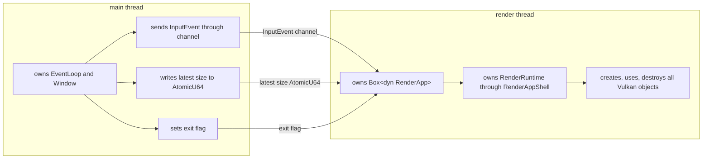

# 线程同步与资源生命周期

> 状态：当前实现事实总结。本文记录主线程 / 渲染线程边界、GPU 同步例外和 Vulkan 资源显式销毁契约。

## 线程模型

## 同步约束

- 主线程不调用 Vulkan、`ash` 或 `truvis-gfx` API。
- 所有 Vulkan 对象在渲染线程创建、使用和销毁。
- resize 通过 latest-size 模式合并连续事件。
- GPU 同步优先通过 RenderGraph、binary semaphore 和 frame timeline 表达。
- `after_prepare` 中的同步 raycast 是显式例外：它使用 runtime-owned `RayCastService` 提交独立 graphics command buffer，并用
  fence 阻塞等待 GPU trace、copy 和 readback。
- App 只应在 `after_prepare` 阶段调用同步 raycast，避免 update/input 阶段读取尚未同步的 GPU scene。

## 资源生命周期契约

生命周期契约以显式 owner 为边界：

- `Gfx` 是 Vulkan root owner，由 `RenderRuntime` 持有并在所有子资源之后销毁；默认 `Gfx::new(...)` 会先初始化 Streamline /
  DLSS runtime，并通过 `sl.interposer.dll` 创建 Vulkan entry。
- 叶子 Vulkan/VMA/WSI wrapper 通过 `destroy(self, ctx, reason)` 或 `destroy_mut(&mut self, ctx, reason)` 释放，释放所需依赖由
  owner 在调用点传入 typed `Gfx` Ctx。
- `Drop` 不调用 Vulkan/VMA/WSI release API，只通过 debug assertion 暴露遗漏的显式销毁。
- Runtime owner、manager、plugin 字段和长期资源 wrapper 不保存 typed `Gfx` Ctx、`&Gfx`、`&GfxDevice` 或
  `&VMemAllocator` 引用。
- manager 更新 descriptor 时只接收自身所需的窄 target；`GlobalDescriptorSets` 保持为全局 pipeline 绑定聚合，不作为下层
  manager 的更新入口。

## GPU 资源分类

- Persistent：pipeline、sampler、descriptor layout、shader binding。
- Frame：command buffer、per-frame buffer、FrameLabel / timeline state。
- Swapchain：swapchain image/view、present semaphore。
- App / Pipeline targets：RT working target、main view target、GBuffer 等窗口尺寸资源由具体 app/plugin 持有，并在 init /
  resize / shutdown 阶段通过 ctx 中的 `GfxResourceManager` 与 `ShaderBindingSystem` 显式创建、注册或释放。
- Asset：`AssetHub` 只持有 texture / model loader task handle、后台任务状态和完成事件队列，并负责 Assimp / glTF model 到 owned
  CPU payload 的导入；`SceneAssetIngestor` 把 loader 结果翻译为 CPU resource handle 事件；`RenderWorld` 内部的 `RenderTextureManager` 持有 texture 的 GPU image/view/bindless 绑定；
  `RenderMeshManager` 持有 mesh vertex/index buffer、BLAS 和 GPU ready 状态；`RenderMaterialManager` 管理 material
  GPU buffer、稳定 slot 以及 `MaterialHandle -> stable slot` 映射；App 通过
  `World::request_model_import` 拿到 `ModelImportHandle`，ready model CPU payload 在 `World::sync_for_render`
  内部由 `SceneAssetIngestor` 自动变为 runtime instances；facade 内部通过 `SceneAssetIngestor` 把 prefab 引用解析为 CPU resource handle；`RenderInstanceManager`
  持有 runtime instance 到稳定 GPU instance slot 的映射。CPU scene 删除 texture/mesh/material 后，对应 render manager
  负责移除 ready cache 或延迟回收 slot；已经提交但尚未完成的 texture/mesh upload 在 timeline 到达后只销毁资源，不重新发布 stale handle。
- Scene GPU：runtime 私有 `RenderWorld` 持有 render-side texture / mesh / material / instance / sky / emissive managers、
  instance / geometry / light / indirect buffer 和当前 FIF 的 raster draw cache，并通过内部 `RenderTlasManager`
  持有 per-FIF TLAS；`RenderSceneView` 只向 render pass 暴露只读 scene 快照。默认 sky 由 `World` 注册为
  `TextureHandle` 并写入 `SceneStore::SceneSkyState`，通过 `RenderTextureManager` 异步上传，并由
  `RenderSkyManager` 根据 scene sky state 提供 fallback、真实 sky binding 和 distribution。
- GUI：imgui font texture、per-frame GUI mesh buffer、texture map。
- RenderGraph：按帧导入的 image 状态引用与同步计划；图内 transient image/buffer 是未来能力，不作为当前资源生命周期类别。

## 创建路径

- `RenderRuntime::new` 初始化 `Gfx`，创建 `World`、`GfxResourceManager`、`ShaderBindingSystem`、`FrameTiming`、
  `PerFrameGpuData` 与 runtime-owned render state。
- `RenderRuntime::init_after_window` 创建 surface、swapchain 和 `SwapchainPresenter`。
- `RenderAppShell` 创建 `RenderRuntime` 并把 `RenderRuntimeInitCtx` 包装为 `RenderAppInitCtx` 交给 App hooks。
- App state 从 `RenderAppInitCtx` 中的 RenderRuntime Ctx 构造 `PluginInitCtx`，依次初始化自己持有的 Plugin。

## 重建路径

- render loop 调用 `RenderApp::recreate_swapchain_if_needed(size)`。
- `RenderAppShell` 调用 `RenderRuntime::handle_resize(size)`。
- RenderRuntime 只有实际重建时返回 `Some(RenderRuntimeResizeCtx)`。
- `RenderAppShell` 把返回值包装为 `RenderAppResizeCtx` 交给 App hooks，App state 构造 `PluginResizeCtx` 并通知需要 resize
  的 Plugin。
- 具体 app/plugin 在 resize 阶段重建自己持有的窗口尺寸 render target。

## 销毁路径

- `RenderApp::shutdown(&mut self)`：`RenderAppShell` 等待 GPU idle 后，先用 `RenderAppShutdownCtx` 调用 App hooks
  shutdown，再用 `PluginShutdownCtx` 反向遍历 Plugin shutdown。
- App / Plugin shutdown 必须在 `RenderRuntime::destroy()` 释放 runtime 子资源之前释放自己持有的 GPU 资源；需要 manager
  或 shader-visible binding 访问时通过 shutdown context 使用 `GfxResourceManager` 与 `ShaderBindingSystem`。
- manager-owned image/view 只能通过 `GfxResourceManager` 释放，manager 负责 image-view-before-image、延迟销毁队列与
  `DestroyReason` 诊断。
- runtime destroy：`gfx.wait_idel()` -> release present/assets/GPU scene/cmd/runtime resources -> `gfx.destroy()`。
- `gfx.destroy()` 会先释放内部 device child，再在 Vulkan device/instance/root 销毁前关闭 Streamline runtime。
- `gfx.destroy()` 开始后，剩余 App / Plugin 字段的 `Drop` 不得再调用 Vulkan/VMA/WSI 销毁 API。
