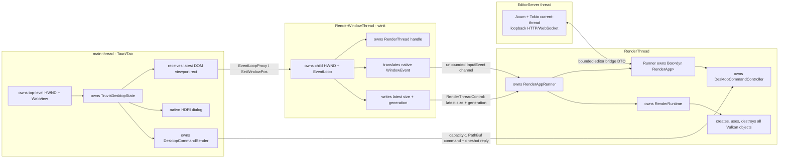

# 线程同步与资源生命周期

> 状态：当前实现事实总结。本文记录桌面主线程、窗口线程、渲染线程、EditorServer 线程边界，GPU 同步例外和 Vulkan 资源显式销毁契约。

## 线程模型

主体 Tauri 应用使用四个职责明确的线程；独立 samples 不启动 Tauri 和 EditorServer，并让 winit main thread 直接承担
下图前两个窗口角色。

```mermaid
flowchart LR
    subgraph MainThread["main thread · Tauri/Tao"]
        Parent["owns top-level HWND + WebView"]
        Desktop["owns TruvisDesktopState"]
        DomRect["receives latest DOM viewport rect"]
        Dialog["native HDRI dialog"]
        Sender["owns DesktopCommandSender"]
        Parent --> Desktop
        Desktop --> DomRect
        Desktop --> Dialog
        Desktop --> Sender
    end

    subgraph WindowThread["RenderWindowThread · winit"]
        Child["owns child HWND + EventLoop"]
        ThreadHandle["owns RenderThread handle"]
        Input["translates native WindowEvent"]
        Size["writes latest size + generation"]
        Child --> ThreadHandle
        Child --> Input
        Child --> Size
    end

    subgraph RenderThread["RenderThread"]
        Runner["owns RenderAppRunner"]
        RenderApp["Runner owns Box&lt;dyn RenderApp&gt;"]
        DesktopCommand["owns DesktopCommandController"]
        Runtime["owns RenderRuntime"]
        Vulkan["creates, uses, destroys all Vulkan objects"]
        Runner --> RenderApp
        Runner --> Runtime
        RenderApp --> DesktopCommand
        Runtime --> Vulkan
    end

    subgraph ServerThread["EditorServer thread"]
        Server["Axum + Tokio current-thread<br/>loopback HTTP/WebSocket"]
    end

    DomRect -- "EventLoopProxy / SetWindowPos" --> Child
    Sender -- "capacity-1 PathBuf command + oneshot reply" --> DesktopCommand
    Input -- "unbounded InputEvent channel" --> Runner
    Size -- "RenderThreadControl: latest size + generation" --> Runner
    Server <-- "bounded editor bridge DTO" --> RenderApp
```

## 同步约束

- main thread 与 `RenderWindowThread` 都不调用 Vulkan、`ash` 或 `truvis-gfx` API。
- 所有 Vulkan 对象在渲染线程创建、使用和销毁。
- `truvis-winit-host` 只跨线程传递可 Send 的 `Win32WindowHandle` / `WindowsDisplayHandle`；raw handle enum 与
  `RenderThreadInit` 只在目标 RenderThread 内重建，parent/child HWND 的 owner 必须保证窗口活到对应线程 join 完成。
- `truvis-render-thread` 持有线程完成状态和 panic 结果，并先发布完成标记再唤醒窗口 EventLoop；frame 内
  `RenderThreadControl` 只保存 Runner 使用的退出、输入和 resize 契约。
- `truvis-asset` Rayon worker 只做文件读取与 HDR/EXR/普通图片 CPU decode；
  `SkyDistributionBuilder` 的独立单线程只读取共享 `TextureBytes` 并构建 CPU Alias entries。
  两类 worker 都不创建、提交或销毁 Vulkan 资源。
- `EmbeddedWinitHost::spawn` 只等待窗口线程的 `EventLoopProxy` ready，然后立即释放 Tauri setup。child HWND 在
  Tao main thread 进入消息泵后异步创建；这避免 Windows 跨线程 `CreateWindowEx` 同步通知 parent 时形成互等。
  child ready 前到达的 viewport rect 只保留 latest 值。
- child HWND 初始保持隐藏的 `1x1` 状态；`RenderWindowThread` 等待第一个非零 DOM rect，先用 `SetWindowPos` 应用真实
  物理尺寸，再创建 `RenderThread`。这样 `RenderThreadInit::initial_size`、App/子系统 display size 与初始 swapchain extent
  从启动时就是同一尺寸，不依赖第二次 resize 修正。
- Tauri resize 先按 DOM 规则改变中央 slot；前端只提交相对 top-level client area 的物理像素矩形，平台宿主通过
  `SetWindowPos` 调整 child HWND。Windows 随后产生正常 `WM_SIZE`，winit 转为 `WindowEvent::Resized`，现有 latest-size、
  resize generation、debounce 与 swapchain 重建路径保持不变。
- 顶层窗口 move 不需要业务消息：`WS_CHILD` 的屏幕位置由 Windows 随 parent HWND 自动移动，child 的 client-relative rect 不变。
- render child 位于 WebView sibling 的 Z-order 顶部并直接接收鼠标消息。winit 的 Windows backend 消费
  `WM_*BUTTONDOWN` 后不会替嵌入式 child 自动切换 keyboard focus，因此 `RenderWindowThread` 在任意鼠标按下时对 child
  调用 `SetFocus`；点击周围 WebView 控件后焦点按 Windows 默认行为返回 WebView。Web UI 不转发 viewport 键盘输入。
- DOM rect 命令只改变平台窗口几何，不进入 `RenderApp`，也不携带场景、材质或 swapchain 语义。
- Tauri `select_hdri` 使用非阻塞原生 dialog；`TruvisDesktopState` 只持有 sender 和 dialog-open 原子状态，不持有 scene
  投影，也不在持有 desktop resources mutex 时打开 dialog 或等待 reply。
- HDRI 的本地 `PathBuf` 只通过容量为 `1` 的私有 `DesktopCommandSender` 进入 RenderThread，不进入 Editor WebSocket。
  `DesktopCommandController` 每帧最多处理一条，并且只在 `TruvisRenderApp::update` 中短暂借用 `World`。
- desktop oneshot reply 只确认 `World::request_sky_texture_from_path` 已接受 CPU scene mutation，不等待 asset decode、
  texture upload 或 sky distribution；Tauri main thread、WebView 和 EditorServer 仍不访问 Vulkan。
- GPU 同步优先通过 RenderGraph、binary semaphore 和 frame timeline 表达。
- `RenderAppRunner` 的默认 120 FPS 软件限帧仍在 RenderThread 内使用 `park_timeout(1 ms)` 短周期轮询；
  它不新增跨线程主动唤醒协议，也不改变输入、resize、退出状态在每轮限帧判断前被检查的顺序。
- `after_prepare` 中的同步 raycast 是显式例外：它使用 runtime-owned `RayCastService` 提交独立 graphics command buffer，并用
  fence 阻塞等待 GPU trace、copy 和 readback。
- App 只应在 `after_prepare` 阶段调用同步 raycast，避免 update/input 阶段读取尚未同步的 GPU scene。

## 资源生命周期契约

生命周期契约以显式 owner 为边界：

- `Gfx` 是 Vulkan root owner，由 `RenderRuntime` 持有并在所有子资源之后销毁；默认 `Gfx::new(...)` 会先初始化 Streamline /
  DLSS runtime，并通过 `sl.interposer.dll` 创建 Vulkan entry。
- 叶子 Vulkan/VMA/WSI wrapper 通过 `destroy(self, ctx, reason)` 或 `destroy_mut(&mut self, ctx, reason)` 释放，释放所需依赖由
  owner 在调用点传入 typed `Gfx` Ctx。
- `Drop` 不调用 Vulkan/VMA/WSI release API，只通过 debug assertion 暴露遗漏的显式销毁。
- Runtime owner、manager、子系统字段和长期资源 wrapper 不保存 typed `Gfx` Ctx、`&Gfx`、`&GfxDevice` 或
  `&VMemAllocator` 引用。
- manager 更新 descriptor 时只接收自身所需的窄 target；`GlobalDescriptorSets` 保持为全局 pipeline 绑定聚合，不作为下层
  manager 的更新入口。

## GPU 资源分类

- Persistent：pipeline、sampler、descriptor layout、shader binding。
- Frame：command buffer、per-frame buffer、FrameLabel / timeline state。
- Swapchain：swapchain image/view、present semaphore。
- App / Pipeline targets：RT working target、main view target、GBuffer、selection outline mask 等窗口尺寸资源由具体
  App/子系统持有，并在 init / resize / shutdown 阶段通过 ctx 中的 `GfxResourceManager` 与
  `ShaderBindingSystem` 显式创建、注册或释放。
- Asset：`AssetHub` 只持有 texture / model loader task handle、后台任务状态和完成事件队列，并负责 Assimp / glTF model 到 owned
  CPU payload 的导入；HDR/EXR texture payload 以共享 RGBA16F 保存，普通图片以共享 RGBA8 保存。
  `SceneAssetIngestor` 把 loader 结果翻译为 CPU resource handle 事件；`RenderWorld` 内部的
  `RenderAssetUploadQueue` 统一持有 texture image 与 sky distribution 的 transfer command pool/timeline，
  `RenderTextureManager` 持有完成后的 texture GPU image/view/bindless 绑定；
  `SceneStore` 保存 mesh 的 submesh metadata 和 instance material 对齐约束；`RenderMeshManager` 持有每个 submesh 的 vertex/index buffer、
  `RtGeometry`、mesh 级 BLAS 和 GPU ready 状态；`RenderMaterialManager` 管理 material
  GPU buffer、稳定 slot 以及 `MaterialHandle -> stable slot` 映射；App 通过
  `World::request_model_import` 拿到 `ModelImportHandle`，ready model CPU payload 在 `World::sync_for_render`
  内部由 `SceneAssetIngestor` 自动变为 runtime instances；facade 内部通过 `SceneAssetIngestor` 把 prefab 引用解析为 CPU resource handle；`RenderInstanceManager`
  持有 runtime instance 到稳定 GPU instance slot 的映射。CPU scene 删除 texture/mesh/material 后，对应 render manager
  负责移除 ready cache 或延迟回收 slot；已经提交但尚未完成的 texture/mesh upload 在 timeline 到达后只销毁资源，不重新发布 stale handle。
- Scene GPU：runtime 私有 `RenderWorld` 持有 render-side texture / mesh / material / instance / sky / emissive managers、
  instance / geometry / light / indirect buffer 和当前 FIF 的 raster draw cache，并通过内部 `RenderTlasManager`
  持有 per-FIF TLAS；`RenderSceneView` 只向 render pass 暴露只读 scene 快照。默认 sky 由 `World` 注册为
  `TextureHandle` 并写入 `SceneStore::SceneSkyState`，通过 `RenderTextureManager` 异步上传，并由
  `RenderSkyManager` 根据 scene sky state 提供 fallback、真实 sky binding 和 distribution，并拥有
  distribution worker、request generation 与 active/retired 状态。旧 distribution 交给
  `GfxResourceManager` 按退休 frame id 跨过 FIF 后销毁，stale 未发布 buffer 在 transfer timeline 完成后立即销毁。
- GUI：imgui font texture、per-frame GUI mesh buffer、当前只包含 font view 的 texture map；debug image handle
  不进入 GUI 生命周期，由 realtime/offline pipeline owner 持有并在当前 present graph 内短暂导入。
- RenderGraph：按帧导入的 image 状态引用与同步计划；图内 transient image/buffer 是未来能力，不作为当前资源生命周期类别。

## 创建路径

- `RenderRuntime::new` 初始化 `Gfx`，创建 `World`、`GfxResourceManager`、`ShaderBindingSystem`、`FrameTiming`、
  `PerFrameGpuData` 与 runtime-owned render state。
- `RenderRuntime::init_after_window` 创建 surface、swapchain 和 `SwapchainPresenter`。
- `RenderAppRunner` 创建 `RenderRuntime` 并把 `RenderRuntimeInitCtx` 包装为 `RenderAppInitCtx` 交给 App hooks。
- App state 直接将 `&mut RenderAppInitCtx::runtime` 传给各具体子系统，按自身顺序初始化长期资源。

## 重建路径

- `RenderAppRunner::run` 在循环安全点调用内部 `recreate_swapchain_if_needed(size)`。
- `RenderAppRunner` 调用 `RenderRuntime::handle_resize(size)`。
- RenderRuntime 只有实际重建时返回 `Some(RenderRuntimeResizeCtx)`。
- `RenderAppRunner` 把返回值包装为 `RenderAppResizeCtx` 交给 App hook；App 直接用 `&mut ctx.runtime`
  通知需要 resize 的具体子系统。
- 具体 App/子系统在 resize 阶段重建自己持有的窗口尺寸 render target。

## 销毁路径

`RenderWorld` 的资产 shutdown 顺序固定为：先停止并 join `SkyDistributionBuilder`，再等待共享
`RenderAssetUploadQueue` timeline 并释放 pending staging/image/buffer，最后销毁
`RenderSkyManager` 已发布的 active/retired/fallback 资源与 `RenderTextureManager` ready images。
这保证 CPU producer、transfer queue 和 shader-visible owner 不会交叉销毁。

桌面窗口的外层销毁顺序固定为：RenderThread 上的 `TruvisRenderApp` 先关闭并清空 desktop command receiver，使尚未处理的
oneshot reply 因 sender drop 退出 → App/runtime/Vulkan 销毁 → `RenderWindowThread` drop child HWND → 停止并 join
EditorServer → Tauri/Tao drop WebView 与 top-level HWND。`TruvisDesktopState::shutting_down` 阻止新 dialog，
`EmbeddedWinitHost::Drop` 为非正常 exit 提供相同顺序的兜底。

- `RenderAppRunner` 内部 shutdown：Runner 等待 GPU idle 后，用 `RenderAppShutdownCtx` 调用具体 `RenderApp`；
  App 在该 hook 内按自己的资源依赖顺序完成所有子系统 shutdown。
- App / 子系统 shutdown 必须在 `RenderRuntime::destroy()` 释放 runtime 子资源之前释放自己持有的 GPU 资源；需要 manager
  或 shader-visible binding 访问时通过 shutdown context 使用 `GfxResourceManager` 与 `ShaderBindingSystem`。
- manager-owned image/view 只能通过 `GfxResourceManager` 释放，manager 负责 image-view-before-image、延迟销毁队列与
  `DestroyReason` 诊断。
- runtime destroy：`gfx.wait_idel()` -> release present/assets/GPU scene/cmd/runtime resources -> `gfx.destroy()`。
- `gfx.destroy()` 会先释放内部 device child，再在 Vulkan device/instance/root 销毁前关闭 Streamline runtime。
- `gfx.destroy()` 开始后，剩余 App / 子系统字段的 `Drop` 不得再调用 Vulkan/VMA/WSI 销毁 API。
