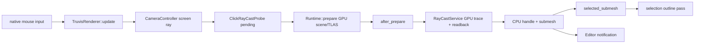

# 点选操作如何实现

> 类型：面向人的问题切片。
> 核对基准：2026-09-20 工作区实现。
> 更新策略：只有用户明确要求时更新；本文是解释性快照，不是实现事实的唯一来源。
> 设计入口：[Runtime Phase Contract](../design/runtime-phase-contract.md)、[Scene Sync 与 RenderWorld](../design/scene-sync-and-render-world.md)。

## 总体链路



点选不是 UI WebView 自己做的，也不是一次鼠标消息直接读取 GPU。它跨越输入、CPU pending state、prepare、同步 raycast 和后续 render。

## 1. 输入到射线

原生 viewport 由 winit child HWND 直接接收鼠标消息。RenderLoop 把输入事件送给 Renderer；WebView 不转发 viewport 鼠标和键盘输入。

`TruvisRenderer::update` 发现左键刚按下后读取物理像素位置和当前 viewport size，调用 `CameraController::make_screen_raycast`。

Camera controller 使用当前 camera 和 projection 把屏幕位置转成 world-space origin/direction，并生成 `RayCastRay`。如果坐标无效或 viewport 不可用，结果为 `None`。

## 2. 暂存请求

有效 ray 不在 update 阶段立即执行。它进入 `ClickRayCastProbe` 的 pending state，同时保留 screen position 供 overlay 显示。

这样做是因为 update 阶段的 GPU scene 可能仍对应上一帧；真正查询必须等 Runtime 完成本帧 prepare。

如果射线生成失败，Renderer 立即清除已有 selection，并发送 selection changed notification。它不会提交一个无效 GPU ray。

## 3. prepare 形成查询基础

Runtime 在 Renderer update 后执行 `prepare(render_view)`：

- 消费 CPU asset loader completion；
- 对账 RenderWorld 资源和 instance membership；
- 上传当前 FIF 的 scene buffer、geometry、material 和 light 数据；
- 更新 TLAS、scene root 和 descriptor；
- 生成当前帧 `RenderSceneView`。

此时 GPU scene 是本帧可查询的派生状态。CPU handle 仍由 GameWorld 保持权威。

## 4. after_prepare 执行同步查询

RenderLoop 在 prepare 后创建 `RenderRuntimeRayCastCtx`，调用 Renderer `after_prepare`。

Renderer 从 probe 取出 pending ray，调用 `cast_sync`。Runtime 的 `RayCastService` 提交 ray tracing pass、copy/readback 和 fence wait；返回结果顺序与输入 ray 保持一致。

这是同步路径，会阻塞 RenderThread 直到命中结果可读。它只用于 picking、camera pivot、drag pan 和 wheel zoom 等需要即时反馈的交互，不用于普通渲染或后台查询。

## 5. GPU hit 转回 CPU 语义

GPU hit 先携带 render-side instance/geometry/primitive 信息。Runtime 依据当前 RenderWorld 的 instance table 和 mesh metadata 解析为：

```text
MeshInstanceHandle
submesh_index
MeshAssetHandle
MaterialAssetHandle
hit distance / barycentric data
```

对外的 selection 语义是 `MeshInstanceHandle + submesh_index`。GPU slot、draw index 和 buffer offset 不离开 Runtime 私有边界。

pending、对象已删除、submesh 越界、GPU resource not ready 或 slot snapshot 失效时，结果可以是 miss 或 error；调用方不应把它解释为另一个对象命中。

## 6. selection 与 Editor

Renderer 将 hit 转为 `WorldSubmeshSelection`，更新 `selected_submesh`。只有 selection 发生变化时，`EditorController` 发送 best-effort selection notification。

Editor notification 只提示 WebView 刷新展示；WebView 仍可主动 query 当前 selection。notification 丢失不会改变 Renderer 或 GameWorld 的 selection authority。

miss 和 raycast error 都清除当前 selection 的对外语义，但 overlay 可以保留最近一次错误/命中信息用于诊断。

## 7. selection outline

后续 `render` 阶段，Renderer 将 `selected_submesh` 交给 selection outline subsystem。subsystem 通过 Runtime 提供的 `WorldSubmeshRasterView` 把 CPU selection 解析为当前 frame 的可绘制 submesh。

如果对象已删除、未 ready 或 selection 不在当前 draw cache，raster view 返回 false 并跳过描边；它不会修改 selection，也不会把 false 当成系统错误。

描边 mask 和 composite pass 属于 Renderer-owned target，按正常 RenderGraph 顺序加入主图。

## 8. 失败与时序

- 左键位置不能生成 ray：立即清 selection。
- ray miss：清 selection，通知 WebView。
- GPU trace/readback error：清 selection，保留诊断错误。
- CPU 对象在 prepare 后删除：解析或描边阶段拒绝 stale handle。
- GPU resource 尚未 ready：返回 miss/不可绘制，不伪造命中。
- RenderThread 没有 frame budget：同步 raycast 可能延迟后续输入和渲染。

点选结果可用不等于画面已经 present；notification 到达也不等于 outline 已经显示。

## 代码入口

- [`truvis_renderer.rs`](../../renderer/truvis-renderer/src/truvis_renderer.rs)
- [`camera_controller.rs`](../../renderer/renderer-kit/src/camera_controller.rs)
- [`render_runtime_ctx.rs`](../../engine/e40-render/truvis-render-runtime/src/render_runtime_ctx.rs)
- [`ray_cast/mod.rs`](../../engine/e40-render/truvis-render-runtime/src/ray_cast/mod.rs)
- [`selection.rs`](../../engine/e40-render/truvis-render-runtime/src/selection.rs)

本文只解释点选问题；Runtime 的完整阶段顺序见 [RenderRuntime 各阶段](render-runtime-phases.md)。
