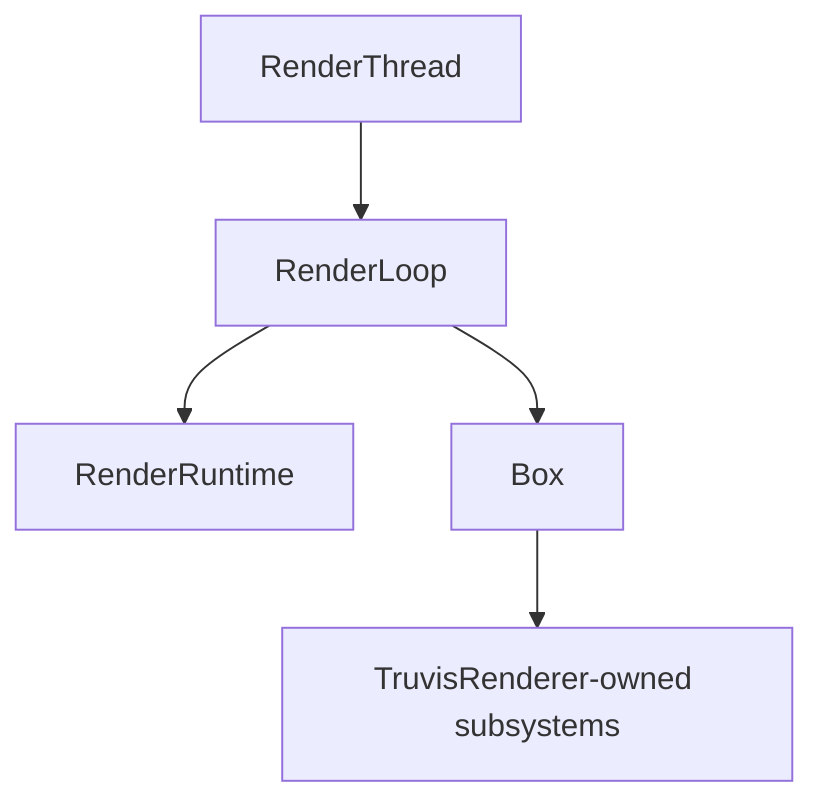

# RenderRuntime 下的对象层级

> 类型：面向人的问题切片。
> 核对基准：2026-09-20 工作区实现。
> 更新策略：只有用户明确要求时更新；本文是解释性快照，不是实现事实的唯一来源。
> 设计入口：[分层与依赖边界](../design/layering-and-dependency-boundaries.md)、[资源生命周期](../design/resource-lifecycle-and-destruction.md)。

## 顶层关系



`RenderLoop` 同时拥有 Runtime 和动态 Renderer。Renderer 不拥有 Runtime；它只在当前 phase 借用 Runtime Ctx。

## RenderRuntime

```text
RenderRuntime
├─ Gfx
├─ GameWorld
├─ GfxResourceRegistry
├─ ShaderBindingSystem
├─ FrameTiming / FrameRenderState
├─ PerFrameGpuData
├─ DlssOptions / DlssSrState / ViewAccumState
├─ RenderWorld
├─ RayCastService
├─ CmdAllocator / FIF timeline
└─ SwapchainPresenter
```

Runtime 是这些对象的生命周期聚合 owner。它负责创建、跨帧使用和最终销毁，但不会替 Renderer 决定具体业务 pass。

## CPU World

`GameWorld` 内部保存 `SceneStore`、asset identity、material、light、sky 和 instance 的 CPU 最终状态。

CPU handle 是业务身份，包含 generation 语义；它不是 GPU instance slot、descriptor index 或 buffer offset。

Renderer update 可以通过 Runtime update Ctx 修改 CPU world。RenderGraph 和 GPU pass 不应直接写回 CPU world。

## RenderWorld

`RenderWorld` 是 Runtime 私有的 GPU scene composition owner，内部包含：

```text
RenderWorld
├─ RenderAssetSystem
│  ├─ GpuTextureStore
│  ├─ GpuMeshStore
│  ├─ GpuMaterialStore
│  └─ GpuAssetUploadQueue
├─ RenderInstanceTable
├─ geometry / buffers / raster draw cache
├─ AnalyticLightTable
├─ RenderEmissiveLightTable
├─ GpuSkyStore / distribution builder
└─ SceneTlas
```

这些 manager 保存 GPU ready state、stable slot、per-FIF buffer 和延迟释放状态。它们不成为 CPU scene 的权威，也不把组合关系交给独立 asset manager。

## Renderer 与子系统

`TruvisRenderer` 自己拥有 camera、input、overlay、Editor controller、selection 和配置状态，并静态持有：

```text
TruvisRenderer
├─ RealtimeRenderSubsystem
├─ OfflineRenderSubsystem
├─ ImGuiSubsystem
├─ SelectionOutlineSubsystem
└─ CoordinateGizmoSubsystem
```

这些 subsystem 可以拥有 pipeline、target、descriptor、GUI buffer 或 SHARC 等 GPU 资源，但必须通过 lifecycle Ctx 创建和销毁。它们不拥有 `Gfx` root、GameWorld 或 RenderWorld。

## 借用型对象

以下对象是阶段视图，不是 owner：

- `RenderRuntimeUpdateCtx`：短暂借用 CPU world、配置和 frame state。
- `RenderRuntimeRayCastCtx`：短暂借用 raycast service 和 GPU scene 查询能力。
- `RenderRuntimeRenderCtx`：只读借用 scene view、present view 和 timing。
- `RenderSceneView`：prepare 后给 pass 的只读 GPU scene 视图。
- `SubsystemRenderCtx`：Renderer 在 render 阶段为具体 subsystem 构造的窄视图。

它们不能跨阶段保存，也不能通过内部引用重新获得完整 Runtime。

## 资源与销毁

Vulkan root owner 是 `Gfx`，最后销毁。Runtime 先释放 present、raycast、RenderWorld、per-frame data、command allocator、binding 和 registry，再销毁 Gfx。

Renderer shutdown 早于 Runtime destroy；窗口 host 晚于 RenderThread 退出。CPU worker、GPU upload queue 和 distribution builder 必须在相应 owner 销毁前停止或完成。

## 关系中最容易混淆的三点

1. `GameWorld` 和 `RenderWorld` 都包含“scene”概念，但前者是 CPU authority，后者是 GPU derived mirror。
2. Renderer 可以调用 Runtime 能力，但不拥有 Runtime。
3. `RenderSceneView` 可以让 pass 读取 GPU scene，但不转移 RenderWorld 的销毁责任。

## 代码入口

- [`RenderRuntime`](../../engine/e40-render/truvis-render-runtime/src/render_runtime.rs)
- [`RenderWorld`](../../engine/e40-render/truvis-render-runtime/src/render_world/render_world.rs)
- [`TruvisRenderer`](../../renderer/truvis-renderer/src/truvis_renderer.rs)
- [`render_runtime_ctx.rs`](../../engine/e40-render/truvis-render-runtime/src/render_runtime_ctx.rs)

阶段顺序见 [RenderRuntime 各阶段](render-runtime-phases.md)，点选结果如何回到 Renderer 见 [点选流程](picking-flow.md)。
