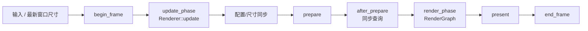

# RenderRuntime 各阶段在做什么

> 类型：面向人的问题切片。
> 核对基准：2026-09-20 工作区实现。
> 更新策略：只有用户明确要求时更新；本文是解释性快照，不是实现事实的唯一来源。
> 设计入口：[Runtime Phase Contract](../design/runtime-phase-contract.md)、[帧执行与窗口生命周期](../design/frame-execution-and-window-lifecycle.md)。

## 先看一帧

可以把一帧分成三个阅读层次：

- Runtime 负责 GPU、CPU world、同步和 frame state。
- RenderLoop 负责按固定顺序调用 Runtime 和 Renderer。
- Renderer 负责 camera、Editor、UI、selection 和具体 pass。

阶段不是简单的函数切分。每个阶段返回的 Ctx 都是在限制下一层能做什么。

## 启动阶段

`RenderRuntime::new` 在没有窗口的情况下创建 `Gfx`、`GameWorld`、`RenderWorld`、binding system、timing 和资源 registry。

`init_after_window` 收到平台窗口句柄后创建 surface、swapchain 和 present owner。真实窗口尺寸在此时进入 `FrameRenderState`。

随后 `Renderer::init` 让具体 Renderer 创建 realtime、offline、ImGui、selection outline 等长期资源。此时仍在 RenderThread 内，所有 Vulkan owner 都可安全建立。

## begin_frame

`begin_frame` 是一帧唯一的资源回收入口。它会：

1. 更新 FrameTiming 和当前 frame id。
2. 等待当前 FIF label 上一次使用完成。
3. 重置本帧 command pool。
4. 清理跨帧延迟释放队列。
5. 通知 binding system 和 RenderWorld 开始当前 frame。

它不处理鼠标、Editor command 或 RenderGraph。它只建立本帧继续工作的同步前提。

## update_phase

Runtime 先同步 frame state 并 acquire 当前 present image，然后交给 Renderer update。

Renderer 在这里消费输入、更新 camera、构建 GUI frame、处理 Editor request、修改 GameWorld 和更新本地配置。

这个阶段可以修改 CPU 语义状态，但不能把 GPU scene 当作本帧已经更新。相机的 `render_view` 只是后续 prepare 要读取的纯数据快照。

## 配置与 resize

Renderer update 之后，Runtime 收敛 DLSS mode、render extent 和 output extent。如果尺寸或 feature 分支发生变化，返回 `RenderRuntimeResizeCtx`。

Renderer 在 `on_resize` 中让各子系统重建窗口尺寸资源。resize 不修改 CPU scene，也不直接进入 RenderGraph。

如果本帧没有实际 resize，就继续使用原有 target；`None` 只表示没有需要传播的 Runtime resize。

## prepare

`prepare` 是 CPU world 到 GPU scene 的翻译边界。它先消费 asset loader completion，再对账 RenderWorld asset membership，刷新 binding，扫描 instance，更新 buffer/TLAS/scene root，最后写 per-frame 数据。

prepare 读取 Renderer 提供的 `RenderView`，但不会调用 Renderer hook。完成后，RenderGraph 才能读取本帧一致的 `RenderSceneView`。

资源未 ready、CPU 对象隐藏或 pending 不代表它已从 membership 删除；删除判断依赖完整对账。

## after_prepare

`ray_cast_phase` 只暴露同步 raycast Ctx。Renderer 的 `after_prepare` 在这里处理 picking、相机 pivot、drag pan 和 wheel zoom 等需要立刻得到命中结果的交互。

raycast 会提交 GPU trace/readback 并等待 fence，因此它是明确的同步例外。普通更新和渲染不应在这个阶段执行。

## render_phase 与 render

Runtime 提供只读 `RenderRuntimeRenderCtx`。Renderer 将 subsystem target、scene view、present target 和具体 pass 加入 RenderGraph，并决定 RT、raster、post-process、selection outline 与 GUI 的顺序。

Render 阶段不能修改 CPU scene，也不能把 graph 中的 image 当成长生命周期 owner。Graph 只表达本帧访问、状态和提交计划。

## present 与 end_frame

`present` 把 graph 写完的 swapchain image 交给 present queue。它表示提交了显示请求，不保证用户已经看到最终像素。

`end_frame` 推进 frame id 和 FIF label，为下一帧选择 command、descriptor 和 per-frame 副本。timeline completion 是另一个事件，通常在未来的 `begin_frame` 作为安全回收条件。

## 无 present target

窗口最小化、零尺寸或 swapchain 暂不可用时，本帧可能没有 present image。RenderLoop 仍检查退出、输入和 resize，但跳过依赖 swapchain 的 prepare/query/render/present 路径，并补齐必要 timeline 状态。

这不是 shutdown。窗口恢复后，后续帧仍可重新 acquire 并继续正常 phase。

## 关闭

关闭顺序是：阻止新请求，执行 Renderer shutdown，等待并销毁 Runtime/Vulkan，等待 RenderThread 结束，再销毁 child HWND、notification task 和 Tauri parent。

Renderer 资源必须早于 Runtime 的 `Gfx` 销毁。窗口 owner 必须活到 RenderThread 不再访问窗口句柄。

## 代码入口

- [`render_runtime.rs`](../../engine/e40-render/truvis-render-runtime/src/render_runtime.rs)
- [`render_runtime_ctx.rs`](../../engine/e40-render/truvis-render-runtime/src/render_runtime_ctx.rs)
- [`render_loop`](../../engine/e50-render-loop/truvis-render-loop/src/render_loop.rs)
- [`TruvisRenderer`](../../renderer/truvis-renderer/src/truvis_renderer.rs)

本文只回答“阶段在做什么”。对象 owner 见 [RenderRuntime 对象层级](render-runtime-object-hierarchy.md)，点选见 [点选流程](picking-flow.md)。
