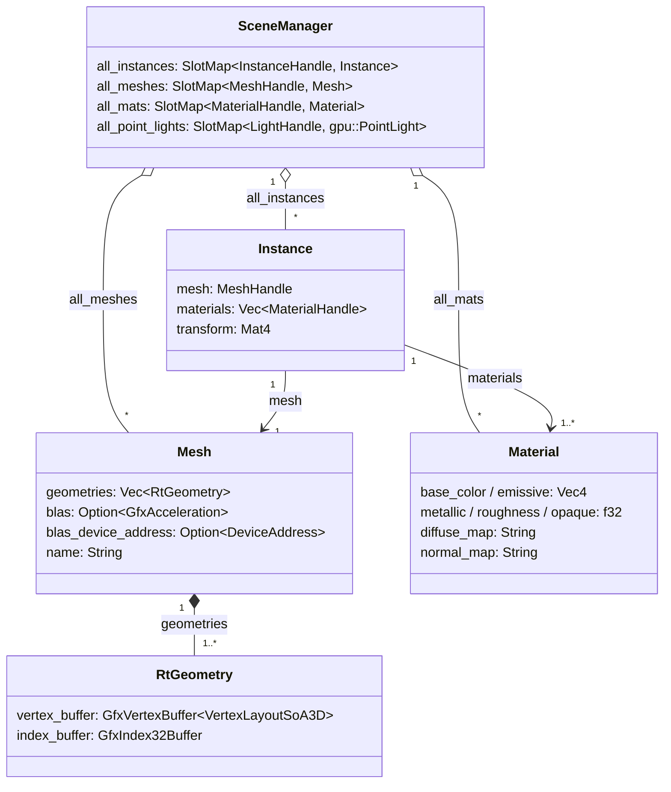
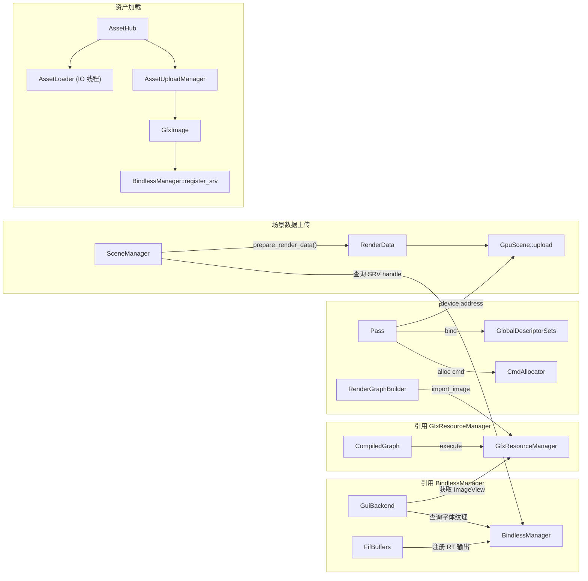
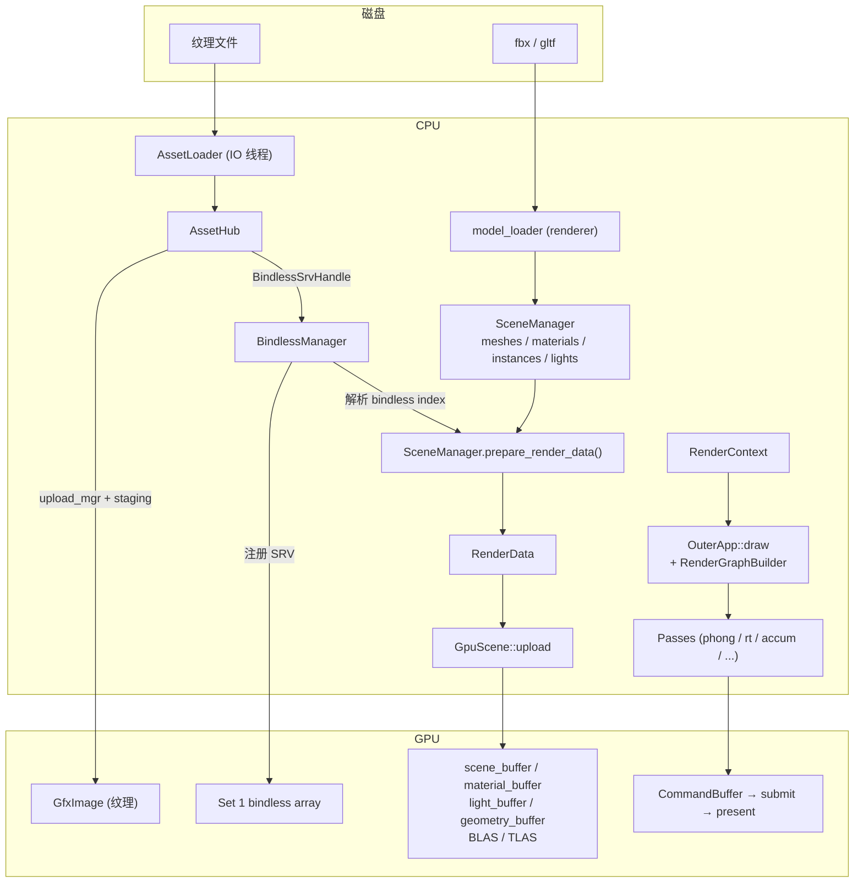
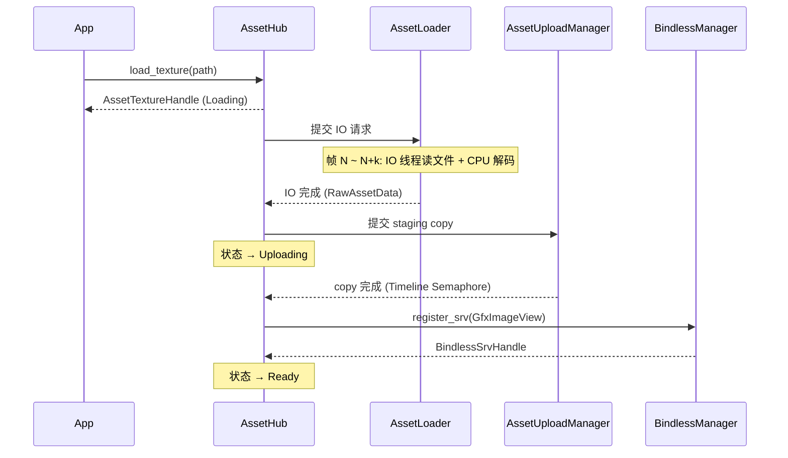
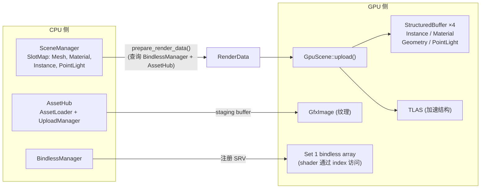
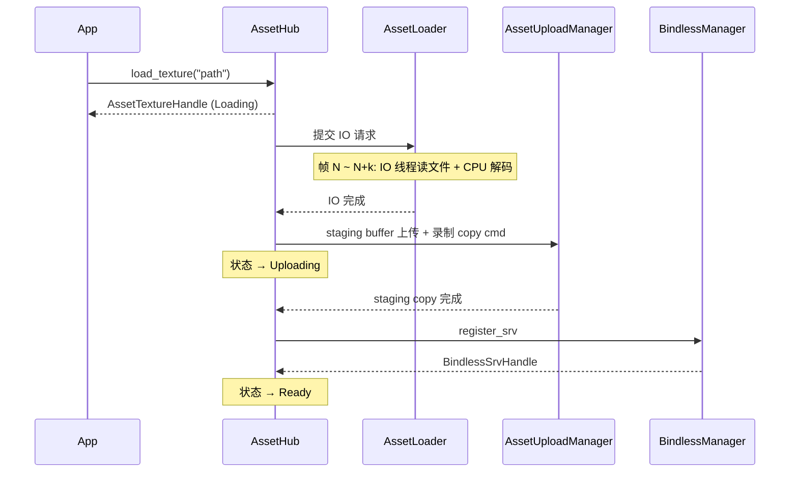

# Engine Crates

渲染引擎的各功能模块。本文件记录 `engine/crates/` 下所有 crate 的分层、职责、数据流、时序以及已知设计问题。

## 1. 依赖层次

依赖图无环，自底向上共 6 层。

```
L0  Foundation
    ├── truvis-utils
    ├── truvis-logs
    ├── truvis-path                     (workspace 根下)
    ├── truvis-shader-binding           (engine/shader/ 下)
    └── truvis-descriptor-layout-{trait, macro}

L1  RHI
    └── truvis-gfx                      Gfx 单例 · Vulkan 原语

L2  渲染接口与资源契约
    └── truvis-render-interface         FrameCounter · CmdAllocator · Handle
                                        GfxResourceManager · BindlessManager
                                        GlobalDescriptorSets · GpuScene · RenderData

L3  渲染能力（同层，互不依赖）
    ├── truvis-asset                    AssetHub 异步纹理加载
    ├── truvis-scene                    SceneManager CPU 场景（依赖 asset）
    ├── truvis-render-graph             RenderGraph · FifBuffers
    └── truvis-gui-backend              GuiPass 纯 Vulkan 录制

L4  渲染器
    └── truvis-renderer                 Renderer · RenderContext
                                        Camera · Timer · RenderPresent

L5  应用框架
    └── truvis-app                      OuterApp · RenderApp · GuiHost
                                        render_pipeline/* 具体 pass 实现
```

**主干依赖链：** `gfx → render-interface → render-graph → renderer → app`

**领域模块（并行依赖 gfx + render-interface）：**

| Crate | 依赖 | 备注 |
| --- | --- | --- |
| truvis-asset | gfx, render-interface | 不依赖 scene |
| truvis-scene | gfx, render-interface, asset | 不依赖 render-graph |
| truvis-gui-backend | gfx, render-interface | 不依赖 render-graph |
| truvis-render-graph | gfx, render-interface | 不依赖 scene / asset |

> [!info] 层次隔离原则
> L3 的 4 个 crate 互不依赖。具体的 pass 实现（需要同时用 RenderGraph + Scene + Gui）放在 L5 的 `truvis-app` 里。

## 2. 模块说明

### `truvis-gfx` (L1)

Vulkan RHI 封装。`Gfx` 单例持有 instance / device / queue / VMA，所有上层的 Vulkan 调用经由此层。

- `gfx::Gfx::init()` / `Gfx::get()`：单例访问
- `commands/`：CommandBuffer / Semaphore / Submit / Barrier 封装
- `resources/`：Image / Buffer / 特化 buffer（StructuredBuffer / IndexBuffer）
- `pipelines/`：Graphics / Compute / RayTracing pipeline 构建
- `raytracing/`：加速结构 (`GfxAcceleration`)
- `swapchain/`：交换链

### `truvis-render-interface` (L2)

渲染流程的"数据契约层"。当前混合了 4 类职责：

| 类别 | 代表模块 | 性质 |
| --- | --- | --- |
| 帧调度原语 | `frame_counter`, `cmd_allocator`, `pipeline_settings` | 纯契约 |
| 资源句柄 | `handles`, `gfx_resource_manager` | 资源生命周期 |
| 全局绑定 | `bindless_manager`, `global_descriptor_sets`, `sampler_manager` | 着色器绑定契约 |
| GPU 场景数据 | `gpu_scene`, `render_data`, `geometry` | 具体实现 |

- `FrameCounter`：Frames in Flight (A/B/C) + timeline semaphore value
- `CmdAllocator`：按 `FrameLabel` 分配复用 CommandBuffer
- `GfxResourceManager`：SlotMap 驱动的 Image/Buffer/View 资源池，支持延迟销毁
- `BindlessManager`：Set 1 的 bindless SRV 注册与索引分配
- `GlobalDescriptorSets`：Set 0 (sampler) / Set 1 (bindless) / Set 2 (per-frame) 三层布局
- `GpuScene`：维护 scene_buffer / material_buffer / light_buffer / geometry_buffer / TLAS

> [!info] 职责混合问题
> `GpuScene` / `RenderData` 是"CPU Scene 的 GPU 镜像"，语义上属于 L3 的 scene→GPU 桥梁，但当前放在 L2 以打破 scene / renderer / passes 的三向依赖。详见第 6 节。

### `truvis-asset` (L3)

纹理资产的异步加载。当前仅处理纹理。

- `AssetHub`：Facade。维护 `texture_states`（Loading → Uploading → Ready），提供 fallback 机制
- `AssetLoader`：IO 线程，`crossbeam-channel` 传递 `AssetLoadRequest` / `LoadResult`
- `AssetUploadManager`：staging buffer + copy command 驱动 GPU 上传
- `AssetTextureHandle`：上层引用资产的轻量 key

### `truvis-scene` (L3)

CPU 侧场景数据管理。

- `SceneManager`：`SlotMap<Mesh/Material/Instance/PointLight>`
- `components/`：`Mesh`, `Material`, `Instance` 组件定义
- `shapes/`：内置几何体（`TriangleSoA` 等）
- `prepare_render_data()`：查询 `BindlessManager` + `AssetHub`，输出 `RenderData` 给 `GpuScene::upload`

**CPU 场景数据模型：**



关键约定：
- `Instance.materials[i]` 与 `Mesh.geometries[i]` 一一对应，材质数量须与 submesh 数量严格对齐
- `Instance` 通过 Handle 引用 Mesh / Material，不直接拥有数据
- `Mesh.blas` 构建后才能用于 TLAS，`blas_device_address` 用于 `AccelerationStructureInstanceKHR`

### `truvis-render-graph` (L3)

声明式渲染图。纯 pass 编排，不依赖 scene / asset。

- `RenderGraphBuilder::add_pass_lambda` / `add_pass(Pass)`
- 自动推导 image barrier 和 semaphore 同步
- `FifBuffers`：render target / depth / color 的 3 帧循环缓冲
- `import_image` / `export_image`：导入外部资源（如 swapchain），跨帧衔接状态

### `truvis-gui-backend` (L3)

ImGui 的 Vulkan 后端。纯 Vulkan 录制层。

- `GuiBackend`：字体纹理上传、descriptor set 管理
- `GuiPass::draw(cmd, draw_data, frame_label, global_ds, bindless)`：接收显式参数而非 `RenderContext`
- RenderGraph 适配（`GuiRgPass`）位于 `truvis-app`，保证此 crate 与 render-graph 解耦

### `truvis-renderer` (L4)

渲染器整合层。

- `Renderer`：帧循环驱动（`begin_frame` / `before_render` / `end_frame`），持有 `CmdAllocator`、`Timer`、`fif_timeline_semaphore`、`RenderPresent`
- `RenderContext`：渲染期间不可变的状态聚合，持有 `SceneManager`、`GpuScene`、`AssetHub`、`FifBuffers`、`BindlessManager`、`GlobalDescriptorSets`、`GfxResourceManager` 等
- `RenderContext2<'a>`：`RenderContext` 的借用视图（未完成迁移，见 6.4）
- `platform/camera.rs` · `platform/timer.rs`
- `present/render_present.rs`：交换链 acquire / present / 重建
- `model_loader/`：场景文件加载入口（调用 `truvis-cxx-binding` 的 Assimp）
- `subsystems/`：`Subsystem` trait（仅定义 `before_render`）

### `truvis-app` (L5)

应用框架 + 所有具体渲染 pass。

- `OuterApp` trait：`init / update / draw / draw_ui / on_window_resized`
- `RenderApp`：组装 `Renderer` + `GuiHost` + `InputManager` + `CameraController` + `OuterApp`
- `gui_front.rs`：`GuiHost` 封装 imgui 上下文
- `gui_rg_pass.rs`：`GuiPass` 的 render-graph 适配
- `platform/`：`InputManager`, `InputEvent`, `InputState`, `CameraController`
- `outer_app/{triangle, shader_toy, cornell_app, sponza_app}`：参考 demo
- `render_pipeline/{phong, accum, denoise_accum, realtime_rt, resolve, sdr, blit, rt_render_graph}`：**具体 pass 实现**

> [!info] 职责过载
> 此 crate 同时承担"应用壳 (OuterApp 框架)"和"pass 算法库"两类职责。新增 demo 需编译全部 pass；别处复用 pass 需拖入整个 app 框架。详见第 6 节。

### `truvis-utils` (L0)

`NamedArray`（名称索引的定长数组）及 `enumed_map!` / `count_indexed_array!` 宏。

### `truvis-logs` (L0)

基于 `env_logger` + `chrono` 的日志初始化。

### `truvis-descriptor-layout-{trait, macro}` (L0)

`#[shader_layout]` 过程宏 + 配套 trait，用于将描述符布局结构体映射到 Vulkan descriptor set layout。

## 3. 组件级关系

本节以单个类型（struct / manager）为粒度，描述它们之间的所有权与引用关系。后续重构以这些组件为单位讨论归属变更。

### 3.1 组件清单

按职责分组。`*` 表示聚合 owner，`→` 表示"被 X 引用/查询"。

| 组件 | 归属 crate | 职责 | 核心字段 / 依赖 |
| --- | --- | --- | --- |
| `Gfx` | gfx | Vulkan 全局单例 | instance, device, queue, VMA |
| `FrameCounter` | render-interface | 帧号与 FIF 索引 | `frame_id: u64`, `fif_count = 3` |
| `FrameLabel` | render-interface | A/B/C 帧标签 | 枚举 |
| `GfxResourceManager` * | render-interface | Image/Buffer/View 资源池 | `SlotMap`, 延迟销毁队列 |
| `CmdAllocator` | render-interface | 每帧 CommandPool + CommandBuffer 回收 | `[GfxCommandPool; 3]` |
| `GlobalDescriptorSets` | render-interface | Set0 sampler / Set1 bindless / Set2 per-frame | 3 个 layout + pool |
| `BindlessManager` | render-interface | Set1 SRV/UAV/SampledImage 槽位分配 | `SecondaryMap`, free_list, dirty map |
| `RenderSamplerManager` | render-interface | 向 Set0 写入预设 sampler | → `GlobalDescriptorSets` |
| `StageBufferManager` | render-interface | 每帧 staging buffer 池 | `[Vec<GfxBuffer>; 3]` |
| `GpuScene` * | render-interface | GPU 侧场景 buffer + TLAS | scene/material/light/geometry/instance buffer |
| `RenderData<'a>` | render-interface | scene→GPU 只读快照 | `InstanceRenderData`, `MaterialRenderData`, `MeshRenderData<'a>` |
| `AssetHub` * | asset | 纹理资产 Facade | → `AssetLoader`, `AssetUploadManager`, `BindlessManager` |
| `AssetLoader` | asset | IO 线程调度 | crossbeam channel, rayon |
| `AssetUploadManager` | asset | Transfer Queue 异步上传 | timeline semaphore, pending 队列 |
| `SceneManager` * | scene | CPU 场景数据 | `SlotMap<Mesh/Material/Instance/Light>` |
| `Mesh` / `Material` / `Instance` | scene | 场景组件 | `RtGeometry`, `AssetTextureHandle` |
| `RenderGraphBuilder` / `CompiledGraph` | render-graph | 渲染图构建与执行 | `DependencyGraph`, `RgResourceManager` |
| `RgResourceManager` | render-graph | 渲染图虚拟资源 | Rg image / buffer slotmap |
| `FifBuffers` | render-graph | RT 输出 / accum / depth 的 3 帧缓冲 | → `GfxResourceManager`, `BindlessManager` |
| `GuiBackend` | gui-backend | ImGui 字体纹理 + `GuiMesh` 缓冲 | → `GfxResourceManager`, `BindlessManager` |
| `GuiPass` | gui-backend | 录制 ImGui draw commands | `GfxGraphicsPipeline` |
| `Renderer` * | renderer | 帧循环驱动 | → `RenderContext`, `CmdAllocator`, `Timer`, `RenderPresent` |
| `RenderContext` * | renderer | 子系统聚合 owner | 持有以下 12 个组件 |
| `RenderPresent` | renderer | 交换链 acquire / present / 重建 | `GfxSurface`, `GfxSwapchain` |
| `Camera` | renderer | 相机参数（位置、欧拉角、FOV） | 无依赖 |
| `Timer` | renderer | 帧间时间 | `Instant` |
| `RenderApp` * | app | 应用组装 | → `Renderer`, `GuiHost`, `InputManager`, `CameraController`, `OuterApp` |
| `GuiHost` | app | imgui 上下文壳 | `imgui::Context` |
| `InputManager` / `InputState` | app | winit 事件 → 输入状态 | `VecDeque<InputEvent>` |
| `CameraController` | app | 输入驱动 Camera 更新 | 持有 `Camera` |
| `GuiRgPass` | app | `GuiPass` 的 render-graph 适配 | → `GuiBackend`, `RenderGraphBuilder` |
| 各 `*Pass` | app | 具体渲染算法 | → `GfxPipeline`, `GlobalDescriptorSets` |

### 3.2 聚合所有权视图

```
RenderApp (app)
├── outer_app: Box<dyn OuterApp>
├── input_manager: InputManager
├── camera_controller: CameraController
│     └── camera: Camera           // 注意：Camera 在 controller 里，不在 Renderer 里
├── gui_host: GuiHost
│     └── imgui_ctx
├── last_render_area: vk::Extent2D
│
└── renderer: Renderer (renderer)
    ├── render_context: RenderContext       ◄── 全系统聚合中心
    │   │
    │   ├── 调度层
    │   │   ├── frame_counter: FrameCounter
    │   │   ├── frame_settings: FrameSettings
    │   │   └── pipeline_settings: PipelineSettings
    │   │
    │   ├── 资源层
    │   │   ├── gfx_resource_manager: GfxResourceManager  ◄── 所有 GPU 资源 SlotMap
    │   │   ├── sampler_manager: RenderSamplerManager
    │   │   ├── per_frame_data_buffers: [StructuredBuffer; 3]
    │   │   └── fif_buffers: FifBuffers                    ◄── 从 render-graph 借来
    │   │
    │   ├── 绑定层
    │   │   ├── bindless_manager: BindlessManager
    │   │   └── global_descriptor_sets: GlobalDescriptorSets
    │   │
    │   ├── 场景层
    │   │   ├── scene_manager: SceneManager          ◄── CPU 侧
    │   │   ├── gpu_scene: GpuScene                  ◄── GPU 侧（注：不在 scene crate）
    │   │   └── asset_hub: AssetHub
    │   │       ├── asset_loader: AssetLoader
    │   │       └── upload_manager: AssetUploadManager
    │   │
    │   └── 时间/累积
    │       ├── delta_time_s · total_time_s
    │       └── accum_data
    │
    ├── cmd_allocator: CmdAllocator
    ├── timer: Timer
    ├── fif_timeline_semaphore: GfxSemaphore
    ├── gpu_scene_update_cmds: Vec<GfxCommandBuffer>
    └── render_present: Option<RenderPresent>
```

> [!info] 几个容易搞错的归属
> - `Camera` 定义在 `renderer` crate，但**实例**被 `CameraController`（app）持有，不在 `Renderer` 里
> - `FifBuffers` 定义在 `render-graph` crate，但被 `RenderContext`（renderer）拥有
> - `GpuScene` 定义在 `render-interface` crate，概念上属于 scene 层
> - `BindlessManager` 被 `AssetHub`、`GuiBackend`、`SceneManager::prepare_render_data`、`FifBuffers` 多方引用——它是事实上的全局单点

### 3.3 关键引用关系（非所有权）



### 3.4 组件依赖热点（谁被最多组件引用）

| 被引用组件 | 引用方数 | 引用方列表 |
| --- | --- | --- |
| `Gfx` (单例) | 所有 | 每个需要调 Vulkan 的组件 |
| `BindlessManager` | 6+ | `AssetHub`, `GuiBackend`, `SceneManager.prepare_render_data`, `FifBuffers`, Passes, `GlobalDescriptorSets` |
| `GfxResourceManager` | 5+ | `AssetHub`, `GuiBackend`, `FifBuffers`, `RenderPresent`, `CompiledGraph::execute`, Passes |
| `GlobalDescriptorSets` | 4+ | `RenderSamplerManager`, `BindlessManager`, `GuiPass`, Passes |
| `FrameCounter` | 6+ | `CmdAllocator`, `StageBufferManager`, `GpuScene`, `BindlessManager`, `FifBuffers`, Passes |
| `AssetHub` | 2 | `SceneManager.prepare_render_data`, 应用层 |

> [!info] `BindlessManager` 的中心化地位
> 异步资产加载、GUI 纹理、场景材质、FifBuffers 中间 RT 结果都需要向 `BindlessManager` 注册。它实质上是"GPU 全局可见资源表"的单点，对应 shader Set 1。

## 4. 数据流



### 关键数据类型

| 类型 | 定义位置 | 角色 |
| --- | --- | --- |
| `AssetTextureHandle` | asset | 纹理资产 key，含状态机 |
| `BindlessSrvHandle` | render-interface | bindless descriptor index |
| `GfxImageHandle` / `GfxBufferHandle` | render-interface | SlotMap 资源 key |
| `RenderData` | render-interface | scene → GPU 只读快照 |
| `GpuScene` | render-interface | GPU 场景 buffer + TLAS |
| `RgImageHandle` / `RgBufferHandle` | render-graph | 渲染图虚拟资源 |
| `RenderContext` | renderer | 全部子系统的聚合 owner |
| `FrameLabel` | render-interface | A/B/C，FIF 索引 |

## 5. 运行时序

### 启动链

```
main (bin)
  │
  ▼
WinitApp::run(outer_app)                 [truvis-winit-app]
  │
  ▼
RenderApp::new()                          [truvis-app]
  ├── Renderer::new()                     [truvis-renderer]
  │     ├── Gfx::init()                   [truvis-gfx]   ← 全局单例
  │     ├── RenderContext {
  │     │     SceneManager,               [scene]
  │     │     GpuScene,                   [render-interface]
  │     │     AssetHub,                   [asset]
  │     │     FifBuffers,                 [render-graph]
  │     │     BindlessManager,
  │     │     GlobalDescriptorSets,
  │     │     GfxResourceManager, ...
  │     │   }
  │     └── CmdAllocator, Timer, RenderPresent
  ├── CameraController · InputManager
  ├── GuiHost                             [truvis-app]
  └── outer_app.init(&mut renderer, &mut camera)
```

### 每帧循环

```
RenderApp::big_update()
│
├── 1. Renderer::begin_frame()
│      ├── fif_timeline_semaphore.wait(frame_id - fif_count)
│      ├── gfx_resource_manager.cleanup(frame_id)
│      └── frame_counter.advance()
│
├── 2. 输入与窗口
│      ├── InputManager::process_events()
│      ├── CameraController::update(&camera)
│      └── (若 resize) outer_app.on_window_resized()
│
├── 3. RenderPresent::acquire_next_image()
│
├── 4. GUI 构建
│      ├── GuiHost::begin_frame()
│      ├── outer_app.draw_ui(ui)
│      └── GuiHost::end_frame() → DrawData
│
├── 5. 场景更新与 GPU 上传
│      ├── outer_app.update(&mut renderer)
│      ├── AssetHub::update()              // 推进异步加载状态机
│      ├── SceneManager::prepare_render_data() → RenderData
│      ├── GpuScene::upload_render_data()  // structured buffer + TLAS
│      └── GlobalDescriptorSets::update()  // per-frame UBO
│
├── 6. 渲染图构建与执行
│      ├── outer_app.draw(&renderer, draw_data, fence)
│      │     ├── RenderGraphBuilder::new()
│      │     ├── add_pass(phong / rt / ... )
│      │     └── add_pass(gui_rg_pass)
│      ├── RenderGraphBuilder::compile()
│      │     ├── 拓扑排序
│      │     └── 自动插入 image barrier
│      └── CompiledGraph::execute(&cmd, &gfx_resource_manager)
│
├── 7. 提交与呈现
│      ├── Queue::submit(signal = timeline semaphore @ frame_id)
│      └── RenderPresent::present()
│
└── 8. Renderer::end_frame()
```

### 资产异步加载时序



## 6. 已知设计问题

### 6.1 `truvis-app` 职责过载

应用壳（OuterApp / RenderApp / InputManager / CameraController）与 pass 算法库（`render_pipeline/*`）共处一个 crate。

- 新增 demo 需编译全部 pass
- 外部 crate / 工具链想复用某个 pass 必须拉入整个 app 框架
- `truvis-app` 跨层依赖 gfx / render-interface / render-graph / gui-backend（理想状态只依赖 renderer）

可能方向：拆分 `truvis-render-passes`（L4）+ `truvis-app`（L5，仅框架）+ demos 作为独立 bin。

### 6.2 `truvis-render-interface` 名实不符

此 crate 既是"接口/契约"（Handle、FrameCounter、BindlessManager），又包含"具体实现"（GpuScene、RenderData、Geometry 工具）。

根本原因：`GpuScene` 是 scene / renderer / passes 的三向公共依赖，无处可放时被塞进 L2。

可能方向：拆分 `truvis-render-core`（纯契约）+ `truvis-render-data`（GpuScene 等具体数据），或让 `GpuScene` 下沉到 scene 并由 scene 暴露 GPU buffer 访问接口。

### 6.3 `SceneManager` 耦合 GPU 绑定细节

`SceneManager::prepare_render_data()` 需要查询 `BindlessManager` 和 `AssetHub` 来解析纹理的 bindless index。这让 L3 的 scene 层知晓了 GPU 绑定实现。

可能方向：scene 仅输出逻辑句柄（`MaterialHandle` + `AssetTextureHandle`），由 renderer 层做 bindless 解析后再写入 `GpuScene`。

### 6.4 `RenderContext` / `RenderContext2` 双存

当前两个类型并存：
- `RenderContext`：拥有所有子系统
- `RenderContext2<'a>`：`&'a` 借用视图，表达"render 期间不可变"

这是一次未完成的重构。任何 pass 通过 `RenderContext` 都能访问所有子系统，无法从类型层面约束访问权限。

可能方向：确立 owner 与 view 的命名约定（如 `RenderContextOwned` + `RenderContextView`），或让 pass 只接收其所需的最小 view 切片。

### 6.5 `Gfx` 单例 vs `Renderer` 实例

`Renderer::new()` 内部调用 `Gfx::init()`，但 `Gfx` 是全局单例。语义上冲突：
- 无法在同一进程创建多个 `Renderer`
- 多窗口 / 离线渲染 / 测试场景受限

可能方向：把 `Gfx` 变为可传递实例，或显式标注 `Renderer` 为"全局唯一"并由 `Gfx::init` 的一次性 guard 保障。

### 6.6 `truvis-gui-backend` 依赖 `shader-binding`

ImGui 后端本应完全独立，但当前引用 `truvis-shader-binding` 以共享顶点 / 常量布局结构体。可接受，但若未来 GUI 后端要被其他渲染框架复用，此依赖需剥离。

## 7. 参考

- 详细架构设计：`docs/design/系统设计.md`
- RenderGraph 设计：`docs/design/render_graph.md`
- 资源系统：`docs/design/资源系统.md`
- 异步资产加载：`docs/design/async_asset_loading.md`
# Engine Crates

渲染引擎各功能模块，按依赖层次从底层到上层排列。

## 依赖层次

```
Layer 0 (Foundation)
├── truvis-utils
├── truvis-logs
├── truvis-path
├── truvis-shader-binding
└── truvis-descriptor-layout-*

Layer 1 (RHI)
└── truvis-gfx

Layer 2 (Resource Management)
└── truvis-render-interface

Layer 3 (Render Graph / Domain)    ← 同层，互不依赖
├── truvis-render-graph            ← 纯 pass 编排，不依赖 scene/asset
├── truvis-asset
├── truvis-scene
└── truvis-gui-backend             ← 纯 Vulkan 录制，不依赖 render-graph

Layer 4 (Integration)
└── truvis-renderer                ← 组装 RenderContext，整合 scene/asset/graph/gui

Layer 5 (App Framework)
└── truvis-app                     ← OuterApp trait + render pipeline + GuiRgPass 适配

Layer 6 (Binaries)
└── truvis-winit-app               ← 具体可执行文件
```

**核心依赖链（主干）：**

```
truvis-gfx
  └── truvis-render-interface
        └── truvis-render-graph
              └── truvis-renderer
                    └── truvis-app
                          └── truvis-winit-app
```

**领域模块（与 render-graph 同层，依赖 gfx + render-interface）：**

```
truvis-asset        ── gfx, render-interface
truvis-scene        ── gfx, render-interface, asset
truvis-gui-backend  ── gfx, render-interface（不依赖 render-graph）
```

---

## 模块说明

### `truvis-gfx`
Vulkan RHI 封装层，以 `Gfx` 单例提供设备、队列、内存分配器（VMA）等底层 GPU 资源的访问接口。所有上层模块的 Vulkan 调用均通过此层进行。

### `truvis-render-interface`
GPU 资源管理边界，包含：
- **`GfxResourceManager`**：基于 SlotMap 的资源池，管理 Image / Buffer / Sampler 等 GPU 资源，返回轻量级 Handle。
- **`CmdAllocator`**：按帧标签（A/B/C）分配和复用 CommandBuffer。
- **`FrameCounter`**：帧计数器，管理 Frames in Flight（固定 3 帧）。
- **`BindlessManager`** / **`GlobalDescriptorSets`**：全局三层 Bindless 绑定集（Set 0~2）。
- **`StageBufferManager`**：staging buffer 上传管理。

### `truvis-render-graph`
声明式 RenderGraph，自动推导图像屏障和信号量同步。**纯 pass 编排层，不依赖 scene/asset 等领域模块。**
- **`RenderGraphBuilder`**：构建 Pass 依赖图，声明资源读写关系。
- **`ComputePass`**：通用 compute pass 封装，接收 `FrameLabel` 和 `GlobalDescriptorSets` 作为参数（而非 `RenderContext`）。
- 支持 Timeline Semaphore 和 Binary Semaphore 的导入/导出。

### `truvis-renderer`
高层渲染管理器，负责组装所有子系统：
- **`Renderer`**：统一管理交换链（`RenderPresent`）、相机（`Camera`）等核心子系统，驱动每帧渲染循环。
- **`RenderContext`**：渲染期间不可变的全局状态聚合体，包含 `SceneManager`、`AssetHub`、`GpuScene`、`BindlessManager`、`GlobalDescriptorSets` 等。定义在此层（而非 render-graph 层），确保层次隔离。
- **`RenderPresent`**：交换链获取、呈现和重建（窗口 Resize）。

### `truvis-app`
应用框架层，面向应用开发者：
- **`OuterApp`** trait：定义 `init / update / draw / draw_ui / on_window_resized` 接口，开发者实现此 trait 即可构建渲染应用。
- **`GuiRgPass`**：ImGui 的 render graph 适配器，将 `GuiPass`（来自 gui-backend）包装为 `RgPass`。
- 内置 GUI 前端集成和平台抽象。
- 包含 `triangle`、`shader_toy`、`rt_cornell`、`rt_sponza` 等参考实现及 render pipeline。

### `truvis-scene`
CPU 侧场景数据管理：
- `SceneManager`：`SlotMap` 管理 `Mesh` / `Material` / `Instance` / `PointLight`。
- `Instance` 通过 `MeshHandle` / `MaterialHandle` 引用数据，`materials[i]` 与 `Mesh.geometries[i]` 一一对应。
- `RtGeometry`：封装 `GfxVertexBuffer<VertexLayoutSoA3D>` + `GfxIndex32Buffer`，支持 BLAS 构建。
- `prepare_render_data()`：查询 `BindlessManager` + `AssetHub`，输出 `RenderData` 给 `GpuScene::upload`。

### `truvis-shader`
着色器编译工具链：
- 调用 Slang 编译器将 `.slang` 编译为 SPIR-V，输出到 `engine/shader/.build/`。
- `build.rs` 自动从 `.slangi` 头文件生成 Rust 类型（`truvis-shader-binding`）。

### `truvis-asset`
异步资产加载：
- **`AssetHub`**：统一资产注册表。
- **`AssetLoader`**：后台线程加载，返回 Handle，支持加载完成回调。
- **`AssetUploadManager`**：将 CPU 数据上传到 GPU（配合 staging buffer）。

### `truvis-gui-backend`
ImGui Vulkan 后端实现，负责字体纹理上传和 UI DrawData 的 GPU 渲染。**纯 Vulkan 录制层，不依赖 render-graph。** `GuiPass::draw` 接收显式参数（`FrameLabel`、`GlobalDescriptorSets`、`BindlessManager`）而非 `RenderContext`。Render graph 适配（`GuiRgPass`）由上层 `truvis-app` 负责。

---

## 数据流

### 核心类型流转



### 关键数据类型

| 类型 | 定义位置 | 说明 |
|------|----------|------|
| `RenderData` | render-interface | 场景只读快照，CPU → GPU 桥梁 |
| `GpuScene` | render-interface | 管理 GPU 侧场景 buffer 和 TLAS |
| `GfxImageHandle` / `GfxBufferHandle` | render-interface | SlotMap 句柄，GPU 资源标识 |
| `BindlessSrvHandle` | render-interface | Bindless descriptor index，传入 shader |
| `AssetTextureHandle` | asset | 纹理资产句柄，跟踪 Loading→Uploading→Ready |
| `RgImageHandle` / `RgBufferHandle` | render-graph | 虚拟资源句柄，编译时映射到物理资源 |
| `RenderContext` | renderer | 只读聚合体，持有所有子系统引用 |

---

## 运行时序（每帧）

```
RenderApp::big_update()
│
├── 1. Renderer::begin_frame()
│      ├── 等待 GPU timeline semaphore（frame N-3 完成）
│      ├── GfxResourceManager::cleanup()  // 释放延迟销毁的资源
│      └── FrameCounter::advance()
│
├── 2. 输入处理 & 窗口 Resize
│      ├── InputManager::process_events()
│      └── CameraController::update()
│
├── 3. RenderPresent::acquire_next_image()
│
├── 4. GUI 帧构建
│      ├── GuiHost::begin_frame()       // imgui NewFrame
│      ├── OuterApp::draw_ui()          // 用户 UI 代码
│      └── GuiHost::end_frame()         // imgui Render
│
├── 5. 场景更新 & GPU 上传
│      ├── OuterApp::update()           // 用户更新场景
│      ├── AssetHub::update()           // 推进异步加载状态机
│      ├── SceneManager::prepare_render_data()  → RenderData
│      ├── GpuScene::upload_render_data()       // 写入 structured buffer + 构建 TLAS
│      └── GlobalDescriptorSets::update()       // 写入 per-frame UBO
│
├── 6. 渲染图构建与执行
│      ├── OuterApp::draw()             // 用户构建 RenderGraphBuilder
│      │     ├── add_pass(gbuffer / lighting / ...)
│      │     └── add_pass(gui_rg_pass)
│      ├── RenderGraphBuilder::compile()
│      │     ├── 拓扑排序
│      │     └── 自动插入 image barrier
│      └── CompiledGraph::execute()
│            └── 按拓扑序逐 pass 录制 GfxCommandBuffer
│
├── 7. 提交 & 呈现
│      ├── Queue::submit() with timeline semaphore signal
│      └── RenderPresent::present()
│
└── 8. Renderer::end_frame()
```

### 资产异步加载时序



---

## 已知设计问题

1. **truvis-app 跨层依赖过多**：app 直接依赖 gfx / render-interface / render-graph / gui-backend 等底层模块，理想情况应由 renderer re-export，app 只依赖 renderer。根本原因是具体渲染管线（phong_pass、rt_pass 等）定义在 app 层。
2. **render-interface 职责过重**：同时承担接口定义（Handle 类型）和运行时管理（GpuScene、CmdAllocator、StageBufferManager）。`GpuScene` / `RenderData` 语义上属于 scene→GPU 桥梁，可考虑独立或下沉到 renderer。
3. **scene 层知道 bindless 细节**：`prepare_render_data()` 需要查询 `BindlessManager` 和 `AssetHub`，让 scene 层耦合了 GPU 绑定实现。更干净的做法是 scene 只输出逻辑句柄，由 renderer 负责解析。
4. **RenderContext 是 God Object**：聚合了所有子系统，任何 pass 通过 `RenderContext2` 都能访问一切，无法从类型层面约束 pass 的访问权限。

---

### `truvis-cxx`
C++ FFI 桥接层：
- 通过 `cxx-build` + CMake 集成 Assimp，提供场景文件（FBX / glTF）加载能力。
- `build.rs` 自动构建 C++ 库并将 DLL 复制到 `target/`。

### `truvis-utils`
通用工具库，当前提供 `NamedArray`（按名称索引的固定大小数组）及 `enumed_map!` / `count_indexed_array!` 等宏。
